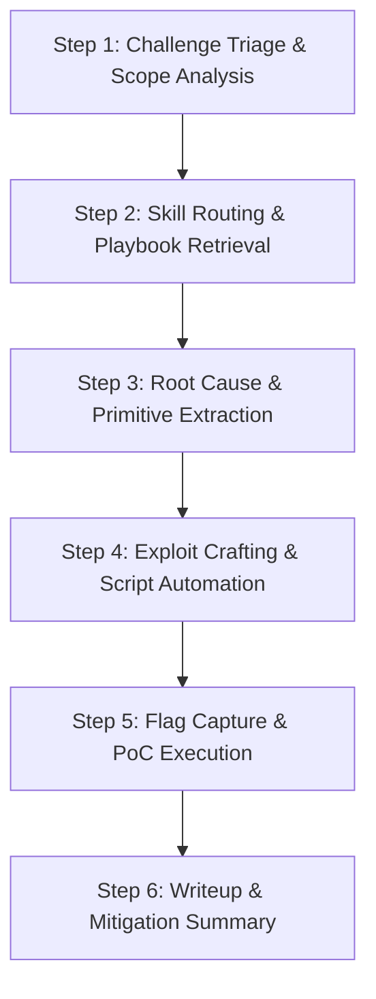

# 🚩 CTF & Cybersecurity Master Playbook Orchestrator (817 Skills)

> Universal dispatcher for 817 offensive & defensive skills.  
> Covers Web, Pwn, Rev, Crypto, DFIR, Cloud, AD, AI/LLM, Smart Contracts, OT/ICS.  
> Auto-routes playbooks (`./<skill>/SKILL.md`), scripts (`scripts/agent.py`), and specs (`references/`).

---

## 🧭 6-Step Universal CTF & Exploit Resolution Framework



### 🔹 Step 1: Challenge Classification & Triage
1. **Category**: Web, Pwn, Rev, Crypto, DFIR, OSINT, Cloud, AD, Smart Contracts, OT/ICS, AI/LLM.
2. **Artifacts**: PCAP, binaries, dumps, source code, dockerfiles, firmware, endpoints.

### 🔹 Step 2: Skill Routing & Playbook Retrieval
1. **Index Search**: Find playbook below by keyword/category.
2. **Load Skill**: Read `./<skill_name>/SKILL.md` via `view_file`.
3. **Inspect Scripts**: Review `./<skill_name>/scripts/agent.py` & `./<skill_name>/references/`.

### 🔹 Step 3: Root Cause & Primitive Extraction
- Code review, GDB debug, Ghidra reversing, Wireshark triage, Volatility 3 dump.
- Extract exploit primitives (Overflow, Format String, SSRF, IDOR, Kerberoasting, Reentrancy).

### 🔹 Step 4: Exploit Crafting & Automation
- Build Python exploit script (`pwntools`, `requests`, `scapy`, `impacket`, `cryptography`, `web3`):
  ```python
  from pwn import *
  context.log_level = 'debug'
  ```

### 🔹 Step 5: Flag Capture & Verification
- Extract/validate flag (`flag{...}`, `CTF{...}`).

### 🔹 Step 6: Writeup & Remediation
- Document root cause, PoC script, flag, blue-team fix.

---

## 📂 Agent Sub-Skill Dispatch Instructions

1. **Full Playbook**: Read `./<skill-name>/SKILL.md` via `view_file`.
2. **Automation Script**: Run `python ./<skill-name>/scripts/agent.py --help` via `run_command`.
3. **References**: Read `./<skill-name>/references/`.

---

## 📊 Master Taxonomy Overview (817 Skills)

| # | Category | Count | Category ID |
|---|---|---|---|
| 1 | 1. 🔴 Red Teaming & Active Directory (38 Skills) | **38** | `red-teaming` |
| 2 | 2. 🌐 Web & API Security (74 Skills) | **74** | `web-app` |
| 3 | 3. ⚙️ Binary Exploitation & Firmware (6 Skills) | **6** | `pwn-rev-firmware` |
| 4 | 4. 🔍 Digital Forensics & IR (67 Skills) | **67** | `dfir` |
| 5 | 5. 🦠 Malware Analysis & C2 (39 Skills) | **39** | `malware-c2` |
| 6 | 6. ☁️ Cloud Security (66 Skills) | **66** | `cloud-security` |
| 7 | 7. 🐳 Container, K8s & DevSecOps (59 Skills) | **59** | `container-k8s-supplychain` |
| 8 | 8. 🎯 Threat Hunting & SIEM (180 Skills) | **180** | `threat-hunting-siem` |
| 9 | 9. 🔐 Cryptography & Blockchain (18 Skills) | **18** | `crypto-blockchain` |
| 10 | 10. 🏭 OT / ICS / SCADA (29 Skills) | **29** | `ot-ics-scada` |
| 11 | 11. 🤖 AI / LLM & Agentic Security (14 Skills) | **14** | `ai-llm-security` |
| 12 | 12. 📱 Mobile & Wireless Security (15 Skills) | **15** | `mobile-wireless` |
| 13 | 13. 🎯 Vuln Management & Pentest (46 Skills) | **46** | `vuln-pentest` |
| 14 | 14. 🛡️ Zero Trust & IAM (58 Skills) | **58** | `iam-zero-trust` |
| 15 | 15. 📋 Compliance & GRC (13 Skills) | **13** | `compliance-grc` |
| 16 | 16. 💻 Endpoint Defense & Deception (95 Skills) | **95** | `endpoint-deception-phishing` |
| | **Total Skills** | **817** | `all` |

---

## 📚 Master Index of All 817 Operational Playbooks

### 1. 🔴 Red Teaming & Active Directory (38 Skills)
> AD attacks, Kerberos ticket abuse, DPAPI dump, C2 ops, privesc, lateral movement.

| Skill | Objective | Standards |
|---|---|---|
| [abusing-dpapi-for-credential-access](./abusing-dpapi-for-credential-access/SKILL.md) | Extract and decrypt Windows DPAPI-protected secrets (Credential Manager, browser logins/cookies, Wi-Fi cred... | `T1555.004` / `DE.CM-01` |
| [abusing-shadow-credentials-for-privesc](./abusing-shadow-credentials-for-privesc/SKILL.md) | Take over Active Directory accounts by writing attacker-controlled public keys to msDS-KeyCredentialLink (S... | `T1098.005` / `PR.AA-05` |
| [building-c2-infrastructure-with-sliver-framework](./building-c2-infrastructure-with-sliver-framework/SKILL.md) | Deploy and harden a Sliver C2 team server (BishopFox's Go-based adversary emulation framework) with multi-p... | `T1071.001, T1071.004, T1573.002, T1090.002, T1105, T1572` / `ID.RA-01, GV.OV-02, DE.AE-07` |
| [building-c2-redirector-infrastructure](./building-c2-redirector-infrastructure/SKILL.md) | Build dumb-pipe and traffic-filtering C2 redirectors with nginx (proxy_pass) and Apache (mod_rewrite), deri... | `T1090.002` / `DE.CM-01` |
| [building-red-team-c2-infrastructure-with-havoc](./building-red-team-c2-infrastructure-with-havoc/SKILL.md) | Deploy and configure the Havoc C2 framework (teamserver, HTTPS/HTTP/SMB listeners, Nginx redirectors, and D... | `T1071.001, T1573.002, T1583.001, T1090.002, T1105, T1055` / `ID.RA-01, GV.OV-02, DE.AE-07` |
| [coercing-authentication-with-coercer-petitpotam](./coercing-authentication-with-coercer-petitpotam/SKILL.md) | Trigger machine account authentication with PetitPotam (MS-EFSR) and Coercer (MS-RPRN, MS-DFSNM, MS-FSRVP, ... | `T1187` / `DE.CM-01` |
| [conducting-domain-persistence-with-dcsync](./conducting-domain-persistence-with-dcsync/SKILL.md) | DCSync attacks by abusing MS-DRSR replication rights (DS-Replication-Get-Changes/-All) to impersonate a Dom... | `T1003.006, T1207, T1098` / `ID.RA-01, GV.OV-02, DE.AE-07` |
| [conducting-full-scope-red-team-engagement](./conducting-full-scope-red-team-engagement/SKILL.md) | Plan and execute a comprehensive, MITRE ATT&CK-aligned red team engagement spanning threat modeling, reconn... | `T1566.001, T1059.001, T1078, T1071.001` / `ID.RA-01, GV.OV-02, DE.AE-07` |
| [conducting-internal-reconnaissance-with-bloodhound-ce](./conducting-internal-reconnaissance-with-bloodhound-ce/SKILL.md) | Conduct internal Active Directory reconnaissance using BloodHound Community Edition's graph database with t... | `T1087.002, T1069.002, T1482, T1018` / `ID.RA-01, GV.OV-02, DE.AE-07` |
| [conducting-pass-the-ticket-attack](./conducting-pass-the-ticket-attack/SKILL.md) | Pass-the-Ticket (PtT) lateral movement by extracting Kerberos TGT/TGS tickets from LSASS memory on a compro... | `T1550.003, T1558.003, T1078` / `ID.RA-01, GV.OV-02, DE.AE-07` |
| [conducting-social-engineering-pretext-call](./conducting-social-engineering-pretext-call/SKILL.md) | Plan and execute authorized vishing (voice phishing) pretext calls to assess employee susceptibility to soc... | `T1598.004, T1566.004, T1589, T1591, T1598` / `ID.RA-01, GV.OV-02, DE.AE-07` |
| [conducting-spearphishing-simulation-campaign](./conducting-spearphishing-simulation-campaign/SKILL.md) | Run a targeted spearphishing simulation for initial access by developing OSINT-derived pretexts, building p... | `T1566.001, T1566.002, T1598.003, T1598.002, T1204.002, T1204.001` / `ID.RA-01, GV.OV-02, DE.AE-07` |
| [executing-red-team-engagement-planning](./executing-red-team-engagement-planning/SKILL.md) | Build the foundational red team engagement plan - scope definition, Rules of Engagement (restrictions, comm... | `T1595, T1190, T1059, T1078` / `ID.RA-01, GV.OV-02, DE.AE-07` |
| [exploiting-active-directory-certificate-services-esc1](./exploiting-active-directory-certificate-services-esc1/SKILL.md) | Abuse misconfigured Active Directory Certificate Services (AD CS) ESC1 vulnerability to request certificate... | `T1595, T1190, T1059, T1078, T1068` / `ID.RA-01, GV.OV-02, DE.AE-07` |
| [exploiting-active-directory-with-bloodhound](./exploiting-active-directory-with-bloodhound/SKILL.md) | BloodHound is a graph-based Active Directory reconnaissance tool that uses graph theory to reveal hidden an... | `T1595, T1190, T1059, T1078, T1592` / `ID.RA-01, GV.OV-02, DE.AE-07` |
| [exploiting-adcs-with-certipy](./exploiting-adcs-with-certipy/SKILL.md) | Use Certipy to enumerate AD CS certificate authorities and templates over LDAP/RPC, then exploit ESC1-ESC16... | `T1649` / `PR.AA-05` |
| [exploiting-constrained-delegation-abuse](./exploiting-constrained-delegation-abuse/SKILL.md) | Exploits Kerberos Constrained Delegation misconfigurations in Active Directory using Impacket's findDelegat... | `T1595, T1190, T1059, T1078, T1021` / `ID.RA-01, GV.OV-02, DE.AE-07` |
| [exploiting-kerberoasting-with-impacket](./exploiting-kerberoasting-with-impacket/SKILL.md) | Performs Kerberoasting (MITRE ATT&CK T1558.003) using Impacket's GetUserSPNs.py to request Kerberos TGS tic... | `T1595, T1190, T1059, T1078, T1003` / `ID.RA-01, GV.OV-02, DE.AE-07` |
| [exploiting-ms17-010-eternalblue-vulnerability](./exploiting-ms17-010-eternalblue-vulnerability/SKILL.md) | Detects and exploits MS17-010 (EternalBlue), a critical remote code execution flaw in Microsoft's SMBv1 imp... | `T1595, T1190, T1059, T1078` / `ID.RA-01, GV.OV-02, DE.AE-07` |
| [exploiting-nopac-cve-2021-42278-42287](./exploiting-nopac-cve-2021-42278-42287/SKILL.md) | Exploits the noPac Active Directory privilege-escalation chain (CVE-2021-42278 sAMAccountName spoofing plus... | `T1595, T1190, T1059, T1078, T1068` / `ID.RA-01, GV.OV-02, DE.AE-07` |
| [exploiting-zerologon-vulnerability-cve-2020-1472](./exploiting-zerologon-vulnerability-cve-2020-1472/SKILL.md) | Exploits the Zerologon vulnerability (CVE-2020-1472) in the Netlogon Remote Protocol using Impacket to rese... | `T1595, T1190, T1059, T1078, T1068` / `ID.RA-01, GV.OV-02, DE.AE-07` |
| [implementing-attack-surface-management](./implementing-attack-surface-management/SKILL.md) | Implements external attack surface management (EASM) using Shodan, Censys, and ProjectDiscovery tools (subf... | `T1078, T1190, T1059, T1595, T1592` / `ID.RA-01, GV.OV-02, DE.AE-07` |
| [mapping-attack-paths-with-bloodhound-ce](./mapping-attack-paths-with-bloodhound-ce/SKILL.md) | Collect Active Directory data with SharpHound and Entra ID data with AzureHound, ingest into BloodHound Com... | `T1069` / `ID.AM-03` |
| [operating-havoc-c2](./operating-havoc-c2/SKILL.md) | Deploy a Havoc C2 team server with Yaotl malleable profiles, generate evasive Demon agents using indirect s... | `T1071.001` / `DE.CM-01` |
| [operating-sliver-c2](./operating-sliver-c2/SKILL.md) | Stand up a Sliver C2 server and mTLS listeners, generate cross-platform implants and beacons, and run post-... | `T1071.001` / `DE.CM-01` |
| [performing-active-directory-bloodhound-analysis](./performing-active-directory-bloodhound-analysis/SKILL.md) | Use BloodHound and SharpHound (or AzureHound) to enumerate Active Directory relationships and graph attack ... | `T1595, T1190, T1059, T1078, T1068` / `ID.RA-01, GV.OV-02, DE.AE-07` |
| [performing-active-directory-forest-trust-attack](./performing-active-directory-forest-trust-attack/SKILL.md) | Enumerate and audit Active Directory forest trust relationships using Impacket for SID filtering analysis, ... | `T1595, T1190, T1059, T1078, T1558.003` / `ID.RA-01, GV.OV-02, DE.AE-07` |
| [performing-binary-exploitation-analysis](./performing-binary-exploitation-analysis/SKILL.md) | Analyze ELF binaries for memory-corruption vulnerabilities and build proof-of-concept exploits using pwntoo... | `T1078, T1190, T1059` / `ID.RA-01, GV.OV-02, DE.AE-07` |
| [performing-credential-access-with-lazagne](./performing-credential-access-with-lazagne/SKILL.md) | Extract stored credentials from compromised endpoints using the LaZagne post-exploitation tool to recover p... | `T1595, T1190, T1059, T1078, T1021` / `ID.RA-01, GV.OV-02, DE.AE-07` |
| [performing-initial-access-with-evilginx3](./performing-initial-access-with-evilginx3/SKILL.md) | authorized initial access using EvilGinx3 adversary-in-the-middle phishing framework to capture session tok... | `T1595, T1190, T1059, T1078, T1003` / `ID.RA-01, GV.OV-02, DE.AE-07` |
| [performing-kerberoasting-attack](./performing-kerberoasting-attack/SKILL.md) | Kerberoasting, a post-exploitation technique that enumerates Active Directory service accounts with Service... | `T1595, T1190, T1059, T1078, T1003` / `ID.RA-01, GV.OV-02, DE.AE-07` |
| [performing-lateral-movement-with-wmiexec](./performing-lateral-movement-with-wmiexec/SKILL.md) | lateral movement across Windows networks using WMI-based remote execution techniques including Impacket wmi... | `T1595, T1190, T1059, T1078, T1021` / `ID.RA-01, GV.OV-02, DE.AE-07` |
| [performing-open-source-intelligence-gathering](./performing-open-source-intelligence-gathering/SKILL.md) | Open Source Intelligence (OSINT) gathering is the first active phase of a red team engagement, where operat... | `T1595, T1190, T1059, T1078, T1592` / `ID.RA-01, GV.OV-02, DE.AE-07` |
| [performing-physical-intrusion-assessment](./performing-physical-intrusion-assessment/SKILL.md) | Conduct authorized physical penetration testing against facilities, server rooms, and restricted areas usin... | `T1595, T1190, T1059, T1078, T1027` / `ID.RA-01, GV.OV-02, DE.AE-07` |
| [performing-privilege-escalation-on-linux](./performing-privilege-escalation-on-linux/SKILL.md) | Guides manual enumeration and automated tooling to escalate from a low-privilege Linux user to root by expl... | `T1595, T1190, T1059, T1078, T1068` / `ID.RA-01, GV.OV-02, DE.AE-07` |
| [performing-purple-team-atomic-testing](./performing-purple-team-atomic-testing/SKILL.md) | Executes Atomic Red Team tests mapped to MITRE ATT&CK via Invoke-AtomicRedTeam PowerShell, generates ATT&CK... | `T1078, T1190, T1059` / `ID.RA-01, DE.AE-07, GV.OV-02` |
| [performing-red-team-with-covenant](./performing-red-team-with-covenant/SKILL.md) | Conducts red team operations using the Covenant C2 framework for authorized adversary simulation, covering ... | `T1595, T1190, T1059, T1078, T1021` / `ID.RA-01, GV.OV-02, DE.AE-07` |
| [relaying-ntlm-for-adcs-esc8](./relaying-ntlm-for-adcs-esc8/SKILL.md) | Uses Impacket's ntlmrelayx.py with a coercion tool (PetitPotam, Coercer, printerbug) to relay NTLM authenti... | `T1557.001` / `DE.CM-01` |

---

### 2. 🌐 Web & API Security (74 Skills)
> OWASP Top 10, SQLi, XSS, CSRF, SSRF, IDOR, JWT abuse, prototype pollution, GraphQL, WebSocket.

| Skill | Objective | Standards |
|---|---|---|
| [bypassing-authentication-with-forced-browsing](./bypassing-authentication-with-forced-browsing/SKILL.md) | Discovering and accessing unprotected pages, APIs, and administrative interfaces by enumerating URLs and by... | `T1190, T1083, T1087` / `PR.PS-01, ID.RA-01, PR.DS-10, DE.CM-01` |
| [detecting-api-enumeration-attacks](./detecting-api-enumeration-attacks/SKILL.md) | Detect API enumeration attacks (BOLA/IDOR, OWASP API1:2023) by writing SIEM detection rules that flag seque... | `T1595, T1595.002, T1046, T1190, T1087` / `PR.PS-01, ID.RA-01, PR.DS-10, DE.CM-01` |
| [detecting-broken-object-property-level-authorization](./detecting-broken-object-property-level-authorization/SKILL.md) | Detect and test for OWASP API3:2023 Broken Object Property Level Authorization (BOPLA), covering excessive ... | `T1190, T1213, T1212` / `PR.PS-01, ID.RA-01, PR.DS-10, DE.CM-01` |
| [detecting-shadow-api-endpoints](./detecting-shadow-api-endpoints/SKILL.md) | Discover and inventory shadow API endpoints that operate outside documented OpenAPI/Swagger specs, using tr... | `T1190, T1133, T1526, T1213` / `PR.PS-01, ID.RA-01, PR.DS-10, DE.CM-01` |
| [exploiting-api-injection-vulnerabilities](./exploiting-api-injection-vulnerabilities/SKILL.md) | Tests API parameters, headers, and request bodies for injection flaws — SQL injection, NoSQL injection, OS ... | `T1190, T1059.007, T1552.001, T1055, T1059` / `PR.PS-01, ID.RA-01, PR.DS-10, DE.CM-01` |
| [exploiting-broken-function-level-authorization](./exploiting-broken-function-level-authorization/SKILL.md) | Tests APIs for Broken Function Level Authorization (OWASP API5:2023) by identifying admin and privileged en... | `T1190, T1059.007, T1552.001, T1068, T1548` / `PR.PS-01, ID.RA-01, PR.DS-10, DE.CM-01` |
| [exploiting-broken-link-hijacking](./exploiting-broken-link-hijacking/SKILL.md) | Discovers and exploits broken link hijacking by spidering a site (Burp Suite Spider, Scrapy, curl scraping)... | `T1190, T1059.007, T1505.003, T1083, T1195` / `PR.PS-01, ID.RA-01, PR.DS-10, DE.CM-01` |
| [exploiting-excessive-data-exposure-in-api](./exploiting-excessive-data-exposure-in-api/SKILL.md) | Tests APIs for excessive data exposure (OWASP API3:2023) by intercepting raw API responses and comparing th... | `T1190, T1059.007, T1552.001, T1027, T1070` / `PR.PS-01, ID.RA-01, PR.DS-10, DE.CM-01` |
| [exploiting-http-request-smuggling](./exploiting-http-request-smuggling/SKILL.md) | Detects and exploits HTTP request smuggling caused by Content-Length/Transfer-Encoding parsing discrepancie... | `T1190, T1059.007, T1505.003, T1083` / `PR.PS-01, ID.RA-01, PR.DS-10, DE.CM-01` |
| [exploiting-idor-vulnerabilities](./exploiting-idor-vulnerabilities/SKILL.md) | Identifies and exploits Insecure Direct Object Reference (IDOR) vulnerabilities by manipulating object iden... | `T1190, T1059.007, T1505.003, T1083` / `PR.PS-01, ID.RA-01, PR.DS-10, DE.CM-01` |
| [exploiting-insecure-deserialization](./exploiting-insecure-deserialization/SKILL.md) | Identifying and exploiting insecure deserialization vulnerabilities in Java, PHP, Python, and .NET applicat... | `T1190, T1059.007, T1505.003, T1083` / `PR.PS-01, ID.RA-01, PR.DS-10, DE.CM-01` |
| [exploiting-jwt-algorithm-confusion-attack](./exploiting-jwt-algorithm-confusion-attack/SKILL.md) | Exploits JWT algorithm confusion where the server's verification library trusts the alg named in the token ... | `T1190, T1059.007, T1552.001, T1055, T1059` / `PR.PS-01, ID.RA-01, PR.DS-10, DE.CM-01` |
| [exploiting-mass-assignment-in-rest-apis](./exploiting-mass-assignment-in-rest-apis/SKILL.md) | Discovers and exploits mass assignment (autobinding) in REST APIs by injecting unexpected or hidden paramet... | `T1190, T1059.007, T1505.003, T1083, T1068` / `PR.PS-01, ID.RA-01, PR.DS-10, DE.CM-01` |
| [exploiting-nosql-injection-vulnerabilities](./exploiting-nosql-injection-vulnerabilities/SKILL.md) | Detects and exploits NoSQL injection vulnerabilities in MongoDB, CouchDB, and similar databases to demonstr... | `T1190, T1059.007, T1505.003, T1083, T1055` / `PR.PS-01, ID.RA-01, PR.DS-10, DE.CM-01` |
| [exploiting-oauth-misconfiguration](./exploiting-oauth-misconfiguration/SKILL.md) | Identifying and exploiting OAuth 2.0 and OpenID Connect misconfigurations including redirect URI manipulati... | `T1190, T1059.007, T1505.003, T1083` / `PR.PS-01, ID.RA-01, PR.DS-10, DE.CM-01` |
| [exploiting-prototype-pollution-in-javascript](./exploiting-prototype-pollution-in-javascript/SKILL.md) | Detects and exploits JavaScript prototype pollution vulnerabilities in client-side and server-side (Node.js... | `T1190, T1059.007, T1505.003, T1083, T1055` / `PR.PS-01, ID.RA-01, PR.DS-10, DE.CM-01` |
| [exploiting-race-condition-vulnerabilities](./exploiting-race-condition-vulnerabilities/SKILL.md) | Detects and exploits race condition (TOCTOU) vulnerabilities in web applications using Burp Suite's Turbo I... | `T1190, T1059.007, T1505.003, T1083, T1027` / `PR.PS-01, ID.RA-01, PR.DS-10, DE.CM-01` |
| [exploiting-server-side-request-forgery](./exploiting-server-side-request-forgery/SKILL.md) | Identifying and exploiting SSRF vulnerabilities to access internal services, cloud metadata, and restricted... | `T1190, T1059.007, T1505.003, T1083, T1078.004` / `PR.PS-01, ID.RA-01, PR.DS-10, DE.CM-01` |
| [exploiting-sql-injection-with-sqlmap](./exploiting-sql-injection-with-sqlmap/SKILL.md) | Detecting and exploiting SQL injection vulnerabilities using sqlmap to extract database contents during aut... | `T1190, T1059.007, T1505.003, T1083, T1055` / `PR.PS-01, ID.RA-01, PR.DS-10, DE.CM-01` |
| [exploiting-template-injection-vulnerabilities](./exploiting-template-injection-vulnerabilities/SKILL.md) | Detects and exploits Server-Side Template Injection (SSTI) vulnerabilities across Jinja2, Twig, Freemarker,... | `T1190, T1059.007, T1505.003, T1083, T1055` / `PR.PS-01, ID.RA-01, PR.DS-10, DE.CM-01` |
| [exploiting-type-juggling-vulnerabilities](./exploiting-type-juggling-vulnerabilities/SKILL.md) | Exploits PHP type juggling vulnerabilities caused by loose (==) comparison operators to bypass authenticati... | `T1190, T1059.007, T1505.003, T1083, T1027` / `PR.PS-01, ID.RA-01, PR.DS-10, DE.CM-01` |
| [exploiting-websocket-vulnerabilities](./exploiting-websocket-vulnerabilities/SKILL.md) | Testing WebSocket implementations for authentication bypass, cross-site hijacking, injection attacks, and i... | `T1190, T1059.007, T1505.003, T1083, T1055` / `PR.PS-01, ID.RA-01, PR.DS-10, DE.CM-01` |
| [implementing-api-abuse-detection-with-rate-limiting](./implementing-api-abuse-detection-with-rate-limiting/SKILL.md) | Implements API abuse detection using token bucket, sliding window, and fixed window rate-limiting algorithm... | `T1190, T1059.007, T1552.001, T1003, T1110` / `PR.PS-01, ID.RA-01, PR.DS-10, DE.CM-01` |
| [implementing-api-gateway-security-controls](./implementing-api-gateway-security-controls/SKILL.md) | Configures API gateways such as Kong, AWS API Gateway, Azure APIM, or Apigee as a centralized security enfo... | `T1190, T1059.007, T1552.001, T1078.004, T1530` / `PR.PS-01, ID.RA-01, PR.DS-10, DE.CM-01` |
| [implementing-api-key-security-controls](./implementing-api-key-security-controls/SKILL.md) | Implements secure API key generation with sufficient entropy, server-side hashing (SHA-256/bcrypt) instead ... | `T1190, T1059.007, T1552.001, T1003, T1110` / `PR.PS-01, ID.RA-01, PR.DS-10, DE.CM-01` |
| [implementing-api-rate-limiting-and-throttling](./implementing-api-rate-limiting-and-throttling/SKILL.md) | Implements API rate limiting and throttling with token bucket, sliding window, and fixed window algorithms,... | `T1190, T1059.007, T1552.001, T1003, T1110` / `PR.PS-01, ID.RA-01, PR.DS-10, DE.CM-01` |
| [implementing-api-schema-validation-security](./implementing-api-schema-validation-security/SKILL.md) | Implements API schema validation using OpenAPI Specification and JSON Schema documents, enforced both at th... | `T1190, T1059.007, T1552.001, T1055, T1059` / `PR.PS-01, ID.RA-01, PR.DS-10, DE.CM-01` |
| [implementing-api-security-posture-management](./implementing-api-security-posture-management/SKILL.md) | Implements API Security Posture Management (API-SPM) to continuously discover, classify, and risk-score API... | `T1190, T1059.007, T1552.001` / `PR.PS-01, ID.RA-01, PR.DS-10, DE.CM-01` |
| [implementing-api-security-testing-with-42crunch](./implementing-api-security-testing-with-42crunch/SKILL.md) | Implements API security testing on the 42Crunch platform, combining API Audit for static analysis of OpenAP... | `T1190, T1059.007, T1552.001` / `PR.PS-01, ID.RA-01, PR.DS-10, DE.CM-01` |
| [implementing-api-threat-protection-with-apigee](./implementing-api-threat-protection-with-apigee/SKILL.md) | Implements API threat protection using Google Apigee reverse-proxy policies, including JSON/XML threat prot... | `T1190, T1059.007, T1552.001, T1078.004, T1530` / `PR.PS-01, ID.RA-01, PR.DS-10, DE.CM-01` |
| [implementing-devsecops-security-scanning](./implementing-devsecops-security-scanning/SKILL.md) | Integrates SAST, DAST, and SCA into CI/CD pipelines using Semgrep for SAST, Trivy for SCA and container sca... | `T1078, T1190, T1059, T1610, T1611` / `PR.PS-01, PR.PS-04, ID.RA-01, PR.DS-10` |
| [implementing-runtime-application-self-protection](./implementing-runtime-application-self-protection/SKILL.md) | Deploy Runtime Application Self-Protection (RASP) agents to detect and block attacks from within applicatio... | `T1078, T1190, T1059, T1059.007` / `PR.PS-01, PR.PS-04, ID.RA-01, PR.DS-10` |
| [implementing-web-application-logging-with-modsecurity](./implementing-web-application-logging-with-modsecurity/SKILL.md) | Configure ModSecurity WAF with the OWASP Core Rule Set (CRS) for web application audit logging, tuning SecR... | `T1190, T1059.007, T1505.003, T1083` / `PR.PS-01, ID.RA-01, PR.DS-10, DE.CM-01` |
| [performing-api-fuzzing-with-restler](./performing-api-fuzzing-with-restler/SKILL.md) | Uses Microsoft RESTler to perform stateful REST API fuzzing: compiles an OpenAPI/Swagger spec into a RESTle... | `T1190, T1059.007, T1552.001, T1055, T1059` / `PR.PS-01, ID.RA-01, PR.DS-10, DE.CM-01` |
| [performing-api-inventory-and-discovery](./performing-api-inventory-and-discovery/SKILL.md) | Performs API inventory and discovery to identify all API endpoints in an organization's environment includi... | `T1190, T1059.007, T1552.001, T1078.004, T1530` / `PR.PS-01, ID.RA-01, PR.DS-10, DE.CM-01` |
| [performing-api-rate-limiting-bypass](./performing-api-rate-limiting-bypass/SKILL.md) | Tests API rate limiting for bypass vulnerabilities using Python (requests/aiohttp) and Burp Suite Turbo Int... | `T1190, T1059.007, T1552.001, T1027, T1055` / `PR.PS-01, ID.RA-01, PR.DS-10, DE.CM-01` |
| [performing-api-security-testing-with-postman](./performing-api-security-testing-with-postman/SKILL.md) | Uses Postman to build structured API security test collections covering the OWASP API Security Top 10—authe... | `T1190, T1059.007, T1552.001, T1055, T1059` / `PR.PS-01, ID.RA-01, PR.DS-10, DE.CM-01` |
| [performing-blind-ssrf-exploitation](./performing-blind-ssrf-exploitation/SKILL.md) | Detect and exploit blind Server-Side Request Forgery (SSRF) using out-of-band techniques such as Burp Colla... | `T1190, T1059.007, T1505.003, T1083, T1078.004` / `PR.PS-01, ID.RA-01, PR.DS-10, DE.CM-01` |
| [performing-clickjacking-attack-test](./performing-clickjacking-attack-test/SKILL.md) | Testing web applications for clickjacking vulnerabilities by assessing frame embedding controls and craftin... | `T1190, T1059.007, T1505.003, T1083` / `PR.PS-01, ID.RA-01, PR.DS-10, DE.CM-01` |
| [performing-content-security-policy-bypass](./performing-content-security-policy-bypass/SKILL.md) | Analyze Content-Security-Policy headers and bypass them to achieve cross-site scripting by exploiting unsaf... | `T1190, T1059.007, T1505.003, T1083, T1055` / `PR.PS-01, ID.RA-01, PR.DS-10, DE.CM-01` |
| [performing-csrf-attack-simulation](./performing-csrf-attack-simulation/SKILL.md) | Testing web applications for Cross-Site Request Forgery vulnerabilities by crafting forged requests that ex... | `T1190, T1059.007, T1505.003, T1083` / `PR.PS-01, ID.RA-01, PR.DS-10, DE.CM-01` |
| [performing-directory-traversal-testing](./performing-directory-traversal-testing/SKILL.md) | Test web applications for path traversal and Local/Remote File Inclusion vulnerabilities by manipulating fi... | `T1190, T1059.007, T1505.003, T1083` / `PR.PS-01, ID.RA-01, PR.DS-10, DE.CM-01` |
| [performing-fuzzing-with-aflplusplus](./performing-fuzzing-with-aflplusplus/SKILL.md) | Performs coverage-guided fuzzing of compiled binaries with AFL++, instrumenting targets via afl-cc/afl-clan... | `T1078, T1190, T1059, T1005` / `PR.PS-01, PR.PS-04, ID.RA-01, PR.DS-10` |
| [performing-graphql-depth-limit-attack](./performing-graphql-depth-limit-attack/SKILL.md) | and test GraphQL depth limit attacks using deeply nested recursive queries to identify denial-of-service vu... | `T1190, T1059.007, T1552.001` / `PR.PS-01, ID.RA-01, PR.DS-10, DE.CM-01` |
| [performing-graphql-introspection-attack](./performing-graphql-introspection-attack/SKILL.md) | Performs GraphQL introspection attacks that extract the full API schema (types, queries, mutations, subscri... | `T1190, T1059.007, T1552.001, T1110` / `PR.PS-01, ID.RA-01, PR.DS-10, DE.CM-01` |
| [performing-graphql-security-assessment](./performing-graphql-security-assessment/SKILL.md) | Assessing GraphQL API endpoints for introspection leaks, injection attacks, authorization flaws, and denial... | `T1190, T1059.007, T1505.003, T1083, T1055` / `PR.PS-01, ID.RA-01, PR.DS-10, DE.CM-01` |
| [performing-http-parameter-pollution-attack](./performing-http-parameter-pollution-attack/SKILL.md) | Executes HTTP Parameter Pollution attacks that inject duplicate request parameters to bypass input validati... | `T1190, T1059.007, T1505.003, T1083, T1055` / `PR.PS-01, ID.RA-01, PR.DS-10, DE.CM-01` |
| [performing-jwt-none-algorithm-attack](./performing-jwt-none-algorithm-attack/SKILL.md) | and test the JWT none algorithm attack, crafting tokens with the alg header set to none using PyJWT and an ... | `T1190, T1059.007, T1552.001, T1027, T1070` / `PR.PS-01, ID.RA-01, PR.DS-10, DE.CM-01` |
| [performing-second-order-sql-injection](./performing-second-order-sql-injection/SKILL.md) | Detect and exploit second-order SQL injection vulnerabilities where malicious input is stored in a database... | `T1190, T1059.007, T1505.003, T1083, T1055` / `PR.PS-01, ID.RA-01, PR.DS-10, DE.CM-01` |
| [performing-security-headers-audit](./performing-security-headers-audit/SKILL.md) | Auditing HTTP security headers including CSP, HSTS, X-Frame-Options, and cookie attributes to identify miss... | `T1190, T1059.007, T1505.003, T1083` / `PR.PS-01, ID.RA-01, PR.DS-10, DE.CM-01` |
| [performing-soap-web-service-security-testing](./performing-soap-web-service-security-testing/SKILL.md) | Performs security testing of SOAP web services by analyzing WSDL definitions and testing for XML injection,... | `T1190, T1059.007, T1552.001, T1055, T1059` / `PR.PS-01, ID.RA-01, PR.DS-10, DE.CM-01` |
| [performing-subdomain-enumeration-with-subfinder](./performing-subdomain-enumeration-with-subfinder/SKILL.md) | Enumerate subdomains of target domains using ProjectDiscovery's Subfinder passive reconnaissance tool to ma... | `T1190, T1059.007, T1505.003, T1083, T1595` / `PR.PS-01, ID.RA-01, PR.DS-10, DE.CM-01` |
| [performing-supply-chain-attack-simulation](./performing-supply-chain-attack-simulation/SKILL.md) | Simulates and detects software supply chain attacks: typosquatting detection via Levenshtein distance again... | `T1078, T1190, T1059, T1195, T1554` / `PR.PS-01, PR.PS-04, ID.RA-01, PR.DS-10` |
| [performing-web-application-firewall-bypass](./performing-web-application-firewall-bypass/SKILL.md) | Bypasses Web Application Firewall protections using encoding tricks, HTTP method manipulation, parameter po... | `T1190, T1059.007, T1505.003, T1083, T1027` / `PR.PS-01, ID.RA-01, PR.DS-10, DE.CM-01` |
| [performing-web-cache-deception-attack](./performing-web-cache-deception-attack/SKILL.md) | Executes web cache deception attacks by exploiting path normalization discrepancies between CDN/reverse-pro... | `T1190, T1059.007, T1505.003, T1083, T1078.004` / `PR.PS-01, ID.RA-01, PR.DS-10, DE.CM-01` |
| [performing-web-cache-poisoning-attack](./performing-web-cache-poisoning-attack/SKILL.md) | Exploiting web cache mechanisms to serve malicious content to other users by poisoning cached responses thr... | `T1190, T1059.007, T1505.003, T1083` / `PR.PS-01, ID.RA-01, PR.DS-10, DE.CM-01` |
| [testing-api-authentication-weaknesses](./testing-api-authentication-weaknesses/SKILL.md) | Tests API authentication mechanisms for weaknesses including broken token validation, missing authenticatio... | `T1190, T1059.007, T1552.001, T1003, T1110` / `PR.PS-01, ID.RA-01, PR.DS-10, DE.CM-01` |
| [testing-api-for-broken-object-level-authorization](./testing-api-for-broken-object-level-authorization/SKILL.md) | Tests REST and GraphQL APIs for Broken Object Level Authorization (BOLA/IDOR, OWASP API1:2023) by intercept... | `T1190, T1059.007, T1552.001, T1027, T1070` / `PR.PS-01, ID.RA-01, PR.DS-10, DE.CM-01` |
| [testing-api-for-mass-assignment-vulnerability](./testing-api-for-mass-assignment-vulnerability/SKILL.md) | Tests APIs for mass assignment (auto-binding), OWASP API3:2023, by identifying writable endpoints, adding u... | `T1190, T1059.007, T1552.001, T0816, T0836` / `PR.PS-01, ID.RA-01, PR.DS-10, DE.CM-01` |
| [testing-api-security-with-owasp-top-10](./testing-api-security-with-owasp-top-10/SKILL.md) | Systematically assesses REST, GraphQL, and gRPC API endpoints against the OWASP API Security Top 10 (2023) ... | `T1190, T1059.007, T1505.003, T1083` / `PR.PS-01, ID.RA-01, PR.DS-10, DE.CM-01` |
| [testing-cors-misconfiguration](./testing-cors-misconfiguration/SKILL.md) | Identifying and exploiting Cross-Origin Resource Sharing misconfigurations that allow unauthorized cross-do... | `T1190, T1059.007, T1505.003, T1083, T1003` / `PR.PS-01, ID.RA-01, PR.DS-10, DE.CM-01` |
| [testing-for-broken-access-control](./testing-for-broken-access-control/SKILL.md) | Systematically tests web applications and APIs for broken access control (OWASP A01:2021), including privil... | `T1190, T1059.007, T1505.003, T1083, T1068` / `PR.PS-01, ID.RA-01, PR.DS-10, DE.CM-01` |
| [testing-for-business-logic-vulnerabilities](./testing-for-business-logic-vulnerabilities/SKILL.md) | Manually identifies flaws in application business logic - price manipulation, multi-step workflow bypass, a... | `T1190, T1059.007, T1505.003, T1083, T1068` / `PR.PS-01, ID.RA-01, PR.DS-10, DE.CM-01` |
| [testing-for-email-header-injection](./testing-for-email-header-injection/SKILL.md) | Tests web application email functionality (contact forms, password reset, newsletter subscriptions) for CRL... | `T1190, T1059.007, T1505.003, T1083, T1055` / `PR.PS-01, ID.RA-01, PR.DS-10, DE.CM-01` |
| [testing-for-host-header-injection](./testing-for-host-header-injection/SKILL.md) | Test web applications for HTTP Host header injection vulnerabilities to identify password reset poisoning, ... | `T1190, T1059.007, T1505.003, T1083, T1055` / `PR.PS-01, ID.RA-01, PR.DS-10, DE.CM-01` |
| [testing-for-json-web-token-vulnerabilities](./testing-for-json-web-token-vulnerabilities/SKILL.md) | Tests JWT implementations for algorithm confusion, "none" algorithm bypass, kid/jku parameter injection, an... | `T1190, T1059.007, T1505.003, T1083, T1068` / `PR.PS-01, ID.RA-01, PR.DS-10, DE.CM-01` |
| [testing-for-open-redirect-vulnerabilities](./testing-for-open-redirect-vulnerabilities/SKILL.md) | Identifies and exploits open redirect vulnerabilities by analyzing URL redirection parameters (next, url, r... | `T1190, T1059.007, T1505.003, T1083, T1566` / `PR.PS-01, ID.RA-01, PR.DS-10, DE.CM-01` |
| [testing-for-sensitive-data-exposure](./testing-for-sensitive-data-exposure/SKILL.md) | Identifying sensitive data exposure vulnerabilities including API key leakage, PII in responses, insecure s... | `T1190, T1059.007, T1505.003, T1083` / `PR.PS-01, ID.RA-01, PR.DS-10, DE.CM-01` |
| [testing-for-xml-injection-vulnerabilities](./testing-for-xml-injection-vulnerabilities/SKILL.md) | Test web applications for XML injection vulnerabilities including XXE, XPath injection, and XML entity atta... | `T1190, T1059.007, T1505.003, T1083, T1055` / `PR.PS-01, ID.RA-01, PR.DS-10, DE.CM-01` |
| [testing-for-xss-vulnerabilities-with-burpsuite](./testing-for-xss-vulnerabilities-with-burpsuite/SKILL.md) | Identifying and validating cross-site scripting vulnerabilities using Burp Suite's scanner, intruder, and r... | `T1190, T1059.007, T1505.003, T1083` / `PR.PS-01, ID.RA-01, PR.DS-10, DE.CM-01` |
| [testing-for-xxe-injection-vulnerabilities](./testing-for-xxe-injection-vulnerabilities/SKILL.md) | Discovering and exploiting XML External Entity injection vulnerabilities to read server files, perform SSRF... | `T1190, T1059.007, T1505.003, T1083, T1048` / `PR.PS-01, ID.RA-01, PR.DS-10, DE.CM-01` |
| [testing-jwt-token-security](./testing-jwt-token-security/SKILL.md) | Assessing JSON Web Token implementations for cryptographic weaknesses, algorithm confusion attacks, and aut... | `T1190, T1059.007, T1505.003, T1083, T1027` / `PR.PS-01, ID.RA-01, PR.DS-10, DE.CM-01` |
| [testing-oauth2-implementation-flaws](./testing-oauth2-implementation-flaws/SKILL.md) | Tests OAuth 2.0 and OpenID Connect implementations for authorization code interception, redirect URI manipu... | `T1190, T1059.007, T1552.001, T1027, T1070` / `PR.PS-01, ID.RA-01, PR.DS-10, DE.CM-01` |
| [testing-websocket-api-security](./testing-websocket-api-security/SKILL.md) | Tests WebSocket API implementations for missing upgrade-handshake authentication, Cross-Site WebSocket Hija... | `T1190, T1059.007, T1552.001, T1055, T1059` / `PR.PS-01, ID.RA-01, PR.DS-10, DE.CM-01` |

---

### 3. ⚙️ Binary Exploitation & Firmware (6 Skills)
> Buffer/Heap overflow, ROP, format string, Ghidra reversing, UEFI security, firmware unpack.

| Skill | Objective | Standards |
|---|---|---|
| [analyzing-uefi-bootkit-persistence](./analyzing-uefi-bootkit-persistence/SKILL.md) | Analyzes UEFI bootkit persistence (SPI flash implants, ESP modifications, Secure Boot bypass, UEFI variable... | `T1542.001, T1542.003, T1553.006, T1542, T1014` / `ID.RA-01, PR.PS-01, PR.PS-02` |
| [auditing-uefi-firmware-with-chipsec](./auditing-uefi-firmware-with-chipsec/SKILL.md) | Use Intel CHIPSEC to assess platform firmware configuration, SPI flash write protection, BIOS lock, SMM/SMR... | `T1542.001` / `ID.AM-02` |
| [detecting-secure-boot-bypass](./detecting-secure-boot-bypass/SKILL.md) | Detect UEFI Secure Boot bypasses and bootkits such as BlackLotus and Bootkitty by verifying Secure Boot sta... | `T1542.003` / `DE.CM-01` |
| [hunting-bootkits-in-efi-system-partition](./hunting-bootkits-in-efi-system-partition/SKILL.md) | Baseline the EFI System Partition and hunt malicious EFI binaries such as ESPecter, BlackLotus, Bootkitty, ... | `T1542.003` / `DE.CM-01` |
| [performing-firmware-extraction-with-binwalk](./performing-firmware-extraction-with-binwalk/SKILL.md) | Performs firmware image extraction and analysis using binwalk to identify embedded filesystems, compressed ... | `T1078, T1190, T1059, T1003, T1110` / `ID.RA-01, PR.PS-01, DE.AE-02` |
| [validating-tpm-measured-boot-attestation](./validating-tpm-measured-boot-attestation/SKILL.md) | Verifies TPM 2.0 measured-boot integrity and remote attestation with tpm2-tools -- reading PCRs (tpm2_pcrre... | `T1542` / `PR.PS-01` |

---

### 4. 🔍 Digital Forensics & IR (67 Skills)
> Volatility memory forensics, disk imaging, MFT/Prefetch/Event log analysis, timeline reconstruction.

| Skill | Objective | Standards |
|---|---|---|
| [acquiring-disk-image-with-dd-and-dcfldd](./acquiring-disk-image-with-dd-and-dcfldd/SKILL.md) | Create forensically sound bit-for-bit disk images with dd or dcfldd on a Linux forensic workstation, preser... | `T1006, T1005, T1025, T1074.001` / `RS.AN-03, DE.AE-02, RS.MA-01` |
| [analyzing-browser-forensics-with-hindsight](./analyzing-browser-forensics-with-hindsight/SKILL.md) | Parse Chromium-based browser databases with Hindsight to extract and correlate browsing history, downloads,... | `T1217, T1539, T1555.003, T1185` / `RS.AN-03, DE.AE-02, RS.MA-01` |
| [analyzing-disk-image-with-autopsy](./analyzing-disk-image-with-autopsy/SKILL.md) | comprehensive forensic analysis of raw (dd), E01, or AFF disk images with Autopsy and The Sleuth Kit, recov... | `T1005, T1074.001, T1070.004, T1083` / `RS.AN-03, DE.AE-02, RS.MA-01` |
| [analyzing-docker-container-forensics](./analyzing-docker-container-forensics/SKILL.md) | Investigate compromised Docker containers by analyzing images, layers, volumes, logs, and runtime artifacts... | `T1610, T1611, T1613, T1612` / `RS.AN-03, DE.AE-02, RS.MA-01` |
| [analyzing-email-headers-for-phishing-investigation](./analyzing-email-headers-for-phishing-investigation/SKILL.md) | Parse and analyze email headers (Received chain, Return-Path, Message-ID) to trace the true origin of a phi... | `T1566.001, T1566.002, T1598.003` / `RS.AN-03, DE.AE-02, RS.MA-01` |
| [analyzing-linux-audit-logs-for-intrusion](./analyzing-linux-audit-logs-for-intrusion/SKILL.md) | Uses the Linux Audit framework (auditd) with ausearch and aureport utilities to detect intrusion attempts, ... | `T1059.004, T1070, T1548.003, T1543.002` / `RS.MA-01, RS.MA-02, RS.AN-03, RC.RP-01` |
| [analyzing-linux-kernel-rootkits](./analyzing-linux-kernel-rootkits/SKILL.md) | Detect kernel-level rootkits in Linux memory dumps using Volatility3 linux plugins (check_syscall, lsmod, h... | `T1014, T1547.006, T1564.001` / `RS.AN-03, DE.AE-02, RS.MA-01` |
| [analyzing-linux-system-artifacts](./analyzing-linux-system-artifacts/SKILL.md) | Examine Linux system artifacts (auth logs, cron/systemd persistence, shell history, SSH keys, and system co... | `T1070, T1059.004, T1543.002, T1053.003` / `RS.AN-03, DE.AE-02, RS.MA-01` |
| [analyzing-lnk-file-and-jump-list-artifacts](./analyzing-lnk-file-and-jump-list-artifacts/SKILL.md) | Analyze Windows LNK shortcut files and Jump List artifacts with LECmd, JLECmd, and manual Shell Link Binary... | `T1547.009, T1204.002, T1059.001` / `RS.AN-03, DE.AE-02, RS.MA-01` |
| [analyzing-mft-for-deleted-file-recovery](./analyzing-mft-for-deleted-file-recovery/SKILL.md) | Analyze the NTFS Master File Table ($MFT) with MFTECmd, analyzeMFT, and X-Ways Forensics to recover metadat... | `T1070.004, T1070.006, T1005` / `RS.AN-03, DE.AE-02, RS.MA-01` |
| [analyzing-network-traffic-for-incidents](./analyzing-network-traffic-for-incidents/SKILL.md) | Analyzes network traffic captures and flow data to identify adversary activity during security incidents, i... | `T1071, T1095, T1573, T1572` / `RS.MA-01, RS.MA-02, RS.AN-03, RC.RP-01` |
| [analyzing-outlook-pst-for-email-forensics](./analyzing-outlook-pst-for-email-forensics/SKILL.md) | Parse Microsoft Outlook PST and OST files using libpff and pst-utils to extract message content, headers, a... | `T1114.001, T1564.008, T1070.008` / `RS.AN-03, DE.AE-02, RS.MA-01` |
| [analyzing-prefetch-files-for-execution-history](./analyzing-prefetch-files-for-execution-history/SKILL.md) | Parse Windows Prefetch files (versions 17, 23, 26, 30) with tools like PECmd, WinPrefetchView, or python-pr... | `T1059.001, T1003.001, T1021.002, T1567.002` / `RS.AN-03, DE.AE-02, RS.MA-01` |
| [analyzing-security-logs-with-splunk](./analyzing-security-logs-with-splunk/SKILL.md) | Leverages Splunk Enterprise Security and SPL (Search Processing Language) to investigate security incidents... | `T1110, T1550.002, T1021.001, T1059.001, T1003.001` / `RS.MA-01, RS.MA-02, RS.AN-03, RC.RP-01` |
| [analyzing-slack-space-and-file-system-artifacts](./analyzing-slack-space-and-file-system-artifacts/SKILL.md) | Examine NTFS slack space, MFT entries, the USN Change Journal, and Alternate Data Streams (ADS) to recover ... | `T1070.006, T1564.004, T1070.004, T1005, T1006` / `RS.AN-03, DE.AE-02, RS.MA-01` |
| [analyzing-usb-device-connection-history](./analyzing-usb-device-connection-history/SKILL.md) | Correlate Windows registry keys (USBSTOR, MountedDevices), Event Logs, and setupapi.dev.log to reconstruct ... | `T1052.001, T1025, T1091, T1005, T1074.001` / `RS.AN-03, DE.AE-02, RS.MA-01` |
| [analyzing-windows-amcache-artifacts](./analyzing-windows-amcache-artifacts/SKILL.md) | Parses the Windows Amcache.hve registry hive with Eric Zimmerman's AmcacheParser and Timeline Explorer to e... | `T1070.004, T1070.006, T1036.005, T1014, T1005` / `RS.AN-03, DE.AE-02, RS.MA-01` |
| [analyzing-windows-lnk-files-for-artifacts](./analyzing-windows-lnk-files-for-artifacts/SKILL.md) | Parse Windows LNK shortcut files to extract target paths, MAC timestamps, volume serial numbers, and machin... | `T1547.001, T1204.002, T1005, T1025, T1074.001` / `RS.AN-03, DE.AE-02, RS.MA-01` |
| [analyzing-windows-prefetch-with-python](./analyzing-windows-prefetch-with-python/SKILL.md) | Parse Windows Prefetch (.pf) files with the windowsprefetch Python library to reconstruct application execu... | `T1036.005, T1070.004, T1070, T1003.001, T1057` / `RS.AN-03, DE.AE-02, RS.MA-01` |
| [analyzing-windows-registry-for-artifacts](./analyzing-windows-registry-for-artifacts/SKILL.md) | Extract and analyze Windows Registry hives with tools like RegRipper and Registry Explorer to uncover user ... | `T1012, T1547.001, T1112, T1003.002, T1025` / `RS.AN-03, DE.AE-02, RS.MA-01` |
| [analyzing-windows-shellbag-artifacts](./analyzing-windows-shellbag-artifacts/SKILL.md) | Analyze Windows Shellbag (BagMRU) registry artifacts with SBECmd and Shellbags Explorer to reconstruct fold... | `T1083, T1074.001, T1135, T1025, T1070.004` / `RS.AN-03, DE.AE-02, RS.MA-01` |
| [building-incident-response-playbook](./building-incident-response-playbook/SKILL.md) | Designs and documents structured incident response playbooks with step-by-step procedures per incident type... | `T1486, T1566, T1190, T1041, T1078` / `RS.MA-01, RS.MA-02, RS.AN-03, RC.RP-01` |
| [building-incident-timeline-with-timesketch](./building-incident-timeline-with-timesketch/SKILL.md) | Build collaborative forensic incident timelines using Timesketch to ingest, normalize, and analyze multi-so... | `T1059.001, T1021.002, T1547.001, T1053.005, T1070.006` / `RS.MA-01, RS.MA-02, RS.AN-03, RC.RP-01` |
| [building-malware-incident-communication-template](./building-malware-incident-communication-template/SKILL.md) | Build structured communication templates for malware incidents (ransomware, wiper, trojan, worm), covering ... | `T1486, T1490, T1657, T1041, T1566` / `RS.MA-01, RS.MA-02, RS.AN-03, RC.RP-01` |
| [building-super-timelines-with-plaso](./building-super-timelines-with-plaso/SKILL.md) | Generate forensic super-timelines with Plaso's log2timeline.py, pinfo.py, psort.py, and psteal.py CLI tools... | `T1070` / `RS.AN-03` |
| [collecting-indicators-of-compromise](./collecting-indicators-of-compromise/SKILL.md) | Systematically collects, categorizes, and distributes indicators of compromise (IOCs) during and after secu... | `T1071.001, T1071.004, T1053.005, T1547.001, T1059.001, T1041` / `RS.MA-01, RS.MA-02, RS.AN-03, RC.RP-01` |
| [collecting-volatile-evidence-from-compromised-host](./collecting-volatile-evidence-from-compromised-host/SKILL.md) | Collect volatile forensic evidence from a compromised host by following the order of volatility, preserving... | `T1059.001, T1057, T1049, T1003.001, T1543.003` / `RS.MA-01, RS.MA-02, RS.AN-03, RC.RP-01` |
| [conducting-cloud-incident-response](./conducting-cloud-incident-response/SKILL.md) | Respond to security incidents in AWS, Azure, and GCP via identity-based containment, cloud-native log analy... | `T1078, T1537, T1580, T1525` / `RS.MA-01, RS.MA-02, RS.AN-03, RC.RP-01` |
| [conducting-malware-incident-response](./conducting-malware-incident-response/SKILL.md) | Respond to malware infections across enterprise endpoints by identifying the malware family, determining in... | `T1204, T1027, T1055, T1059, T1486` / `RS.MA-01, RS.MA-02, RS.AN-03, RC.RP-01` |
| [conducting-memory-forensics-with-volatility](./conducting-memory-forensics-with-volatility/SKILL.md) | Performs memory forensics analysis using Volatility 3 to extract evidence of malware execution, process inj... | `T1055, T1003.001, T1014, T1059.001, T1620` / `RS.MA-01, RS.MA-02, RS.AN-03, RC.RP-01` |
| [conducting-phishing-incident-response](./conducting-phishing-incident-response/SKILL.md) | Respond to phishing incidents by analyzing reported emails, extracting indicators, sandboxing URLs/attachme... | `T1566.001, T1566.002, T1204.002, T1204.001, T1114, T1056.003` / `RS.MA-01, RS.MA-02, RS.AN-03, RC.RP-01` |
| [conducting-post-incident-lessons-learned](./conducting-post-incident-lessons-learned/SKILL.md) | Facilitate structured post-incident reviews to identify root causes, document what worked and failed, and p... | `T1566, T1486, T1059, T1078` / `RS.MA-01, RS.MA-02, RS.AN-03, RC.RP-01` |
| [containing-active-breach](./containing-active-breach/SKILL.md) | Executes containment strategies to stop active adversary operations and prevent lateral movement during a c... | `T1486, T1021.002, T1078, T1071.001, T1570` / `RS.MA-01, RS.MA-02, RS.AN-03, RC.RP-01` |
| [detecting-email-account-compromise](./detecting-email-account-compromise/SKILL.md) | Detect compromised O365 and Google Workspace email accounts by analyzing Unified Audit Logs and Azure AD si... | `T1486, T1490, T1070, T1078, T1566` / `RS.MA-01, RS.MA-02, RS.AN-03, RC.RP-01` |
| [eradicating-malware-from-infected-systems](./eradicating-malware-from-infected-systems/SKILL.md) | Systematically map and remove malware, backdoors, and attacker persistence mechanisms (registry Run keys, s... | `T1486, T1490, T1070, T1078, T1547` / `RS.MA-01, RS.MA-02, RS.AN-03, RC.RP-01` |
| [extracting-browser-history-artifacts](./extracting-browser-history-artifacts/SKILL.md) | Extracts and analyzes browser history, cookies, cache, downloads, and bookmarks from Chrome, Firefox, and E... | `T1005, T1074, T1119, T1070, T1059` / `RS.AN-03, DE.AE-02, RS.MA-01` |
| [extracting-credentials-from-memory-dump](./extracting-credentials-from-memory-dump/SKILL.md) | Extracts cached credentials, password hashes, Kerberos tickets, and authentication tokens from Windows memo... | `T1005, T1074, T1119, T1070, T1003` / `RS.AN-03, DE.AE-02, RS.MA-01` |
| [extracting-windows-event-logs-artifacts](./extracting-windows-event-logs-artifacts/SKILL.md) | Extract, parse, and analyze Windows Event Logs (EVTX) using Chainsaw, Hayabusa, and EvtxECmd to detect late... | `T1005, T1074, T1119, T1070, T1021` / `RS.AN-03, DE.AE-02, RS.MA-01` |
| [generating-forensic-timelines-with-hayabusa](./generating-forensic-timelines-with-hayabusa/SKILL.md) | Run Hayabusa against collected Windows EVTX files to apply Sigma detection rules and produce a prioritized,... | `T1059.001` / `RS.AN-03` |
| [implementing-velociraptor-for-ir-collection](./implementing-velociraptor-for-ir-collection/SKILL.md) | Deploy and configure Velociraptor for scalable endpoint forensic artifact collection during incident respon... | `T1486, T1490, T1070, T1078, T1005` / `RS.MA-01, RS.MA-02, RS.AN-03, RC.RP-01` |
| [investigating-ransomware-attack-artifacts](./investigating-ransomware-attack-artifacts/SKILL.md) | Forensically preserve memory and disk, collect ransom notes and encrypted file samples, and identify the ra... | `T1005, T1074, T1119, T1070, T1486` / `RS.AN-03, DE.AE-02, RS.MA-01` |
| [parsing-artifacts-with-eric-zimmerman-tools](./parsing-artifacts-with-eric-zimmerman-tools/SKILL.md) | Parse Windows forensic artifacts—$MFT/$J (MFTECmd), Prefetch (PECmd), registry hives (RECmd), shellbags, an... | `T1112` / `RS.AN-03` |
| [performing-active-directory-compromise-investigation](./performing-active-directory-compromise-investigation/SKILL.md) | Investigate Active Directory compromise by analyzing authentication logs, replication metadata, Group Polic... | `T1486, T1490, T1070, T1078, T1021` / `RS.MA-01, RS.MA-02, RS.AN-03, RC.RP-01` |
| [performing-cloud-forensics-investigation](./performing-cloud-forensics-investigation/SKILL.md) | Collect and analyze cloud forensic evidence using AWS CLI, Azure CLI, or gcloud to snapshot volumes, captur... | `T1005, T1074, T1119, T1070, T1078.004` / `RS.AN-03, DE.AE-02, RS.MA-01` |
| [performing-cloud-incident-containment-procedures](./performing-cloud-incident-containment-procedures/SKILL.md) | cloud-native incident containment across AWS, Azure, and GCP using platform CLIs to revoke or disable compr... | `T1486, T1490, T1070, T1078, T1021` / `RS.MA-01, RS.MA-02, RS.AN-03, RC.RP-01` |
| [performing-cloud-storage-forensic-acquisition](./performing-cloud-storage-forensic-acquisition/SKILL.md) | forensic acquisition of cloud storage services including Google Drive, OneDrive, Dropbox, and Box by pullin... | `T1005, T1074, T1119, T1070, T1059` / `RS.AN-03, DE.AE-02, RS.MA-01` |
| [performing-disk-forensics-investigation](./performing-disk-forensics-investigation/SKILL.md) | Conduct disk forensics investigations using forensic imaging, file system analysis, and timeline reconstruc... | `T1486, T1490, T1070, T1078, T1005` / `RS.MA-01, RS.MA-02, RS.AN-03, RC.RP-01` |
| [performing-file-carving-with-foremost](./performing-file-carving-with-foremost/SKILL.md) | Recovers files from disk images and unallocated space using Foremost's header-footer signature carving, ext... | `T1005, T1074, T1119, T1070, T1059` / `RS.AN-03, DE.AE-02, RS.MA-01` |
| [performing-insider-threat-investigation](./performing-insider-threat-investigation/SKILL.md) | Investigates insider threat incidents involving employees, contractors, or trusted partners who misuse auth... | `T1486, T1490, T1070, T1078, T1048` / `RS.MA-01, RS.MA-02, RS.AN-03, RC.RP-01` |
| [performing-linux-log-forensics-investigation](./performing-linux-log-forensics-investigation/SKILL.md) | forensic investigation of Linux system logs including syslog, auth.log, systemd journal (via journalctl), k... | `T1005, T1074, T1119, T1070, T1059` / `RS.AN-03, DE.AE-02, RS.MA-01` |
| [performing-log-analysis-for-forensic-investigation](./performing-log-analysis-for-forensic-investigation/SKILL.md) | Collect, parse, and correlate system, application, and security logs to reconstruct events and establish ti... | `T1005, T1074, T1119, T1070, T1685.002` / `RS.AN-03, DE.AE-02, RS.MA-01` |
| [performing-malware-persistence-investigation](./performing-malware-persistence-investigation/SKILL.md) | Systematically investigate all persistence mechanisms on Windows and Linux systems to identify how malware ... | `T1005, T1074, T1119, T1070, T1547` / `RS.AN-03, DE.AE-02, RS.MA-01` |
| [performing-memory-forensics-with-volatility3](./performing-memory-forensics-with-volatility3/SKILL.md) | Analyze volatile memory (RAM) dumps using the Volatility 3 framework to extract running processes, network ... | `T1005, T1074, T1119, T1070, T1059` / `RS.AN-03, DE.AE-02, RS.MA-01` |
| [performing-mobile-device-forensics-with-cellebrite](./performing-mobile-device-forensics-with-cellebrite/SKILL.md) | Acquire and analyze mobile device data using Cellebrite UFED Touch/4PC, UFED Physical Analyzer, and open-so... | `T1005, T1074, T1119, T1070, T1059` / `RS.AN-03, DE.AE-02, RS.MA-01` |
| [performing-network-forensics-with-wireshark](./performing-network-forensics-with-wireshark/SKILL.md) | Capture and analyze network traffic using Wireshark and tshark to reconstruct network events from PCAP/PCAP... | `T1005, T1074, T1119, T1070, T1059` / `RS.AN-03, DE.AE-02, RS.MA-01` |
| [performing-network-packet-capture-analysis](./performing-network-packet-capture-analysis/SKILL.md) | forensic analysis of network packet captures (PCAP/PCAPNG) using Wireshark, tshark, and tcpdump to reconstr... | `T1005, T1074, T1119, T1070, T1048` / `RS.AN-03, DE.AE-02, RS.MA-01` |
| [performing-ransomware-response](./performing-ransomware-response/SKILL.md) | Executes a structured ransomware incident response from detection through containment, forensic analysis, d... | `T1486, T1490, T1070, T1078, T1489` / `RS.MA-01, RS.MA-02, RS.AN-03, RC.RP-01` |
| [performing-sqlite-database-forensics](./performing-sqlite-database-forensics/SKILL.md) | Performs forensic analysis of SQLite databases by examining B-tree page structures, recovering deleted reco... | `T1005, T1074, T1119, T1070, T1059` / `RS.AN-03, DE.AE-02, RS.MA-01` |
| [performing-steganography-detection](./performing-steganography-detection/SKILL.md) | Detects and extracts hidden data embedded in images, audio, and other media files using steganalysis tools ... | `T1005, T1074, T1119, T1070, T1059` / `RS.AN-03, DE.AE-02, RS.MA-01` |
| [performing-timeline-reconstruction-with-plaso](./performing-timeline-reconstruction-with-plaso/SKILL.md) | Builds comprehensive forensic super-timelines using Plaso (log2timeline and psort) to correlate events acro... | `T1005, T1074, T1119, T1070, T1059` / `RS.AN-03, DE.AE-02, RS.MA-01` |
| [performing-windows-artifact-analysis-with-eric-zimmerman-tools](./performing-windows-artifact-analysis-with-eric-zimmerman-tools/SKILL.md) | Performs comprehensive Windows forensic artifact analysis using Eric Zimmerman's open-source EZ Tools suite... | `T1005, T1074, T1119, T1070, T1059` / `RS.AN-03, DE.AE-02, RS.MA-01` |
| [recovering-deleted-files-with-photorec](./recovering-deleted-files-with-photorec/SKILL.md) | Recovers deleted files from disk images and storage media using PhotoRec's file signature-based carving eng... | `T1005, T1074, T1119, T1070, T1059` / `RS.AN-03, DE.AE-02, RS.MA-01` |
| [testing-ransomware-recovery-procedures](./testing-ransomware-recovery-procedures/SKILL.md) | Tests and validates ransomware recovery procedures - backup restore operations (e.g. with Restic), RTO/RPO ... | `T1486, T1490, T1070, T1078, T1489` / `RS.MA-01, RS.MA-02, RS.AN-03, RC.RP-01` |
| [triaging-security-incident](./triaging-security-incident/SKILL.md) | Performs initial triage of security incidents using the NIST SP 800-61r3 and SANS PICERL frameworks, classi... | `T1486, T1490, T1070, T1078` / `RS.MA-01, RS.MA-02, RS.AN-03, RC.RP-01` |
| [triaging-security-incident-with-ir-playbook](./triaging-security-incident-with-ir-playbook/SKILL.md) | Classifies and prioritizes security incidents using structured IR playbooks and SIEM/case-management querie... | `T1486, T1490, T1070, T1078` / `RS.MA-01, RS.MA-02, RS.AN-03, RC.RP-01` |
| [triaging-windows-with-kape](./triaging-windows-with-kape/SKILL.md) | Runs KAPE (Kroll Artifact Parser and Extractor) to collect targeted forensic artifacts (registry hives, $MF... | `T1005` / `RS.AN-03` |
| [validating-backup-integrity-for-recovery](./validating-backup-integrity-for-recovery/SKILL.md) | Validates backup integrity through cryptographic hash verification, automated restore testing, corruption d... | `T1486, T1490, T1070, T1078, T1489` / `RS.MA-01, RS.MA-02, RS.AN-03, RC.RP-01` |

---

### 5. 🦠 Malware Analysis & C2 (39 Skills)
> Static/dynamic triage (CAPE/PEStudio), YARA rules, UPX unpacking, Sliver/Havoc C2.

| Skill | Objective | Standards |
|---|---|---|
| [analyzing-android-malware-with-apktool](./analyzing-android-malware-with-apktool/SKILL.md) | static analysis of Android APK malware using apktool for resource decompilation, jadx for Java source recov... | `T1406, T1407, T1626.001, T1655.001, T1521.001` / `DE.AE-02, RS.AN-03, ID.RA-01, DE.CM-01` |
| [analyzing-bootkit-and-rootkit-samples](./analyzing-bootkit-and-rootkit-samples/SKILL.md) | Analyzes bootkit and advanced rootkit malware infecting the Master Boot Record (MBR), Volume Boot Record (V... | `T1542.003, T1542.001, T1542.002, T1014, T1547.006` / `DE.AE-02, RS.AN-03, ID.RA-01, DE.CM-01` |
| [analyzing-cobalt-strike-beacon-configuration](./analyzing-cobalt-strike-beacon-configuration/SKILL.md) | Extract and analyze Cobalt Strike beacon configuration from PE files and memory dumps to identify C2 infras... | `T1071.001, T1573.001, T1090.004, T1105, T1027` / `DE.AE-02, RS.AN-03, ID.RA-01, DE.CM-01` |
| [analyzing-cobaltstrike-malleable-c2-profiles](./analyzing-cobaltstrike-malleable-c2-profiles/SKILL.md) | Parse and analyze Cobalt Strike Malleable C2 profiles with dissect.cobaltstrike (profiles and beacon-payloa... | `T1071.001, T1573.002, T1001.003, T1090.004, T1102` / `DE.AE-02, RS.AN-03, ID.RA-01, DE.CM-01` |
| [analyzing-command-and-control-communication](./analyzing-command-and-control-communication/SKILL.md) | Analyzes malware C2 communication over HTTP, HTTPS, DNS, and custom protocols to reverse-engineer beacon pa... | `T1071.001, T1573, T1571, T1008, T1095` / `DE.AE-02, RS.AN-03, ID.RA-01, DE.CM-01` |
| [analyzing-golang-malware-with-ghidra](./analyzing-golang-malware-with-ghidra/SKILL.md) | Reverse engineer Go-compiled malware in Ghidra by parsing Go buildinfo and pclntab structures, recovering s... | `T1027, T1620, T1140, T1059` / `DE.AE-02, RS.AN-03, ID.RA-01, DE.CM-01` |
| [analyzing-heap-spray-exploitation](./analyzing-heap-spray-exploitation/SKILL.md) | Detect and analyze heap spray attacks in memory dumps using Volatility3 plugins to identify NOP sled patter... | `T1203, T1059.007, T1106` / `DE.AE-02, RS.AN-03, ID.RA-01, DE.CM-01` |
| [analyzing-linux-elf-malware](./analyzing-linux-elf-malware/SKILL.md) | Analyze malicious Linux ELF binaries — botnets, cryptominers, ransomware, and rootkits targeting Linux serv... | `T1027, T1059.004, T1620, T1574.006` / `DE.AE-02, RS.AN-03, ID.RA-01, DE.CM-01` |
| [analyzing-macro-malware-in-office-documents](./analyzing-macro-malware-in-office-documents/SKILL.md) | Analyzes malicious VBA macros embedded in Microsoft Office documents (Word, Excel, PowerPoint) to identify ... | `T1137.001, T1204.002, T1059.005, T1027` / `DE.AE-02, RS.AN-03, ID.RA-01, DE.CM-01` |
| [analyzing-malicious-pdf-with-peepdf](./analyzing-malicious-pdf-with-peepdf/SKILL.md) | static analysis of malicious PDF documents using peepdf, pdfid, and pdf-parser to extract embedded JavaScri... | `T1204.002, T1059.007, T1027, T1106` / `DE.AE-02, RS.AN-03, ID.RA-01, DE.CM-01` |
| [analyzing-malware-behavior-with-cuckoo-sandbox](./analyzing-malware-behavior-with-cuckoo-sandbox/SKILL.md) | Detonate malware samples in Cuckoo Sandbox to observe runtime behavior — process creation, file system and ... | `T1497, T1055, T1071, T1027` / `DE.AE-02, RS.AN-03, ID.RA-01, DE.CM-01` |
| [analyzing-malware-persistence-with-autoruns](./analyzing-malware-persistence-with-autoruns/SKILL.md) | Use Sysinternals Autoruns to systematically enumerate and analyze malware persistence mechanisms across Win... | `T1547.001, T1543.003, T1053.005, T1574.001, T1037.001` / `DE.AE-02, RS.AN-03, ID.RA-01, DE.CM-01` |
| [analyzing-malware-sandbox-evasion-techniques](./analyzing-malware-sandbox-evasion-techniques/SKILL.md) | Detect sandbox and VM evasion techniques in malware samples by analyzing timing checks, VM/hypervisor artif... | `T1497.001, T1497.003, T1480, T1027.002` / `DE.AE-02, RS.AN-03, ID.RA-01, DE.CM-01` |
| [analyzing-memory-dumps-with-volatility](./analyzing-memory-dumps-with-volatility/SKILL.md) | Analyzes RAM memory dumps from compromised systems using the Volatility framework to identify malicious pro... | `T1055, T1003, T1059, T1620` / `DE.AE-02, RS.AN-03, ID.RA-01, DE.CM-01` |
| [analyzing-network-covert-channels-in-malware](./analyzing-network-covert-channels-in-malware/SKILL.md) | Detect and analyze covert communication channels used by malware, including DNS tunneling, ICMP exfiltratio... | `T1071.001, T1095, T1572, T1001` / `DE.AE-02, RS.AN-03, ID.RA-01, DE.CM-01` |
| [analyzing-network-traffic-of-malware](./analyzing-network-traffic-of-malware/SKILL.md) | Analyzes network traffic generated by malware during sandbox execution or live incident response to identif... | `T1071.001, T1571, T1573, T1095` / `DE.AE-02, RS.AN-03, ID.RA-01, DE.CM-01` |
| [analyzing-packed-malware-with-upx-unpacker](./analyzing-packed-malware-with-upx-unpacker/SKILL.md) | Identifies and unpacks UPX-packed malware samples, including binaries with modified UPX magic bytes or head... | `T1027.002, T1140, T1620` / `DE.AE-02, RS.AN-03, ID.RA-01, DE.CM-01` |
| [analyzing-pdf-malware-with-pdfid](./analyzing-pdf-malware-with-pdfid/SKILL.md) | Analyzes malicious PDF files using PDFiD, pdf-parser, and peepdf to identify embedded JavaScript, shellcode... | `T1204.002, T1566.001, T1059.007, T1027` / `DE.AE-02, RS.AN-03, ID.RA-01, DE.CM-01` |
| [analyzing-ransomware-encryption-mechanisms](./analyzing-ransomware-encryption-mechanisms/SKILL.md) | Analyzes encryption algorithms, key management, and file encryption routines used by ransomware families to... | `T1486, T1573.001, T1573.002, T1027` / `DE.AE-02, RS.AN-03, ID.RA-01, DE.CM-01` |
| [analyzing-supply-chain-malware-artifacts](./analyzing-supply-chain-malware-artifacts/SKILL.md) | Investigate supply chain attack artifacts including trojanized software updates, compromised build pipeline... | `T1195.002, T1195.001, T1554, T1553.002, T1027` / `DE.AE-02, RS.AN-03, ID.RA-01, DE.CM-01` |
| [deobfuscating-javascript-malware](./deobfuscating-javascript-malware/SKILL.md) | Deobfuscates malicious JavaScript found in phishing pages, web skimmers, and dropper scripts by reversing e... | `T1027, T1027.010, T1140, T1059.007, T1027.006` / `DE.AE-02, RS.AN-03, ID.RA-01, DE.CM-01` |
| [deobfuscating-powershell-obfuscated-malware](./deobfuscating-powershell-obfuscated-malware/SKILL.md) | Systematically deobfuscates multi-layer PowerShell malware using AST analysis, dynamic tracing, and tools l... | `T1059.001, T1027.010, T1140, T1027, T1620` / `DE.AE-02, RS.AN-03, ID.RA-01, DE.CM-01` |
| [detecting-fileless-malware-techniques](./detecting-fileless-malware-techniques/SKILL.md) | Detects and analyzes fileless malware that operates entirely in memory using PowerShell, WMI, .NET reflecti... | `T1027, T1055, T1140, T1497, T1547` / `DE.AE-02, RS.AN-03, ID.RA-01, DE.CM-01` |
| [detecting-process-injection-techniques](./detecting-process-injection-techniques/SKILL.md) | Detects and analyzes process injection techniques used by malware including classic DLL injection, process ... | `T1027, T1055, T1140, T1497, T1070` / `DE.AE-02, RS.AN-03, ID.RA-01, DE.CM-01` |
| [detecting-rootkit-activity](./detecting-rootkit-activity/SKILL.md) | Detects rootkit presence on compromised systems by identifying hidden processes, hooked system calls, modif... | `T1014, T1547.006, T1564.001, T1574.006` / `DE.AE-02, RS.AN-03, ID.RA-01, DE.CM-01` |
| [extracting-config-from-agent-tesla-rat](./extracting-config-from-agent-tesla-rat/SKILL.md) | Extracts embedded configuration from Agent Tesla RAT samples, including SMTP/FTP/Telegram exfiltration cred... | `T1027, T1055, T1140, T1497, T1003` / `DE.AE-02, RS.AN-03, ID.RA-01, DE.CM-01` |
| [extracting-iocs-from-malware-samples](./extracting-iocs-from-malware-samples/SKILL.md) | Extracts indicators of compromise (IOCs) from malware samples, including file hashes, network indicators (I... | `T1027, T1055, T1140, T1497` / `DE.AE-02, RS.AN-03, ID.RA-01, DE.CM-01` |
| [performing-automated-malware-analysis-with-cape](./performing-automated-malware-analysis-with-cape/SKILL.md) | Deploy and operate the CAPEv2 malware sandbox (a Cuckoo derivative) to run samples in a monitored Windows g... | `T1027, T1055, T1140, T1497, T1070` / `DE.AE-02, RS.AN-03, ID.RA-01, DE.CM-01` |
| [performing-dynamic-analysis-with-any-run](./performing-dynamic-analysis-with-any-run/SKILL.md) | interactive dynamic malware analysis using the ANY.RUN cloud sandbox to detonate samples, observe real-time... | `T1027, T1055, T1140, T1497, T1591` / `DE.AE-02, RS.AN-03, ID.RA-01, DE.CM-01` |
| [performing-firmware-malware-analysis](./performing-firmware-malware-analysis/SKILL.md) | Analyzes firmware images for embedded malware, backdoors, and unauthorized modifications in routers, IoT de... | `T1027, T1055, T1140, T1497, T1505.003` / `DE.AE-02, RS.AN-03, ID.RA-01, DE.CM-01` |
| [performing-malware-triage-with-yara](./performing-malware-triage-with-yara/SKILL.md) | Performs rapid malware triage and classification using YARA rules that match file patterns, strings, byte s... | `T1027, T1055, T1140, T1497, T0816` / `DE.AE-02, RS.AN-03, ID.RA-01, DE.CM-01` |
| [performing-memory-forensics-with-volatility3-plugins](./performing-memory-forensics-with-volatility3-plugins/SKILL.md) | Analyze memory dumps using Volatility3 plugins to detect injected code, rootkits, credential theft, and mal... | `T1027, T1055, T1140, T1497, T1003` / `DE.AE-02, RS.AN-03, ID.RA-01, DE.CM-01` |
| [performing-static-malware-analysis-with-pe-studio](./performing-static-malware-analysis-with-pe-studio/SKILL.md) | Performs static analysis of Windows PE malware samples using PEStudio to examine file headers, imports, str... | `T1027, T1055, T1140, T1497, T0816` / `DE.AE-02, RS.AN-03, ID.RA-01, DE.CM-01` |
| [performing-yara-rule-development-for-detection](./performing-yara-rule-development-for-detection/SKILL.md) | Develops precise YARA and YARA-X rules for malware detection by identifying unique strings, byte sequences,... | `T1027, T1055, T1140, T1497` / `DE.AE-02, RS.AN-03, ID.RA-01, DE.CM-01` |
| [reverse-engineering-android-malware-with-jadx](./reverse-engineering-android-malware-with-jadx/SKILL.md) | Reverse engineers malicious Android APK files using the JADX decompiler to read Java/Kotlin source, inspect... | `T1027, T1055, T1140, T1497, T1068` / `DE.AE-02, RS.AN-03, ID.RA-01, DE.CM-01` |
| [reverse-engineering-dotnet-malware-with-dnspy](./reverse-engineering-dotnet-malware-with-dnspy/SKILL.md) | Reverse engineers .NET malware samples using the dnSpy decompiler and debugger to read C#/VB.NET source, de... | `T1027, T1055, T1140, T1497` / `DE.AE-02, RS.AN-03, ID.RA-01, DE.CM-01` |
| [reverse-engineering-malware-with-ghidra](./reverse-engineering-malware-with-ghidra/SKILL.md) | Reverse engineers malware binaries using NSA's Ghidra disassembler and decompiler to study internal logic, ... | `T1027, T1055, T1140, T1497, T1070` / `DE.AE-02, RS.AN-03, ID.RA-01, DE.CM-01` |
| [reverse-engineering-ransomware-encryption-routine](./reverse-engineering-ransomware-encryption-routine/SKILL.md) | Reverse engineer ransomware encryption routines to identify cryptographic algorithms, key generation flaws,... | `T1027, T1055, T1140, T1497, T1486` / `DE.AE-02, RS.AN-03, ID.RA-01, DE.CM-01` |
| [reverse-engineering-rust-malware](./reverse-engineering-rust-malware/SKILL.md) | Reverse engineers Rust-compiled malware using IDA Pro and Ghidra, covering techniques for non-null-terminat... | `T1027, T1055, T1140, T1497` / `DE.AE-02, RS.AN-03, ID.RA-01, DE.CM-01` |

---

### 6. ☁️ Cloud Security (66 Skills)
> AWS/Azure/GCP privesc, Pacu, Scout Suite, CloudTrail, GuardDuty, IAM audit.

| Skill | Objective | Standards |
|---|---|---|
| [analyzing-cloud-storage-access-patterns](./analyzing-cloud-storage-access-patterns/SKILL.md) | Detect abnormal access in AWS S3, GCS, and Azure Blob Storage by analyzing CloudTrail Data Events, GCS audi... | `T1530, T1567.002, T1619, T1078.004, T1048` / `PR.IR-01, ID.AM-08, GV.SC-06, DE.CM-01` |
| [analyzing-office365-audit-logs-for-compromise](./analyzing-office365-audit-logs-for-compromise/SKILL.md) | Parse Office 365 Unified Audit Logs via Microsoft Graph API to detect email forwarding rule creation, inbox... | `T1114.002, T1098.002, T1556.006, T1078.004` / `PR.IR-01, ID.AM-08, GV.SC-06, DE.CM-01` |
| [auditing-aws-s3-bucket-permissions](./auditing-aws-s3-bucket-permissions/SKILL.md) | Systematically audit AWS S3 bucket permissions to identify publicly accessible buckets, overly permissive A... | `T1530, T1619, T1078.004, T1537, T1567.002` / `PR.IR-01, ID.AM-08, GV.SC-06, DE.CM-01` |
| [auditing-azure-active-directory-configuration](./auditing-azure-active-directory-configuration/SKILL.md) | Auditing Microsoft Entra ID (Azure Active Directory) configuration to identify risky authentication policie... | `T1078.004, T1098.003, T1556.006, T1069.003, T1526` / `PR.IR-01, ID.AM-08, GV.SC-06, DE.CM-01` |
| [auditing-cloud-with-cis-benchmarks](./auditing-cloud-with-cis-benchmarks/SKILL.md) | Audit AWS, Azure, and GCP environments against the CIS Foundations Benchmarks by running automated scans wi... | `T1078.004, T1530, T1098.003, T1685.002, T1580` / `PR.IR-01, ID.AM-08, GV.SC-06, DE.CM-01` |
| [auditing-gcp-iam-permissions](./auditing-gcp-iam-permissions/SKILL.md) | Auditing Google Cloud Platform IAM permissions to identify overly permissive bindings, primitive role usage... | `T1078.004, T1098.003, T1528, T1548.005, T1580` / `PR.IR-01, ID.AM-08, GV.SC-06, DE.CM-01` |
| [auditing-kubernetes-cluster-rbac](./auditing-kubernetes-cluster-rbac/SKILL.md) | Auditing Kubernetes cluster RBAC configurations to identify overly permissive roles, wildcard permissions, ... | `T1098.006, T1552.007, T1611, T1613, T1078.004` / `PR.IR-01, ID.AM-08, GV.SC-06, DE.CM-01` |
| [auditing-terraform-infrastructure-for-security](./auditing-terraform-infrastructure-for-security/SKILL.md) | Auditing Terraform infrastructure-as-code for security misconfigurations using Checkov, tfsec, Terrascan, a... | `T1078.004, T1530, T1190, T1552.001, T1580` / `PR.IR-01, ID.AM-08, GV.SC-06, DE.CM-01` |
| [building-cloud-siem-with-sentinel](./building-cloud-siem-with-sentinel/SKILL.md) | Deploy Microsoft Sentinel as a cloud-native SIEM/SOAR by configuring multi-cloud data connectors (AWS, Azur... | `T1078.004, T1548.005, T1485, T1530, T1021.007` / `PR.IR-01, ID.AM-08, GV.SC-06, DE.CM-01` |
| [conducting-cloud-penetration-testing](./conducting-cloud-penetration-testing/SKILL.md) | This skill outlines methodologies for performing authorized penetration testing against AWS, Azure, and GCP... | `T1078.004, T1580, T1530, T1538` / `PR.IR-01, ID.AM-08, GV.SC-06, DE.CM-01` |
| [detecting-aws-cloudtrail-anomalies](./detecting-aws-cloudtrail-anomalies/SKILL.md) | Detect unusual API call patterns in AWS CloudTrail logs using boto3, statistical baselining, and behavioral... | `T1078.004, T1580, T1538, T1098.001, T1526` / `PR.IR-01, ID.AM-08, GV.SC-06, DE.CM-01` |
| [detecting-aws-credential-exposure-with-trufflehog](./detecting-aws-credential-exposure-with-trufflehog/SKILL.md) | Scan source code repositories, CI/CD pipelines, and configuration files for exposed AWS credentials using T... | `T1552.001, T1552, T1078.004, T1589.001` / `PR.IR-01, ID.AM-08, GV.SC-06, DE.CM-01` |
| [detecting-aws-guardduty-findings-automation](./detecting-aws-guardduty-findings-automation/SKILL.md) | Build automated AWS GuardDuty finding response pipelines using EventBridge and Lambda to trigger real-time ... | `T1078.004, T1496, T1580, T1530, T1110` / `PR.IR-01, ID.AM-08, GV.SC-06, DE.CM-01` |
| [detecting-aws-iam-privilege-escalation](./detecting-aws-iam-privilege-escalation/SKILL.md) | Detect AWS IAM privilege escalation paths using boto3 and Cloudsplaining policy analysis to identify overly... | `T1098.001, T1098.003, T1078.004, T1548.005, T1484` / `PR.IR-01, ID.AM-08, GV.SC-06, DE.CM-01` |
| [detecting-azure-lateral-movement](./detecting-azure-lateral-movement/SKILL.md) | Detect lateral movement in Azure AD/Entra ID environments using Microsoft Graph API audit logs, Azure Senti... | `T1078.004, T1550.001, T1021.007, T1098.003, T1528` / `PR.IR-01, ID.AM-08, GV.SC-06, DE.CM-01` |
| [detecting-azure-service-principal-abuse](./detecting-azure-service-principal-abuse/SKILL.md) | Detect Azure service principal abuse in Microsoft Entra ID using KQL detection queries (Sentinel/Splunk) ag... | `T1078.004, T1098.001, T1528, T1550.001, T1098.003` / `PR.IR-01, ID.AM-08, GV.SC-06, DE.CM-01` |
| [detecting-azure-storage-account-misconfigurations](./detecting-azure-storage-account-misconfigurations/SKILL.md) | Audit Azure Blob and ADLS storage accounts for public access exposure, weak or long-lived SAS tokens, missi... | `T1530, T1078.004, T1619, T1580` / `PR.IR-01, ID.AM-08, GV.SC-06, DE.CM-01` |
| [detecting-cloud-threats-with-guardduty](./detecting-cloud-threats-with-guardduty/SKILL.md) | Deploy and operationalize Amazon GuardDuty, covering protection plans for S3, EKS, EC2 runtime monitoring, ... | `T1078.004, T1530, T1537, T1580, T1071` / `PR.IR-01, ID.AM-08, GV.SC-06, DE.CM-01` |
| [detecting-compromised-cloud-credentials](./detecting-compromised-cloud-credentials/SKILL.md) | Detect compromised cloud credentials across AWS, Azure, and GCP by analyzing anomalous API activity, imposs... | `T1078.004, T1530, T1537, T1580, T1003` / `PR.IR-01, ID.AM-08, GV.SC-06, DE.CM-01` |
| [detecting-cryptomining-in-cloud](./detecting-cryptomining-in-cloud/SKILL.md) | This skill teaches security teams how to detect and respond to unauthorized cryptocurrency mining operation... | `T1078.004, T1530, T1537, T1580, T1071` / `PR.IR-01, ID.AM-08, GV.SC-06, DE.CM-01` |
| [detecting-misconfigured-azure-storage](./detecting-misconfigured-azure-storage/SKILL.md) | Audit Azure Storage accounts for public blob containers, missing encryption, overly permissive SAS tokens, ... | `T1078.004, T1530, T1537, T1580, T1610` / `PR.IR-01, ID.AM-08, GV.SC-06, DE.CM-01` |
| [detecting-oauth-token-theft](./detecting-oauth-token-theft/SKILL.md) | Detect and respond to OAuth token theft and replay in Microsoft Entra ID (Azure AD), covering access token ... | `T1078.004, T1530, T1537, T1580` / `PR.IR-01, ID.AM-08, GV.SC-06, DE.CM-01` |
| [detecting-s3-data-exfiltration-attempts](./detecting-s3-data-exfiltration-attempts/SKILL.md) | Detecting data exfiltration attempts from AWS S3 buckets by analyzing CloudTrail S3 data events, VPC Flow L... | `T1530, T1567.002, T1537, T1119` / `PR.IR-01, ID.AM-08, GV.SC-06, DE.CM-01` |
| [detecting-serverless-function-injection](./detecting-serverless-function-injection/SKILL.md) | Detects and prevents code injection attacks targeting serverless functions (AWS Lambda, Azure Functions, Go... | `T1190, T1059, T1648, T1078.004, T1068` / `PR.IR-01, ID.AM-08, GV.SC-06, DE.CM-01` |
| [detecting-shadow-it-cloud-usage](./detecting-shadow-it-cloud-usage/SKILL.md) | Detect unauthorized SaaS and cloud service usage (shadow IT) by parsing proxy access logs, DNS query logs, ... | `T1567.002, T1526, T1078.004, T1213` / `PR.IR-01, ID.AM-08, GV.SC-06, DE.CM-01` |
| [detecting-suspicious-oauth-application-consent](./detecting-suspicious-oauth-application-consent/SKILL.md) | Detect risky OAuth application consent grants in Azure AD / Microsoft Entra ID using Microsoft Graph API, a... | `T1528, T1550.001, T1098.001, T1566.002` / `PR.IR-01, ID.AM-08, GV.SC-06, DE.CM-01` |
| [emulating-cloud-attacks-with-stratus-red-team](./emulating-cloud-attacks-with-stratus-red-team/SKILL.md) | Install and run Stratus Red Team to detonate granular, MITRE ATT&CK-mapped AWS, Azure, GCP, and Kubernetes ... | `T1078` / `DE.CM-01` |
| [enumerating-cloud-with-cloudfox](./enumerating-cloud-with-cloudfox/SKILL.md) | Run CloudFox's read-only Describe/List/Get enumeration (all-checks, role-trusts, secrets, endpoints, and pe... | `T1526` / `ID.AM-03` |
| [exploiting-aws-with-pacu](./exploiting-aws-with-pacu/SKILL.md) | Runs the Pacu AWS exploitation framework end-to-end — session and credential setup, IAM enumeration, automa... | `T1078.004` / `PR.AA-05` |
| [implementing-aws-config-rules-for-compliance](./implementing-aws-config-rules-for-compliance/SKILL.md) | Implements AWS Config managed and custom rules for continuous compliance monitoring of AWS resources aligne... | `T1078.004, T1530, T1537, T1580` / `PR.IR-01, ID.AM-08, GV.SC-06, DE.CM-01` |
| [implementing-aws-macie-for-data-classification](./implementing-aws-macie-for-data-classification/SKILL.md) | Enable and configure Amazon Macie via AWS CLI/Terraform to discover, classify, and protect sensitive data (... | `T1078.004, T1530, T1537, T1580, T1003` / `PR.IR-01, ID.AM-08, GV.SC-06, DE.CM-01` |
| [implementing-aws-nitro-enclave-security](./implementing-aws-nitro-enclave-security/SKILL.md) | Build AWS Nitro Enclave confidential computing environments using nitro-cli to create enclave images, confi... | `T1078.004, T1530, T1537, T1580, T0816` / `PR.IR-01, ID.AM-08, GV.SC-06, DE.CM-01` |
| [implementing-aws-security-hub](./implementing-aws-security-hub/SKILL.md) | Deploy AWS Security Hub as a centralized CSPM platform, backed by AWS Config, aggregating findings from Gua... | `T1078.004, T1530, T1537, T1580` / `PR.IR-01, ID.AM-08, GV.SC-06, DE.CM-01` |
| [implementing-aws-security-hub-compliance](./implementing-aws-security-hub-compliance/SKILL.md) | Deploy AWS Security Hub, backed by AWS Config, to aggregate findings from GuardDuty, Inspector, Macie, Fire... | `T1078.004, T1530, T1537, T1580` / `PR.IR-01, ID.AM-08, GV.SC-06, DE.CM-01` |
| [implementing-azure-defender-for-cloud](./implementing-azure-defender-for-cloud/SKILL.md) | Enable Microsoft Defender for Cloud (CSPM + CWPP) across VMs, containers, SQL, storage, and Key Vault, usin... | `T1078.004, T1530, T1537, T1580, T1610` / `PR.IR-01, ID.AM-08, GV.SC-06, DE.CM-01` |
| [implementing-cloud-dlp-for-data-protection](./implementing-cloud-dlp-for-data-protection/SKILL.md) | Implement cloud DLP using Amazon Macie, Google Cloud DLP API, Microsoft Purview, Azure Information Protecti... | `T1078.004, T1530, T1537, T1580` / `PR.IR-01, ID.AM-08, GV.SC-06, DE.CM-01` |
| [implementing-cloud-security-posture-management](./implementing-cloud-security-posture-management/SKILL.md) | Continuously monitor multi-cloud environments (AWS, Azure, GCP) for misconfigurations, compliance violation... | `T1078.004, T1530, T1537, T1580` / `PR.IR-01, ID.AM-08, GV.SC-06, DE.CM-01` |
| [implementing-cloud-trail-log-analysis](./implementing-cloud-trail-log-analysis/SKILL.md) | Implementing AWS CloudTrail log analysis for security monitoring, threat detection, and forensic investigat... | `T1078.004, T1530, T1537, T1580, T1068` / `PR.IR-01, ID.AM-08, GV.SC-06, DE.CM-01` |
| [implementing-cloud-waf-rules](./implementing-cloud-waf-rules/SKILL.md) | Deploys and tunes Web Application Firewall rules on AWS WAF, Azure WAF, and Cloudflare, covering managed ru... | `T1078.004, T1530, T1537, T1580, T0816` / `PR.IR-01, ID.AM-08, GV.SC-06, DE.CM-01` |
| [implementing-cloud-workload-protection](./implementing-cloud-workload-protection/SKILL.md) | Implements cloud workload protection using boto3 and google-cloud APIs for runtime security monitoring, pro... | `T1078.004, T1530, T1537, T1580, T1071` / `PR.IR-01, ID.AM-08, GV.SC-06, DE.CM-01` |
| [implementing-gcp-binary-authorization](./implementing-gcp-binary-authorization/SKILL.md) | Implements GCP Binary Authorization end to end, including creating KMS-backed attestors, Container Analysis... | `T1078.004, T1530, T1537, T1580, T1610` / `PR.IR-01, ID.AM-08, GV.SC-06, DE.CM-01` |
| [implementing-gcp-organization-policy-constraints](./implementing-gcp-organization-policy-constraints/SKILL.md) | Implements GCP Organization Policy constraints via gcloud and Terraform, such as restricting external IPs, ... | `T1078.004, T1530, T1537, T1580` / `PR.IR-01, ID.AM-08, GV.SC-06, DE.CM-01` |
| [implementing-gcp-vpc-firewall-rules](./implementing-gcp-vpc-firewall-rules/SKILL.md) | Implements and audits GCP VPC firewall rules using gcloud, covering auditing overly permissive rules, creat... | `T1078.004, T1530, T1537, T1580` / `PR.IR-01, ID.AM-08, GV.SC-06, DE.CM-01` |
| [implementing-secrets-management-with-vault](./implementing-secrets-management-with-vault/SKILL.md) | Deploy HashiCorp Vault for centralized secrets management, covering dynamic secret generation for databases... | `T1078.004, T1530, T1537, T1580, T1003` / `PR.IR-01, ID.AM-08, GV.SC-06, DE.CM-01` |
| [implementing-zero-trust-in-cloud](./implementing-zero-trust-in-cloud/SKILL.md) | Guides zero trust implementation across AWS, Azure, and GCP per NIST SP 800-207 and BeyondCorp principles, ... | `T1078.004, T1530, T1537, T1580` / `PR.IR-01, ID.AM-08, GV.SC-06, DE.CM-01` |
| [implementing-zero-trust-network-access](./implementing-zero-trust-network-access/SKILL.md) | Configures Zero Trust Network Access (ZTNA) in AWS, Azure, and GCP using identity-aware proxies, micro-segm... | `T1078.004, T1530, T1537, T1580` / `PR.IR-01, ID.AM-08, GV.SC-06, DE.CM-01` |
| [managing-cloud-identity-with-okta](./managing-cloud-identity-with-okta/SKILL.md) | Implement Okta as a centralized cloud identity provider: configure SSO with AWS, Azure, and GCP, deploy phi... | `T1078.004, T1530, T1537, T1580, T1566` / `PR.IR-01, ID.AM-08, GV.SC-06, DE.CM-01` |
| [performing-aws-account-enumeration-with-scout-suite](./performing-aws-account-enumeration-with-scout-suite/SKILL.md) | Run the agentless, open-source ScoutSuite tool (via pip install and the `scout` CLI) against an AWS account... | `T1078.004, T1530, T1537, T1580` / `PR.IR-01, ID.AM-08, GV.SC-06, DE.CM-01` |
| [performing-aws-privilege-escalation-assessment](./performing-aws-privilege-escalation-assessment/SKILL.md) | Performing authorized privilege escalation assessments in AWS environments to identify IAM misconfiguration... | `T1078.004, T1530, T1537, T1580, T1068` / `PR.IR-01, ID.AM-08, GV.SC-06, DE.CM-01` |
| [performing-cloud-asset-inventory-with-cartography](./performing-cloud-asset-inventory-with-cartography/SKILL.md) | Run Cartography to sync AWS, GCP, or Azure resources into a Neo4j graph database, mapping relationships suc... | `T1078.004, T1530, T1537, T1580` / `PR.IR-01, ID.AM-08, GV.SC-06, DE.CM-01` |
| [performing-cloud-forensics-with-aws-cloudtrail](./performing-cloud-forensics-with-aws-cloudtrail/SKILL.md) | Investigate AWS account compromise by querying CloudTrail with boto3's LookupEvents or AWS Athena SQL over ... | `T1078.004, T1530, T1537, T1580, T1003` / `PR.IR-01, ID.AM-08, GV.SC-06, DE.CM-01` |
| [performing-cloud-log-forensics-with-athena](./performing-cloud-log-forensics-with-athena/SKILL.md) | Uses AWS Athena to query CloudTrail, VPC Flow Logs, S3 access logs, and ALB logs for forensic investigation... | `T1078.004, T1530, T1537, T1580, T1021` / `PR.IR-01, ID.AM-08, GV.SC-06, DE.CM-01` |
| [performing-cloud-native-forensics-with-falco](./performing-cloud-native-forensics-with-falco/SKILL.md) | Uses Falco YAML rules for runtime threat detection in containers and Kubernetes, monitoring syscalls for sh... | `T1078.004, T1530, T1537, T1580, T1068` / `PR.IR-01, ID.AM-08, GV.SC-06, DE.CM-01` |
| [performing-cloud-native-threat-hunting-with-aws-detective](./performing-cloud-native-threat-hunting-with-aws-detective/SKILL.md) | Investigate AWS security incidents using Amazon Detective's behavior graphs, built from CloudTrail, VPC Flo... | `T1078.004, T1530, T1537, T1580, T1071` / `PR.IR-01, ID.AM-08, GV.SC-06, DE.CM-01` |
| [performing-cloud-penetration-testing-with-pacu](./performing-cloud-penetration-testing-with-pacu/SKILL.md) | Run authorized AWS penetration tests with Pacu, the open-source AWS exploitation framework, to enumerate IA... | `T1078.004, T1530, T1537, T1580, T1068` / `PR.IR-01, ID.AM-08, GV.SC-06, DE.CM-01` |
| [performing-gcp-penetration-testing-with-gcpbucketbrute](./performing-gcp-penetration-testing-with-gcpbucketbrute/SKILL.md) | Performs authorized GCP security testing using GCPBucketBrute to enumerate publicly accessible storage buck... | `T1078.004, T1530, T1537, T1580, T1068` / `PR.IR-01, ID.AM-08, GV.SC-06, DE.CM-01` |
| [performing-gcp-security-assessment-with-forseti](./performing-gcp-security-assessment-with-forseti/SKILL.md) | Performing comprehensive security assessments of Google Cloud Platform environments using Forseti Security,... | `T1078.004, T1530, T1537, T1580` / `PR.IR-01, ID.AM-08, GV.SC-06, DE.CM-01` |
| [performing-serverless-function-security-review](./performing-serverless-function-security-review/SKILL.md) | Performing security reviews of serverless functions across AWS Lambda, Azure Functions, and GCP Cloud Funct... | `T1078.004, T1530, T1537, T1580, T1055` / `PR.IR-01, ID.AM-08, GV.SC-06, DE.CM-01` |
| [remediating-s3-bucket-misconfiguration](./remediating-s3-bucket-misconfiguration/SKILL.md) | Provides step-by-step procedures for remediating Amazon S3 bucket misconfigurations that expose sensitive d... | `T1078.004, T1530, T1537, T1580, T1573` / `PR.IR-01, ID.AM-08, GV.SC-06, DE.CM-01` |
| [securing-api-gateway-with-aws-waf](./securing-api-gateway-with-aws-waf/SKILL.md) | Secures AWS API Gateway endpoints with AWS WAF by configuring managed rule groups for OWASP Top 10 protecti... | `T1078.004, T1530, T1537, T1580, T0816` / `PR.IR-01, ID.AM-08, GV.SC-06, DE.CM-01` |
| [securing-aws-iam-permissions](./securing-aws-iam-permissions/SKILL.md) | Hardens AWS IAM configurations to enforce least-privilege access, covering IAM policy scoping, permission b... | `T1078.004, T1530, T1537, T1580, T1003` / `PR.IR-01, ID.AM-08, GV.SC-06, DE.CM-01` |
| [securing-aws-lambda-execution-roles](./securing-aws-lambda-execution-roles/SKILL.md) | Hardens AWS Lambda execution roles by writing least-privilege IAM policies, applying permission boundaries,... | `T1078.004, T1530, T1537, T1580` / `PR.IR-01, ID.AM-08, GV.SC-06, DE.CM-01` |
| [securing-azure-with-microsoft-defender](./securing-azure-with-microsoft-defender/SKILL.md) | Deploys and configures Microsoft Defender for Cloud as a CNAPP for Azure, multi-cloud, and hybrid environme... | `T1078.004, T1530, T1537, T1580, T1610` / `PR.IR-01, ID.AM-08, GV.SC-06, DE.CM-01` |
| [securing-container-registry-images](./securing-container-registry-images/SKILL.md) | Secures container registry images (ECR, ACR, GCR, Docker Hub) by scanning with Trivy and Grype, signing wit... | `T1078.004, T1530, T1537, T1580, T1610` / `PR.IR-01, ID.AM-08, GV.SC-06, DE.CM-01` |
| [securing-kubernetes-on-cloud](./securing-kubernetes-on-cloud/SKILL.md) | Hardens managed Kubernetes clusters on EKS, AKS, and GKE by implementing Pod Security Standards, network po... | `T1078.004, T1530, T1537, T1580, T1610` / `PR.IR-01, ID.AM-08, GV.SC-06, DE.CM-01` |
| [securing-serverless-functions](./securing-serverless-functions/SKILL.md) | Hardens serverless compute platforms (AWS Lambda, Azure Functions, Google Cloud Functions): least-privilege... | `T1078.004, T1530, T1537, T1580, T1003` / `PR.IR-01, ID.AM-08, GV.SC-06, DE.CM-01` |

---

### 7. 🐳 Container, K8s & DevSecOps (59 Skills)
> Docker escapes, K8s RBAC audit, Falco runtime, Trivy scan, SBOM, Sigstore/Cosign.

| Skill | Objective | Standards |
|---|---|---|
| [analyzing-kubernetes-audit-logs](./analyzing-kubernetes-audit-logs/SKILL.md) | Parses Kubernetes API server audit logs (JSON lines) to detect exec-into-pod, secret access, RBAC modificat... | `T1610, T1613, T1078, T1552.007` / `PR.PS-01, PR.IR-01, ID.AM-08, DE.CM-01` |
| [analyzing-sbom-for-supply-chain-vulnerabilities](./analyzing-sbom-for-supply-chain-vulnerabilities/SKILL.md) | Parses Software Bill of Materials (SBOM) in CycloneDX and SPDX JSON formats to identify supply chain vulner... | `T1195.001, T1195.002, T1554, T1190` / `GV.SC-01, GV.SC-03, GV.SC-06, GV.SC-07` |
| [auditing-kubernetes-rbac-privilege-escalation](./auditing-kubernetes-rbac-privilege-escalation/SKILL.md) | Find over-permissive RBAC roles and service-account token abuse paths in Kubernetes using kubectl auth can-... | `T1078` / `PR.AA-05` |
| [benchmarking-kubernetes-with-kube-bench](./benchmarking-kubernetes-with-kube-bench/SKILL.md) | Run kube-bench (Aqua Security) against a Kubernetes cluster's control-plane, kubelet, and node configuratio... | `T1610` / `PR.PS-01` |
| [building-devsecops-pipeline-with-gitlab-ci](./building-devsecops-pipeline-with-gitlab-ci/SKILL.md) | Configure a GitLab CI/CD pipeline that embeds SAST (Semgrep, SpotBugs, Gosec, Bandit, NodeJsScan), DAST, co... | `T1195.001, T1195.002, T1552.001, T1190, T1610` / `PR.PS-01, GV.SC-07, ID.IM-04, PR.PS-04` |
| [detecting-container-drift-at-runtime](./detecting-container-drift-at-runtime/SKILL.md) | Detect unauthorized runtime drift in containers by monitoring binary execution, file system changes, and co... | `T1610, T1611, T1609, T1525` / `PR.PS-01, PR.IR-01, ID.AM-08, DE.CM-01` |
| [detecting-container-escape-attempts](./detecting-container-escape-attempts/SKILL.md) | Detect container escape attempts where an adversary breaks out of container isolation to reach the host or ... | `T1610, T1611, T1609, T1525` / `PR.PS-01, PR.IR-01, ID.AM-08, DE.CM-01` |
| [detecting-container-escape-with-falco-rules](./detecting-container-escape-with-falco-rules/SKILL.md) | Write and tune Falco rules that monitor Linux syscalls to detect container escape techniques in real time, ... | `T1610, T1611, T1609, T1525, T1068` / `PR.PS-01, PR.IR-01, ID.AM-08, DE.CM-01` |
| [detecting-container-runtime-threats-with-falco](./detecting-container-runtime-threats-with-falco/SKILL.md) | Write and deploy Falco rules with the modern eBPF driver to detect container escape, namespace abuse, privi... | `T1611` / `DE.CM-01` |
| [detecting-dependency-confusion](./detecting-dependency-confusion/SKILL.md) | Detect and prevent dependency confusion (public-over-private package name resolution) in npm, PyPI, and Mav... | `T1195.001` / `ID.RA-09` |
| [detecting-malicious-npm-packages](./detecting-malicious-npm-packages/SKILL.md) | Triage npm packages and lockfiles for install-script malware, credential exfiltration, and worming behavior... | `T1195.002` / `DE.CM-09` |
| [detecting-privilege-escalation-in-kubernetes-pods](./detecting-privilege-escalation-in-kubernetes-pods/SKILL.md) | Detect and prevent privilege escalation in Kubernetes pods by combining admission control (OPA policies), r... | `T1610, T1611, T1609, T1525, T1068` / `PR.PS-01, PR.IR-01, ID.AM-08, DE.CM-01` |
| [detecting-typosquatting-packages](./detecting-typosquatting-packages/SKILL.md) | Flag misspelled, brandjacked, and typosquatted package names across npm, PyPI, and crates.io before install... | `T1195.002` / `ID.RA-09` |
| [detecting-typosquatting-packages-in-npm-pypi](./detecting-typosquatting-packages-in-npm-pypi/SKILL.md) | Detects typosquatting attacks in npm and PyPI package registries by analyzing package name similarity using... | `T1195.001, T1195.002, T1608.001, T1554` / `GV.SC-01, GV.SC-03, GV.SC-06, GV.SC-07` |
| [escaping-containers-to-host](./escaping-containers-to-host/SKILL.md) | Abuse privileged pods, host mounts, runC CVEs, and exposed Docker sockets to break out of a container and r... | `T1611` / `PR.PS-01` |
| [generating-and-analyzing-sboms](./generating-and-analyzing-sboms/SKILL.md) | Generate CycloneDX and SPDX SBOMs from container images and filesystems with Syft, correlate them to CVEs w... | `T1195.001` / `ID.AM-08` |
| [hardening-docker-containers-for-production](./hardening-docker-containers-for-production/SKILL.md) | Harden Dockerfiles, images, and container runtime settings against the CIS Docker Benchmark v1.8.0: non-roo... | `T1610, T1611, T1609, T1525, T1068` / `PR.PS-01, PR.IR-01, ID.AM-08, DE.CM-01` |
| [hardening-docker-daemon-configuration](./hardening-docker-daemon-configuration/SKILL.md) | Harden the Docker daemon (dockerd) by configuring /etc/docker/daemon.json with user namespace remapping, TL... | `T1610, T1611, T1609, T1525, T1553` / `PR.PS-01, PR.IR-01, ID.AM-08, DE.CM-01` |
| [implementing-aqua-security-for-container-scanning](./implementing-aqua-security-for-container-scanning/SKILL.md) | Deploy Aqua Security's Trivy scanner to detect vulnerabilities, misconfigurations, secrets, and license iss... | `T1195, T1554, T1059.004, T1610, T1611` / `PR.PS-01, GV.SC-07, ID.IM-04, PR.PS-04` |
| [implementing-code-signing-for-artifacts](./implementing-code-signing-for-artifacts/SKILL.md) | Implements code signing for build artifacts (binaries, packages, containers) using GPG, Sigstore, and platf... | `T1195, T1554, T1059.004, T1610, T1611` / `PR.PS-01, GV.SC-07, ID.IM-04, PR.PS-04` |
| [implementing-container-image-minimal-base-with-distroless](./implementing-container-image-minimal-base-with-distroless/SKILL.md) | Reduces container attack surface by building application images on Google distroless base images that conta... | `T1610, T1611, T1609, T1525, T1195` / `PR.PS-01, PR.IR-01, ID.AM-08, DE.CM-01` |
| [implementing-container-network-policies-with-calico](./implementing-container-network-policies-with-calico/SKILL.md) | Enforces Kubernetes network segmentation by creating and auditing Calico NetworkPolicy and GlobalNetworkPol... | `T1610, T1611, T1609, T1525` / `PR.PS-01, PR.IR-01, ID.AM-08, DE.CM-01` |
| [implementing-fuzz-testing-in-cicd-with-aflplusplus](./implementing-fuzz-testing-in-cicd-with-aflplusplus/SKILL.md) | Integrates AFL++ coverage-guided fuzzing into CI/CD pipelines, covering harness construction, AFL++/Address... | `T1195, T1554, T1059.004, T1005, T1059` / `PR.PS-01, GV.SC-07, ID.IM-04, PR.PS-04` |
| [implementing-github-advanced-security-for-code-scanning](./implementing-github-advanced-security-for-code-scanning/SKILL.md) | Configures GitHub Advanced Security (code scanning with CodeQL, secret scanning, dependency review, and Dep... | `T1195, T1554, T1059.004` / `PR.PS-01, GV.SC-07, ID.IM-04, PR.PS-04` |
| [implementing-image-provenance-verification-with-cosign](./implementing-image-provenance-verification-with-cosign/SKILL.md) | Signs and verifies container image provenance using Sigstore Cosign, covering key-based and keyless OIDC-ba... | `T1610, T1611, T1609, T1525, T1195` / `PR.PS-01, PR.IR-01, ID.AM-08, DE.CM-01` |
| [implementing-infrastructure-as-code-security-scanning](./implementing-infrastructure-as-code-security-scanning/SKILL.md) | Implements automated security scanning for Infrastructure as Code using Checkov, tfsec, and KICS to detect ... | `T1195, T1554, T1059.004, T1078.004, T1530` / `PR.PS-01, GV.SC-07, ID.IM-04, PR.PS-04` |
| [implementing-kubernetes-network-policy-with-calico](./implementing-kubernetes-network-policy-with-calico/SKILL.md) | Implements Kubernetes network segmentation using Calico's Kubernetes NetworkPolicy and GlobalNetworkPolicy ... | `T1610, T1611, T1609, T1525` / `PR.PS-01, PR.IR-01, ID.AM-08, DE.CM-01` |
| [implementing-kubernetes-pod-security-standards](./implementing-kubernetes-pod-security-standards/SKILL.md) | Configures Kubernetes Pod Security Standards (Privileged, Baseline, Restricted) enforced via the built-in P... | `T1610, T1611, T1609, T1525` / `PR.PS-01, PR.IR-01, ID.AM-08, DE.CM-01` |
| [implementing-network-policies-for-kubernetes](./implementing-network-policies-for-kubernetes/SKILL.md) | Writes Kubernetes NetworkPolicy YAML (default-deny-all, DNS egress, namespace/pod selector rules) enforced ... | `T1610, T1611, T1609, T1525` / `PR.PS-01, PR.IR-01, ID.AM-08, DE.CM-01` |
| [implementing-opa-gatekeeper-for-policy-enforcement](./implementing-opa-gatekeeper-for-policy-enforcement/SKILL.md) | Deploys OPA Gatekeeper via Helm as a Kubernetes admission controller and writes ConstraintTemplates with Re... | `T1610, T1611, T1609, T1525` / `PR.PS-01, PR.IR-01, ID.AM-08, DE.CM-01` |
| [implementing-pod-security-admission-controller](./implementing-pod-security-admission-controller/SKILL.md) | Implement Kubernetes Pod Security Admission (PSA), the built-in admission controller stable since v1.25, to... | `T1610, T1611, T1609, T1525` / `PR.PS-01, PR.IR-01, ID.AM-08, DE.CM-01` |
| [implementing-policy-as-code-with-open-policy-agent](./implementing-policy-as-code-with-open-policy-agent/SKILL.md) | Implements policy-as-code enforcement with Open Policy Agent (OPA) and Gatekeeper for Kubernetes and CI/CD ... | `T1195, T1554, T1059.004, T1610, T1611` / `PR.PS-01, GV.SC-07, ID.IM-04, PR.PS-04` |
| [implementing-rbac-hardening-for-kubernetes](./implementing-rbac-hardening-for-kubernetes/SKILL.md) | Harden Kubernetes RBAC by implementing least-privilege Roles and ClusterRoles, auditing RoleBindings, elimi... | `T1610, T1611, T1609, T1525` / `PR.PS-01, PR.IR-01, ID.AM-08, DE.CM-01` |
| [implementing-runtime-security-with-tetragon](./implementing-runtime-security-with-tetragon/SKILL.md) | Implement eBPF-based runtime security observability and enforcement in Kubernetes clusters using Cilium Tet... | `T1610, T1611, T1609, T1525` / `PR.PS-01, PR.IR-01, ID.AM-08, DE.CM-01` |
| [implementing-secret-scanning-with-gitleaks](./implementing-secret-scanning-with-gitleaks/SKILL.md) | This skill covers implementing Gitleaks for detecting and preventing hardcoded secrets in git repositories.... | `T1195, T1554, T1059.004, T1003, T1110` / `PR.PS-01, GV.SC-07, ID.IM-04, PR.PS-04` |
| [implementing-secrets-scanning-in-ci-cd](./implementing-secrets-scanning-in-ci-cd/SKILL.md) | Integrate gitleaks and trufflehog into CI/CD pipelines to detect leaked secrets before deployment | `T1195, T1554, T1059.004` / `PR.PS-01, GV.SC-07, ID.IM-04, PR.PS-04` |
| [implementing-semgrep-for-custom-sast-rules](./implementing-semgrep-for-custom-sast-rules/SKILL.md) | Write custom Semgrep SAST rules in YAML to detect application-specific vulnerabilities, enforce coding stan... | `T1195, T1554, T1059.004` / `PR.PS-01, GV.SC-07, ID.IM-04, PR.PS-04` |
| [implementing-sigstore-for-software-signing](./implementing-sigstore-for-software-signing/SKILL.md) | Implements Sigstore-based software signing and verification using Cosign keyless signing, Rekor transparenc... | `T1078, T1190, T1059, T1610, T1611` / `GV.SC-01, GV.SC-03, GV.SC-06, GV.SC-07` |
| [implementing-supply-chain-security-with-in-toto](./implementing-supply-chain-security-with-in-toto/SKILL.md) | Implement software supply chain integrity verification for container builds using the in-toto framework, co... | `T1610, T1611, T1609, T1525, T1195` / `PR.PS-01, PR.IR-01, ID.AM-08, DE.CM-01` |
| [integrating-dast-with-owasp-zap-in-pipeline](./integrating-dast-with-owasp-zap-in-pipeline/SKILL.md) | Integrates OWASP ZAP (Zed Attack Proxy) into GitHub Actions and GitLab CI pipelines, covering baseline, ful... | `T1195, T1554, T1059.004` / `PR.PS-01, GV.SC-07, ID.IM-04, PR.PS-04` |
| [integrating-sast-into-github-actions-pipeline](./integrating-sast-into-github-actions-pipeline/SKILL.md) | Integrates CodeQL and Semgrep SAST scanning into GitHub Actions, covering scans on pull requests/pushes, ru... | `T1195, T1554, T1059.004` / `PR.PS-01, GV.SC-07, ID.IM-04, PR.PS-04` |
| [performing-container-escape-detection](./performing-container-escape-detection/SKILL.md) | Detects container escape attempts by analyzing namespace configurations, privileged container checks, dange... | `T1610, T1611, T1609, T1525` / `PR.PS-01, PR.IR-01, ID.AM-08, DE.CM-01` |
| [performing-container-image-hardening](./performing-container-image-hardening/SKILL.md) | Harden container images by minimizing attack surface, stripping unnecessary packages, implementing multi-st... | `T1195, T1554, T1059.004, T1610, T1611` / `PR.PS-01, GV.SC-07, ID.IM-04, PR.PS-04` |
| [performing-container-security-scanning-with-trivy](./performing-container-security-scanning-with-trivy/SKILL.md) | Scan container images, filesystems, Git repositories, and Kubernetes manifests for OS and language-dependen... | `T1610, T1611, T1609, T1525, T1195` / `PR.PS-01, PR.IR-01, ID.AM-08, DE.CM-01` |
| [performing-docker-bench-security-assessment](./performing-docker-bench-security-assessment/SKILL.md) | Run Docker Bench for Security, the open-source CIS Docker Benchmark audit script, to check host configurati... | `T1610, T1611, T1609, T1525` / `PR.PS-01, PR.IR-01, ID.AM-08, DE.CM-01` |
| [performing-kubernetes-cis-benchmark-with-kube-bench](./performing-kubernetes-cis-benchmark-with-kube-bench/SKILL.md) | Audit Kubernetes cluster security posture against the CIS Kubernetes Benchmark using kube-bench, running au... | `T1610, T1611, T1609, T1525` / `PR.PS-01, PR.IR-01, ID.AM-08, DE.CM-01` |
| [performing-kubernetes-etcd-security-assessment](./performing-kubernetes-etcd-security-assessment/SKILL.md) | Assess the security posture of Kubernetes etcd clusters by evaluating encryption at rest, TLS transport con... | `T1610, T1611, T1609, T1525, T1573` / `PR.PS-01, PR.IR-01, ID.AM-08, DE.CM-01` |
| [performing-kubernetes-penetration-testing](./performing-kubernetes-penetration-testing/SKILL.md) | Systematically evaluate Kubernetes cluster security by simulating attacker techniques against the API serve... | `T1610, T1611, T1609, T1525` / `PR.PS-01, PR.IR-01, ID.AM-08, DE.CM-01` |
| [performing-sca-dependency-scanning-with-snyk](./performing-sca-dependency-scanning-with-snyk/SKILL.md) | This skill covers implementing Software Composition Analysis (SCA) using Snyk to detect vulnerable open-sou... | `T1195, T1554, T1059.004` / `PR.PS-01, GV.SC-07, ID.IM-04, PR.PS-04` |
| [performing-threat-modeling-with-owasp-threat-dragon](./performing-threat-modeling-with-owasp-threat-dragon/SKILL.md) | Uses OWASP Threat Dragon (web or desktop) to build data flow diagrams, identify threats with STRIDE, LINDDU... | `T1195, T1554, T1059.004` / `PR.PS-01, GV.SC-07, ID.IM-04, PR.PS-04` |
| [scanning-container-images-with-grype](./scanning-container-images-with-grype/SKILL.md) | Scans container images, filesystems, and SBOMs for known CVEs using Anchore Grype, matching Syft-generated ... | `T1610, T1611, T1609, T1525, T1195` / `PR.PS-01, PR.IR-01, ID.AM-08, DE.CM-01` |
| [scanning-containers-with-trivy-in-cicd](./scanning-containers-with-trivy-in-cicd/SKILL.md) | Integrates Aqua Security's Trivy scanner into CI/CD pipelines to detect OS package and application dependen... | `T1195, T1554, T1059.004, T1610, T1611` / `PR.PS-01, GV.SC-07, ID.IM-04, PR.PS-04` |
| [scanning-docker-images-with-trivy](./scanning-docker-images-with-trivy/SKILL.md) | Scans Docker container images with Trivy, Aqua Security's open-source scanner, to detect vulnerabilities in... | `T1610, T1611, T1609, T1525, T1190` / `PR.PS-01, PR.IR-01, ID.AM-08, DE.CM-01` |
| [scanning-iac-and-images-with-trivy](./scanning-iac-and-images-with-trivy/SKILL.md) | Scans container images, Infrastructure-as-Code (Terraform, CloudFormation, Kubernetes manifests, Dockerfile... | `T1525` / `ID.RA-01` |
| [scanning-kubernetes-manifests-with-kubesec](./scanning-kubernetes-manifests-with-kubesec/SKILL.md) | security risk analysis on Kubernetes resource manifests using Kubesec to identify misconfigurations, privil... | `T1610, T1611, T1609, T1525, T1068` / `PR.PS-01, PR.IR-01, ID.AM-08, DE.CM-01` |
| [securing-container-registry-with-harbor](./securing-container-registry-with-harbor/SKILL.md) | Configures the Harbor open-source container registry's security features — integrated Trivy vulnerability s... | `T1610, T1611, T1609, T1525, T1190` / `PR.PS-01, PR.IR-01, ID.AM-08, DE.CM-01` |
| [securing-github-actions-workflows](./securing-github-actions-workflows/SKILL.md) | Hardens GitHub Actions workflows against supply chain attacks, credential theft, and privilege escalation: ... | `T1195, T1554, T1059.004, T1068, T1548` / `PR.PS-01, GV.SC-07, ID.IM-04, PR.PS-04` |
| [securing-helm-chart-deployments](./securing-helm-chart-deployments/SKILL.md) | Secures Helm chart deployments by verifying chart signatures and provenance, rendering and scanning templat... | `T1610, T1611, T1609, T1525, T1195` / `PR.PS-01, PR.IR-01, ID.AM-08, DE.CM-01` |
| [verifying-build-provenance-with-slsa-sigstore](./verifying-build-provenance-with-slsa-sigstore/SKILL.md) | Verifies artifact signatures and SLSA provenance using Sigstore's cosign (verify, verify-attestation, verif... | `T1195` / `PR.DS-01` |

---

### 8. 🎯 Threat Hunting & SIEM (180 Skills)
> Sigma rules, Splunk SPL, Elastic SIEM, Zeek network triage, Suricata IDS/IPS, ATT&CK mapping.

| Skill | Objective | Standards |
|---|---|---|
| [analyzing-api-gateway-access-logs](./analyzing-api-gateway-access-logs/SKILL.md) | Parses API Gateway access logs (AWS API Gateway, Kong, Nginx) to detect BOLA/IDOR attacks, rate limit bypas... | `T1190, T1110.004, T1078.004, T1119` / `DE.CM-01, RS.MA-01, GV.OV-01, DE.AE-02` |
| [analyzing-apt-group-with-mitre-navigator](./analyzing-apt-group-with-mitre-navigator/SKILL.md) | Query ATT&CK data with attackcti, mitreattack-python, and stix2, then build MITRE ATT&CK Navigator layers a... | `T1059.001, T1071.001, T1003.001, T1486, T1547.001` / `ID.RA-01, ID.RA-05, DE.CM-01, DE.AE-02` |
| [analyzing-azure-activity-logs-for-threats](./analyzing-azure-activity-logs-for-threats/SKILL.md) | Queries Azure Monitor activity logs and sign-in logs via azure-monitor-query to detect suspicious administr... | `T1078.004, T1098.003, T1538, T1556.009, T1580` / `DE.CM-01, RS.MA-01, GV.OV-01, DE.AE-02` |
| [analyzing-campaign-attribution-evidence](./analyzing-campaign-attribution-evidence/SKILL.md) | Systematically evaluate cyber-campaign evidence to attribute an operation to a threat actor, using the Diam... | `T1587.001, T1583.001, T1588.002, T1071.001` / `ID.RA-01, ID.RA-05, DE.CM-01, DE.AE-02` |
| [analyzing-certificate-transparency-for-phishing](./analyzing-certificate-transparency-for-phishing/SKILL.md) | Monitor Certificate Transparency logs using crt.sh and Certstream to detect phishing domains, lookalike cer... | `T1583.001, T1583.004, T1566.002, T1608.005, T1596.003` / `ID.RA-01, ID.RA-05, DE.CM-01, DE.AE-02` |
| [analyzing-cyber-kill-chain](./analyzing-cyber-kill-chain/SKILL.md) | Analyzes intrusion activity against the Lockheed Martin Cyber Kill Chain framework to identify which phases... | `T1566.001, T1190, T1547.001, T1071.001, T1486` / `ID.RA-01, ID.RA-05, DE.CM-01, DE.AE-02` |
| [analyzing-dns-logs-for-exfiltration](./analyzing-dns-logs-for-exfiltration/SKILL.md) | Analyzes DNS query logs to detect data exfiltration via DNS tunneling, DGA domain communication, and covert... | `T1048.003, T1071.004, T1567` / `DE.CM-01, DE.AE-02, RS.MA-01, DE.AE-06` |
| [analyzing-indicators-of-compromise](./analyzing-indicators-of-compromise/SKILL.md) | Analyzes indicators of compromise (IOCs) including IP addresses, domains, file hashes, URLs, and email arti... | `T1071, T1105, T1041, T1567` / `ID.RA-01, ID.RA-05, DE.CM-01, DE.AE-02` |
| [analyzing-malware-family-relationships-with-malpedia](./analyzing-malware-family-relationships-with-malpedia/SKILL.md) | Query the Malpedia API to look up malware family aliases and naming (platform.family_name), pull community/... | `T1587.001, T1027, T1071` / `ID.RA-01, ID.RA-05, DE.CM-01, DE.AE-02` |
| [analyzing-memory-forensics-with-lime-and-volatility](./analyzing-memory-forensics-with-lime-and-volatility/SKILL.md) | Performs Linux memory acquisition using LiME (Linux Memory Extractor) kernel module and analysis with Volat... | `T1055, T1003.001, T1620, T1564.001` / `DE.CM-01, RS.MA-01, GV.OV-01, DE.AE-02` |
| [analyzing-persistence-mechanisms-in-linux](./analyzing-persistence-mechanisms-in-linux/SKILL.md) | Scan Linux systems for persistence mechanisms including crontab/systemd entries, LD_PRELOAD injection, shel... | `T1053.003, T1543.002, T1574.006, T1546.004, T1098.004` / `DE.CM-01, DE.AE-02, DE.AE-07, ID.RA-05` |
| [analyzing-powershell-empire-artifacts](./analyzing-powershell-empire-artifacts/SKILL.md) | Detect PowerShell Empire post-exploitation framework artifacts in Windows Script Block Logging (Event ID 41... | `T1059.001, T1071.001, T1003.001, T1558.003, T1027.010` / `DE.CM-01, DE.AE-02, DE.AE-07, ID.RA-05` |
| [analyzing-powershell-script-block-logging](./analyzing-powershell-script-block-logging/SKILL.md) | Parse Windows PowerShell Script Block Logs (Event ID 4104) from EVTX files to detect obfuscated commands, e... | `T1059.001, T1027.010, T1140, T1105` / `DE.CM-01, RS.MA-01, GV.OV-01, DE.AE-02` |
| [analyzing-ransomware-leak-site-intelligence](./analyzing-ransomware-leak-site-intelligence/SKILL.md) | Safely monitor ransomware group Tor-hosted data leak sites (DLS) to collect and extract structured victim p... | `T1657, T1486, T1567.002, T1591` / `ID.RA-01, ID.RA-05, DE.CM-01, DE.AE-02` |
| [analyzing-ransomware-network-indicators](./analyzing-ransomware-network-indicators/SKILL.md) | Identify ransomware-related network indicators, including C2 beaconing patterns, TOR exit node connections,... | `T1071.001, T1573, T1048, T1567.002, T1486` / `DE.CM-01, DE.AE-02, DE.AE-07, ID.RA-05` |
| [analyzing-threat-actor-ttps-with-mitre-attack](./analyzing-threat-actor-ttps-with-mitre-attack/SKILL.md) | Systematically map threat actor behavior and observed IOCs to the MITRE ATT&CK framework, build technique c... | `T1566.001, T1059.001, T1071.001, T1547.001, T1053.005` / `ID.RA-01, ID.RA-05, DE.CM-01, DE.AE-02` |
| [analyzing-threat-actor-ttps-with-mitre-navigator](./analyzing-threat-actor-ttps-with-mitre-navigator/SKILL.md) | Map advanced persistent threat (APT) group TTPs to the MITRE ATT&CK framework using the attackcti Python li... | `T1566.001, T1059.001, T1071.001, T1547.001, T1053.005` / `ID.RA-01, ID.RA-05, DE.CM-01, DE.AE-02` |
| [analyzing-threat-intelligence-feeds](./analyzing-threat-intelligence-feeds/SKILL.md) | Analyzes structured and unstructured threat intelligence feeds to extract actionable indicators, adversary ... | `T1071.001, T1566, T1568, T1583.001, T1102` / `ID.RA-01, ID.RA-05, DE.CM-01, DE.AE-02` |
| [analyzing-threat-landscape-with-misp](./analyzing-threat-landscape-with-misp/SKILL.md) | Query a MISP (Malware Information Sharing Platform) instance via PyMISP to compute event statistics, IOC ty... | `T1566, T1071.001, T1568, T1583.001, T1102` / `ID.RA-01, ID.RA-05, DE.CM-01, DE.AE-02` |
| [analyzing-tls-certificate-transparency-logs](./analyzing-tls-certificate-transparency-logs/SKILL.md) | Queries Certificate Transparency logs via crt.sh and pycrtsh to detect phishing domains, unauthorized certi... | `T1583.001, T1566.002, T1598.003, T1583.006` / `DE.CM-01, RS.MA-01, GV.OV-01, DE.AE-02` |
| [analyzing-typosquatting-domains-with-dnstwist](./analyzing-typosquatting-domains-with-dnstwist/SKILL.md) | Generate domain permutations with dnstwist and check DNS resolution to detect typosquatting, homograph phis... | `T1583.001, T1566.002, T1598.003, T1583.006` / `ID.RA-01, ID.RA-05, DE.CM-01, DE.AE-02` |
| [analyzing-web-server-logs-for-intrusion](./analyzing-web-server-logs-for-intrusion/SKILL.md) | Parse Apache and Nginx access logs to detect SQL injection attempts, local file inclusion, directory traver... | `T1190, T1059.007, T1110, T1595.002, T1505.003` / `DE.CM-01, RS.MA-01, GV.OV-01, DE.AE-02` |
| [analyzing-windows-event-logs-in-splunk](./analyzing-windows-event-logs-in-splunk/SKILL.md) | Analyzes Windows Security, System, and Sysmon event logs in Splunk to detect authentication attacks, privil... | `T1110, T1053.005, T1547.001, T1021.002, T1558.003, T1003.006` / `DE.CM-01, DE.AE-02, RS.MA-01, DE.AE-06` |
| [auditing-tls-certificate-transparency-logs](./auditing-tls-certificate-transparency-logs/SKILL.md) | Monitors Certificate Transparency (CT) logs to detect unauthorized certificate issuance, discover subdomain... | `T1596.003, T1583.001, T1587.003, T1593, T1566.002` / `ID.RA-01, ID.RA-05, DE.CM-01, DE.AE-02` |
| [automating-ioc-enrichment](./automating-ioc-enrichment/SKILL.md) | Automates the enrichment of raw indicators of compromise with multi-source threat intelligence context usin... | `T1071.001, T1583.001, T1588.001, T1590.005, T1596` / `ID.RA-01, ID.RA-05, DE.CM-01, DE.AE-02` |
| [building-adversary-infrastructure-tracking-system](./building-adversary-infrastructure-tracking-system/SKILL.md) | Build an automated adversary infrastructure tracking system in Python (dnspython, python-whois, shodan, net... | `T1583.001, T1583.004, T1596.001, T1590.002, T1071.001` / `ID.RA-01, ID.RA-05, DE.CM-01, DE.AE-02` |
| [building-attack-pattern-library-from-cti-reports](./building-attack-pattern-library-from-cti-reports/SKILL.md) | Parse cyber threat intelligence reports (Mandiant, CrowdStrike, Talos, Microsoft) with stix2, mitreattack-p... | `T1566.001, T1059.001, T1003.001, T1558.003, T1550.002` / `ID.RA-01, ID.RA-05, DE.CM-01, DE.AE-02` |
| [building-automated-malware-submission-pipeline](./building-automated-malware-submission-pipeline/SKILL.md) | Builds an automated malware submission and analysis pipeline that collects suspicious files from endpoints ... | `T1204.002, T1566.001, T1027, T1055, T1497` / `DE.CM-01, DE.AE-02, RS.MA-01, DE.AE-06` |
| [building-detection-rule-with-splunk-spl](./building-detection-rule-with-splunk-spl/SKILL.md) | Build effective detection rules using Splunk Search Processing Language (SPL) correlation searches to ident... | `T1059.001, T1003.001, T1021.002, T1110.003, T1053.005, T1048` / `DE.CM-01, DE.AE-02, RS.MA-01, DE.AE-06` |
| [building-detection-rules-with-sigma](./building-detection-rules-with-sigma/SKILL.md) | Builds vendor-agnostic detection rules using the Sigma rule format for threat detection across SIEM platfor... | `T1059.001, T1003.001, T1055, T1053.005, T1547.001` / `DE.CM-01, DE.AE-02, RS.MA-01, DE.AE-06` |
| [building-incident-response-dashboard](./building-incident-response-dashboard/SKILL.md) | Builds real-time incident response dashboards in Splunk, Elastic, or Grafana to provide SOC analysts and le... | `T1486, T1071.001, T1021.002, T1041, T1566` / `DE.CM-01, DE.AE-02, RS.MA-01, DE.AE-06` |
| [building-ioc-defanging-and-sharing-pipeline](./building-ioc-defanging-and-sharing-pipeline/SKILL.md) | Build an automated pipeline that ingests raw IOCs (URLs, IPs, domains, emails), normalizes and deduplicates... | `T1071.001, T1583.001, T1105, T1566.002` / `ID.RA-01, ID.RA-05, DE.CM-01, DE.AE-02` |
| [building-ioc-enrichment-pipeline-with-opencti](./building-ioc-enrichment-pipeline-with-opencti/SKILL.md) | Build an automated IOC enrichment pipeline on OpenCTI (STIX 2.1 native threat intel platform) using its int... | `T1071.001, T1583.001, T1105, T1590.005, T1588.001` / `ID.RA-01, ID.RA-05, DE.CM-01, DE.AE-02` |
| [building-soc-escalation-matrix](./building-soc-escalation-matrix/SKILL.md) | Build a structured SOC escalation matrix defining severity tiers, response SLAs, tiered escalation paths, a... | `T1078, T1071, T1041` / `DE.CM-01, DE.AE-02, RS.MA-01, DE.AE-06` |
| [building-soc-metrics-and-kpi-tracking](./building-soc-metrics-and-kpi-tracking/SKILL.md) | Builds SOC performance metrics and KPI tracking dashboards measuring Mean Time to Detect (MTTD), Mean Time ... | `T1078, T1071` / `DE.CM-01, DE.AE-02, RS.MA-01, DE.AE-06` |
| [building-soc-playbook-for-ransomware](./building-soc-playbook-for-ransomware/SKILL.md) | Builds a structured SOC incident response playbook for ransomware attacks covering detection, containment, ... | `T1486, T1490, T1489, T1566, T1059.001` / `DE.CM-01, DE.AE-02, RS.MA-01, DE.AE-06` |
| [building-threat-actor-profile-from-osint](./building-threat-actor-profile-from-osint/SKILL.md) | Build threat actor profiles by collecting OSINT from vendor reports, paste sites, dark web forums, social m... | `T1591, T1589, T1593, T1590` / `ID.RA-01, ID.RA-05, DE.CM-01, DE.AE-02` |
| [building-threat-feed-aggregation-with-misp](./building-threat-feed-aggregation-with-misp/SKILL.md) | Deploy MISP via Docker and configure feeds from sources like abuse.ch, AlienVault OTX, and CIRCL to aggrega... | `T1071, T1105, T1588.001` / `ID.RA-01, ID.RA-05, DE.CM-01, DE.AE-02` |
| [building-threat-hunt-hypothesis-framework](./building-threat-hunt-hypothesis-framework/SKILL.md) | Build a systematic threat-hunt workflow that turns threat intelligence and ATT&CK gap analysis into testabl... | `T1071, T1059.001, T1055, T1547` / `DE.CM-01, DE.AE-02, DE.AE-07, ID.RA-05` |
| [building-threat-intelligence-enrichment-in-splunk](./building-threat-intelligence-enrichment-in-splunk/SKILL.md) | Build automated IOC enrichment pipelines in Splunk Enterprise Security by ingesting threat feeds into KV St... | `T1071, T1105, T1041` / `DE.CM-01, DE.AE-02, RS.MA-01, DE.AE-06` |
| [building-threat-intelligence-feed-integration](./building-threat-intelligence-feed-integration/SKILL.md) | Builds automated threat intelligence feed integration pipelines connecting STIX/TAXII feeds, open-source th... | `T1071, T1105, T1588.001` / `DE.CM-01, DE.AE-02, RS.MA-01, DE.AE-06` |
| [building-threat-intelligence-platform](./building-threat-intelligence-platform/SKILL.md) | Design and deploy a Threat Intelligence Platform (TIP) by integrating open-source CTI tools (MISP, OpenCTI,... | `T1071, T1588.001, T1591` / `ID.RA-01, ID.RA-05, DE.CM-01, DE.AE-02` |
| [building-vulnerability-scanning-workflow](./building-vulnerability-scanning-workflow/SKILL.md) | Builds a structured vulnerability scanning workflow using tools like Nessus, Qualys, and OpenVAS to discove... | `T1595.002, T1190, T1046` / `DE.CM-01, DE.AE-02, RS.MA-01, DE.AE-06` |
| [collecting-open-source-intelligence](./collecting-open-source-intelligence/SKILL.md) | Collects and synthesizes open-source intelligence (OSINT) about threat actors, malicious infrastructure, an... | `T1593.001, T1589.002, T1596.002, T1590, T1596.001` / `ID.RA-01, ID.RA-05, DE.CM-01, DE.AE-02` |
| [collecting-threat-intelligence-with-misp](./collecting-threat-intelligence-with-misp/SKILL.md) | Deploy MISP, configure threat feeds (MISP community, freetext, TAXII, CSV), and use the PyMISP API to progr... | `T1071.001, T1588.001, T1583.001, T1566.001, T1587.001` / `ID.RA-01, ID.RA-05, DE.CM-01, DE.AE-02` |
| [correlating-security-events-in-qradar](./correlating-security-events-in-qradar/SKILL.md) | Correlates security events in IBM QRadar SIEM using AQL (Ariel Query Language), custom rules, building bloc... | `T1078, T1110.003, T1021, T1071.001, T1041` / `DE.CM-01, DE.AE-02, RS.MA-01, DE.AE-06` |
| [correlating-threat-campaigns](./correlating-threat-campaigns/SKILL.md) | Correlates disparate security incidents, IOCs, and adversary behaviors across time and organizations to ide... | `T1566, T1071.001, T1587.001, T1583.001, T1588.002` / `ID.RA-01, ID.RA-05, DE.CM-01, DE.AE-02` |
| [detecting-beaconing-patterns-with-zeek](./detecting-beaconing-patterns-with-zeek/SKILL.md) | Performs statistical analysis of Zeek conn.log connection intervals to detect C2 beaconing patterns. Uses t... | `T1071.001, T1071.004, T1573, T1008, T1095` / `DE.CM-01, RS.MA-01, GV.OV-01, DE.AE-02` |
| [detecting-credential-dumping-techniques](./detecting-credential-dumping-techniques/SKILL.md) | Detect LSASS credential dumping, SAM database extraction, and NTDS.dit theft (e.g. via Mimikatz) using Sysm... | `T1078, T1190, T1059, T1003, T1110` / `DE.CM-01, DE.AE-02, DE.AE-06, ID.RA-05` |
| [detecting-dcsync-attack-in-active-directory](./detecting-dcsync-attack-in-active-directory/SKILL.md) | Detect DCSync attacks (MITRE T1003.006) where adversaries abuse Active Directory replication privileges to ... | `T1046, T1057, T1082, T1083, T1003` / `DE.CM-01, DE.AE-02, DE.AE-07, ID.RA-05` |
| [detecting-dll-sideloading-attacks](./detecting-dll-sideloading-attacks/SKILL.md) | Detect DLL side-loading and search-order hijacking (MITRE T1574) where adversaries plant malicious DLLs for... | `T1046, T1057, T1082, T1083, T1027` / `DE.CM-01, DE.AE-02, DE.AE-07, ID.RA-05` |
| [detecting-email-forwarding-rules-attack](./detecting-email-forwarding-rules-attack/SKILL.md) | Detect malicious inbox/mail-flow forwarding rules that adversaries create to maintain persistent access to ... | `T1046, T1057, T1082, T1083, T1547` / `DE.CM-01, DE.AE-02, DE.AE-07, ID.RA-05` |
| [detecting-entra-offensive-tools-in-graph-logs](./detecting-entra-offensive-tools-in-graph-logs/SKILL.md) | Hunt AADGraphActivityLogs and MicrosoftGraphActivityLogs in Microsoft Sentinel/Log Analytics using KQL to f... | `T1078.004` / `DE.CM-09` |
| [detecting-golden-ticket-attacks-in-kerberos-logs](./detecting-golden-ticket-attacks-in-kerberos-logs/SKILL.md) | Detect Golden Ticket attacks in Active Directory using Splunk and KQL queries against domain controller eve... | `T1046, T1057, T1082, T1083, T1003` / `DE.CM-01, DE.AE-02, DE.AE-07, ID.RA-05` |
| [detecting-golden-ticket-forgery](./detecting-golden-ticket-forgery/SKILL.md) | Detect Kerberos Golden Ticket forgery (e.g. Mimikatz-forged tickets) by analyzing Windows Event ID 4769 for... | `T1078, T1190, T1059, T1003, T1110` / `DE.CM-01, DE.AE-02, DE.AE-06, ID.RA-05` |
| [detecting-insider-data-exfiltration-via-dlp](./detecting-insider-data-exfiltration-via-dlp/SKILL.md) | Detects insider data exfiltration by analyzing DLP policy violations, file access patterns, upload volume a... | `T1078, T1190, T1059, T1048, T1041` / `DE.CM-01, RS.MA-01, GV.OV-01, DE.AE-02` |
| [detecting-insider-threat-behaviors](./detecting-insider-threat-behaviors/SKILL.md) | Detect insider threat behavioral indicators including unusual data access, off-hours activity, mass file do... | `T1046, T1057, T1082, T1083` / `DE.CM-01, DE.AE-02, DE.AE-07, ID.RA-05` |
| [detecting-insider-threat-with-ueba](./detecting-insider-threat-with-ueba/SKILL.md) | Implement User and Entity Behavior Analytics (UEBA) using Elasticsearch/OpenSearch to build behavioral base... | `T1078, T1190, T1059, T1048, T1041` / `DE.CM-01, DE.AE-02, DE.AE-06, ID.RA-05` |
| [detecting-kerberoasting-attacks](./detecting-kerberoasting-attacks/SKILL.md) | Detect Kerberoasting attacks by monitoring for anomalous Kerberos TGS requests (Event ID 4769) targeting se... | `T1046, T1057, T1082, T1083, T1003` / `DE.CM-01, DE.AE-02, DE.AE-07, ID.RA-05` |
| [detecting-lateral-movement-with-splunk](./detecting-lateral-movement-with-splunk/SKILL.md) | Detect adversary lateral movement across networks using Splunk SPL queries against Windows authentication l... | `T1046, T1057, T1082, T1083, T1021` / `DE.CM-01, DE.AE-02, DE.AE-07, ID.RA-05` |
| [detecting-living-off-the-land-attacks](./detecting-living-off-the-land-attacks/SKILL.md) | Detect abuse of legitimate Windows binaries (LOLBins) used for living off the land attacks. Monitors proces... | `T1078, T1190, T1059` / `DE.CM-01, DE.AE-02, DE.AE-06, ID.RA-05` |
| [detecting-living-off-the-land-with-lolbas](./detecting-living-off-the-land-with-lolbas/SKILL.md) | Detect Living Off the Land Binaries (LOLBins/LOLBAS) abuse including certutil, regsvr32, mshta, and rundll3... | `T1078, T1190, T1059` / `DE.CM-01, DE.AE-02, DE.AE-06, ID.RA-05` |
| [detecting-malicious-scheduled-tasks-with-sysmon](./detecting-malicious-scheduled-tasks-with-sysmon/SKILL.md) | Detect malicious scheduled task creation and modification using Sysmon Event IDs 1 (Process Create for scht... | `T1046, T1057, T1082, T1083, T1021` / `DE.CM-01, DE.AE-02, DE.AE-07, ID.RA-05` |
| [detecting-mimikatz-execution-patterns](./detecting-mimikatz-execution-patterns/SKILL.md) | Detect Mimikatz credential-dumping activity via command-line pattern matching, LSASS access signatures, bin... | `T1046, T1057, T1082, T1083, T1003` / `DE.CM-01, DE.AE-02, DE.AE-07, ID.RA-05` |
| [detecting-ntlm-relay-with-event-correlation](./detecting-ntlm-relay-with-event-correlation/SKILL.md) | Detect NTLM relay attacks (T1557.001) by correlating Windows Event 4624 LogonType 3 for IP-to-hostname mism... | `T1046, T1057, T1082, T1083, T1069` / `DE.CM-01, DE.AE-02, DE.AE-07, ID.RA-05` |
| [detecting-pass-the-hash-attacks](./detecting-pass-the-hash-attacks/SKILL.md) | Detect Pass-the-Hash (T1550.002) attacks by analyzing NTLM authentication patterns, flagging Type 3 logons ... | `T1046, T1057, T1082, T1083, T1003` / `DE.CM-01, DE.AE-02, DE.AE-07, ID.RA-05` |
| [detecting-pass-the-ticket-attacks](./detecting-pass-the-ticket-attacks/SKILL.md) | Detect Kerberos Pass-the-Ticket (PtT) attacks by analyzing Windows Event IDs 4768, 4769, and 4771 for anoma... | `T1078, T1190, T1059, T1003, T1110` / `DE.CM-01, DE.AE-02, DE.AE-06, ID.RA-05` |
| [detecting-privilege-escalation-attempts](./detecting-privilege-escalation-attempts/SKILL.md) | Detect privilege escalation attempts across Windows and Linux, including access token manipulation, UAC byp... | `T1046, T1057, T1082, T1083, T1068` / `DE.CM-01, DE.AE-02, DE.AE-07, ID.RA-05` |
| [detecting-process-hollowing-technique](./detecting-process-hollowing-technique/SKILL.md) | Detect process hollowing (MITRE T1055.012) by analyzing memory-mapped sections, hollowed process indicators... | `T1046, T1057, T1082, T1083, T1055` / `DE.CM-01, DE.AE-02, DE.AE-07, ID.RA-05` |
| [detecting-rdp-brute-force-attacks](./detecting-rdp-brute-force-attacks/SKILL.md) | Detect RDP brute force attacks by parsing Windows Security Event Logs (EVTX files, via python-evtx) for fai... | `T1021.001, T1110.001, T1110.003, T1078` / `DE.CM-01, DE.AE-02, DE.AE-06, ID.RA-05` |
| [detecting-service-account-abuse](./detecting-service-account-abuse/SKILL.md) | Detect abuse of service accounts by hunting for anomalous interactive logons, privilege escalation, and lat... | `T1078.002, T1021.001, T1098.001, T1550.002` / `DE.CM-01, DE.AE-02, DE.AE-07, ID.RA-05` |
| [detecting-sql-injection-via-waf-logs](./detecting-sql-injection-via-waf-logs/SKILL.md) | Analyze WAF (ModSecurity/AWS WAF/Cloudflare) logs to detect SQL injection attack campaigns. Parses ModSecur... | `T1190, T1505.003, T1059.007` / `DE.CM-01, RS.MA-01, GV.OV-01, DE.AE-02` |
| [detecting-supply-chain-attacks-in-ci-cd](./detecting-supply-chain-attacks-in-ci-cd/SKILL.md) | Scans GitHub Actions workflows and CI/CD pipeline configurations for supply chain attack vectors including ... | `T1195.002, T1195.001, T1199, T1554` / `DE.CM-01, RS.MA-01, GV.OV-01, DE.AE-02` |
| [detecting-suspicious-powershell-execution](./detecting-suspicious-powershell-execution/SKILL.md) | Hunt for suspicious PowerShell execution (T1059.001) such as encoded commands, download cradles, AMSI bypas... | `T1059.001, T1027.010, T1620, T1105` / `DE.CM-01, DE.AE-02, DE.AE-07, ID.RA-05` |
| [detecting-t1003-credential-dumping-with-edr](./detecting-t1003-credential-dumping-with-edr/SKILL.md) | Detect OS credential dumping (MITRE T1003) targeting LSASS memory, the SAM database, NTDS.dit, and cached c... | `T1003.001, T1003.002, T1003.003, T1003.006` / `DE.CM-01, DE.AE-02, DE.AE-07, ID.RA-05` |
| [detecting-t1055-process-injection-with-sysmon](./detecting-t1055-process-injection-with-sysmon/SKILL.md) | Detect process injection techniques (T1055) - including DLL injection, process hollowing, and APC injection... | `T1055.001, T1055.002, T1055.003, T1055.012` / `DE.CM-01, DE.AE-02, DE.AE-07, ID.RA-05` |
| [detecting-t1548-abuse-elevation-control-mechanism](./detecting-t1548-abuse-elevation-control-mechanism/SKILL.md) | Detect abuse of elevation control mechanisms (T1548), including Windows UAC bypass via auto-elevating binar... | `T1548.002, T1548.001, T1548.003, T1548.004` / `DE.CM-01, DE.AE-02, DE.AE-07, ID.RA-05` |
| [detecting-wmi-persistence](./detecting-wmi-persistence/SKILL.md) | Detect WMI event subscription persistence (MITRE T1546.003) by analyzing Sysmon Event IDs 19, 20, and 21 fo... | `T1546.003, T1047, T1059.001` / `DE.CM-01, DE.AE-02, DE.AE-07, ID.RA-05` |
| [evaluating-threat-intelligence-platforms](./evaluating-threat-intelligence-platforms/SKILL.md) | Evaluates and selects Threat Intelligence Platform (TIP) products based on organizational requirements incl... | `T1591, T1592, T1593, T1589` / `ID.RA-01, ID.RA-05, DE.CM-01, DE.AE-02` |
| [extracting-memory-artifacts-with-rekall](./extracting-memory-artifacts-with-rekall/SKILL.md) | Uses Rekall memory forensics framework to analyze memory dumps for process hollowing, injected code via VAD... | `T1078, T1190, T1059, T1055, T1005` / `DE.CM-01, RS.MA-01, GV.OV-01, DE.AE-02` |
| [fleet-hunting-with-velociraptor](./fleet-hunting-with-velociraptor/SKILL.md) | Deploy a Velociraptor server and agents, then author VQL (Velociraptor Query Language) artifacts and run th... | `T1059` / `DE.CM-01` |
| [generating-threat-intelligence-reports](./generating-threat-intelligence-reports/SKILL.md) | Generates structured cyber threat intelligence reports at strategic, operational, and tactical levels tailo... | `T1591, T1592, T1593, T1589` / `ID.RA-01, ID.RA-05, DE.CM-01, DE.AE-02` |
| [hunting-advanced-persistent-threats](./hunting-advanced-persistent-threats/SKILL.md) | Proactively hunts for Advanced Persistent Threat (APT) activity within enterprise environments using hypoth... | `T1591, T1592, T1593, T1589, T1005` / `ID.RA-01, ID.RA-05, DE.CM-01, DE.AE-02` |
| [hunting-credential-stuffing-attacks](./hunting-credential-stuffing-attacks/SKILL.md) | Detects credential stuffing attacks by analyzing authentication logs for login velocity anomalies, ASN dive... | `T1078, T1190, T1059, T1003, T1110` / `DE.CM-01, RS.MA-01, GV.OV-01, DE.AE-02` |
| [hunting-evtx-with-chainsaw](./hunting-evtx-with-chainsaw/SKILL.md) | Run Chainsaw against collected Windows EVTX files to hunt with the SigmaHQ rule corpus, built-in detection ... | `T1059.001` / `DE.AE-02` |
| [hunting-for-anomalous-powershell-execution](./hunting-for-anomalous-powershell-execution/SKILL.md) | Hunt for malicious PowerShell activity by analyzing Script Block Logging (Event 4104), Module Logging (Even... | `T1046, T1057, T1082, T1083, T1003` / `DE.CM-01, DE.AE-02, DE.AE-07, ID.RA-05` |
| [hunting-for-beaconing-with-frequency-analysis](./hunting-for-beaconing-with-frequency-analysis/SKILL.md) | Identify command-and-control beaconing patterns in network traffic by applying statistical frequency analys... | `T1046, T1057, T1082, T1083, T1071` / `DE.CM-01, DE.AE-02, DE.AE-07, ID.RA-05` |
| [hunting-for-cobalt-strike-beacons](./hunting-for-cobalt-strike-beacons/SKILL.md) | Detect Cobalt Strike beacon command-and-control traffic using default TLS certificate signatures (serial 8B... | `T1046, T1057, T1082, T1083, T1071` / `DE.CM-01, DE.AE-02, DE.AE-07, ID.RA-05` |
| [hunting-for-command-and-control-beaconing](./hunting-for-command-and-control-beaconing/SKILL.md) | Detect C2 beaconing patterns in network traffic using frequency analysis, jitter detection, and domain repu... | `T1046, T1057, T1082, T1083, T1071` / `DE.CM-01, DE.AE-02, DE.AE-07, ID.RA-05` |
| [hunting-for-data-exfiltration-indicators](./hunting-for-data-exfiltration-indicators/SKILL.md) | Hunt for data exfiltration by analyzing Zeek and Suricata network telemetry for unusual data flows, DNS tun... | `T1046, T1057, T1082, T1083, T1048` / `DE.CM-01, DE.AE-02, DE.AE-07, ID.RA-05` |
| [hunting-for-data-staging-before-exfiltration](./hunting-for-data-staging-before-exfiltration/SKILL.md) | Detect data-staging activity (MITRE ATT&CK T1074) by analyzing EDR/Sysmon process-creation and file-system ... | `T1046, T1057, T1082, T1083, T1048` / `DE.CM-01, DE.AE-02, DE.AE-07, ID.RA-05` |
| [hunting-for-dcom-lateral-movement](./hunting-for-dcom-lateral-movement/SKILL.md) | Hunt for DCOM-based lateral movement (MITRE ATT&CK T1021.003) by detecting abuse of MMC20.Application, Shel... | `T1046, T1057, T1082, T1083, T1021` / `DE.CM-01, DE.AE-02, DE.AE-07, ID.RA-05` |
| [hunting-for-dcsync-attacks](./hunting-for-dcsync-attacks/SKILL.md) | Detect DCSync attacks (MITRE ATT&CK T1003.006) by analyzing Windows Event ID 4662 (AccessMask 0x100) for DS... | `T1046, T1057, T1082, T1083, T1003` / `DE.CM-01, DE.AE-02, DE.AE-07, ID.RA-05` |
| [hunting-for-defense-evasion-via-timestomping](./hunting-for-defense-evasion-via-timestomping/SKILL.md) | Detect NTFS timestamp manipulation (MITRE T1070.006) by comparing $STANDARD_INFORMATION vs $FILE_NAME times... | `T1046, T1057, T1082, T1083, T1027` / `DE.CM-01, DE.AE-02, DE.AE-07, ID.RA-05` |
| [hunting-for-dns-based-persistence](./hunting-for-dns-based-persistence/SKILL.md) | Hunts for DNS-based persistence mechanisms such as DNS hijacking, dangling CNAME records enabling subdomain... | `T1046, T1057, T1082, T1083, T1547` / `DE.CM-01, DE.AE-02, DE.AE-07, ID.RA-05` |
| [hunting-for-dns-tunneling-with-zeek](./hunting-for-dns-tunneling-with-zeek/SKILL.md) | Detects DNS tunneling and covert-channel data exfiltration by analyzing Zeek dns.log for high-entropy subdo... | `T1046, T1057, T1082, T1083, T1048` / `DE.CM-01, DE.AE-02, DE.AE-07, ID.RA-05` |
| [hunting-for-domain-fronting-c2-traffic](./hunting-for-domain-fronting-c2-traffic/SKILL.md) | Detects domain fronting C2 traffic by analyzing SNI-vs-HTTP-Host-header mismatches in proxy logs and inspec... | `T1046, T1057, T1082, T1083, T1071` / `DE.CM-01, DE.AE-02, DE.AE-07, ID.RA-05` |
| [hunting-for-lateral-movement-via-wmi](./hunting-for-lateral-movement-via-wmi/SKILL.md) | Detects WMI-based lateral movement (e.g. wmic process call create, Win32_Process.Create()) by analyzing Win... | `T1046, T1057, T1082, T1083, T1021` / `DE.CM-01, DE.AE-02, DE.AE-07, ID.RA-05` |
| [hunting-for-living-off-the-cloud-techniques](./hunting-for-living-off-the-cloud-techniques/SKILL.md) | Hunts for adversary abuse of legitimate cloud services (Azure, AWS, GCP, and SaaS platforms) for command-an... | `T1046, T1057, T1082, T1083, T1048` / `DE.CM-01, DE.AE-02, DE.AE-07, ID.RA-05` |
| [hunting-for-living-off-the-land-binaries](./hunting-for-living-off-the-land-binaries/SKILL.md) | Proactively hunts for adversary abuse of legitimate, signed system binaries (LOLBins) used to execute malic... | `T1046, T1057, T1082, T1083, T1027` / `DE.CM-01, DE.AE-02, DE.AE-07, ID.RA-05` |
| [hunting-for-lolbins-execution-in-endpoint-logs](./hunting-for-lolbins-execution-in-endpoint-logs/SKILL.md) | Hunts for LOLBins (Living Off the Land Binaries) abuse, mapped to MITRE T1218, by analyzing endpoint proces... | `T1046, T1057, T1082, T1083, T1027` / `DE.CM-01, DE.AE-02, DE.AE-07, ID.RA-05` |
| [hunting-for-ntlm-relay-attacks](./hunting-for-ntlm-relay-attacks/SKILL.md) | Detects NTLM relay attacks (MITRE T1557.001) by analyzing Windows Event ID 4624 logon type 3 with NTLMSSP a... | `T1046, T1057, T1082, T1083, T1003` / `DE.CM-01, DE.AE-02, DE.AE-07, ID.RA-05` |
| [hunting-for-persistence-mechanisms-in-windows](./hunting-for-persistence-mechanisms-in-windows/SKILL.md) | Systematically hunts for adversary persistence mechanisms across Windows endpoints, covering registry Run/R... | `T1046, T1057, T1082, T1083, T1547` / `DE.CM-01, DE.AE-02, DE.AE-07, ID.RA-05` |
| [hunting-for-persistence-via-wmi-subscriptions](./hunting-for-persistence-via-wmi-subscriptions/SKILL.md) | Hunts for adversary persistence via WMI event subscriptions (MITRE T1546.003) by monitoring the creation of... | `T1046, T1057, T1082, T1083, T1547` / `DE.CM-01, DE.AE-02, DE.AE-07, ID.RA-05` |
| [hunting-for-process-injection-techniques](./hunting-for-process-injection-techniques/SKILL.md) | Detects process injection techniques (MITRE T1055) — including CreateRemoteThread injection, process hollow... | `T1046, T1057, T1082, T1083, T1055` / `DE.CM-01, DE.AE-02, DE.AE-07, ID.RA-05` |
| [hunting-for-registry-persistence-mechanisms](./hunting-for-registry-persistence-mechanisms/SKILL.md) | Hunts for registry-based persistence mechanisms (MITRE T1547) in Windows environments, including Run/RunOnc... | `T1046, T1057, T1082, T1083, T1547` / `DE.CM-01, DE.AE-02, DE.AE-07, ID.RA-05` |
| [hunting-for-registry-run-key-persistence](./hunting-for-registry-run-key-persistence/SKILL.md) | Detect MITRE ATT&CK T1547.001 registry Run key persistence by analyzing Sysmon Event ID 13 logs and registr... | `T1046, T1057, T1082, T1083, T1547` / `DE.CM-01, DE.AE-02, DE.AE-07, ID.RA-05` |
| [hunting-for-scheduled-task-persistence](./hunting-for-scheduled-task-persistence/SKILL.md) | Runs a hypothesis-driven threat hunt for Windows Scheduled Task persistence (T1053), guiding SIEM/EDR queri... | `T1046, T1057, T1082, T1083, T1547` / `DE.CM-01, DE.AE-02, DE.AE-07, ID.RA-05` |
| [hunting-for-shadow-copy-deletion](./hunting-for-shadow-copy-deletion/SKILL.md) | Runs a hypothesis-driven threat hunt for Volume Shadow Copy deletion (T1490) by querying SIEM/EDR telemetry... | `T1046, T1057, T1082, T1083, T1486` / `DE.CM-01, DE.AE-02, DE.AE-07, ID.RA-05` |
| [hunting-for-spearphishing-indicators](./hunting-for-spearphishing-indicators/SKILL.md) | Hunt for spearphishing campaign indicators across email logs, endpoint telemetry, and network data to detec... | `T1046, T1057, T1082, T1083, T1566` / `DE.CM-01, DE.AE-02, DE.AE-07, ID.RA-05` |
| [hunting-for-startup-folder-persistence](./hunting-for-startup-folder-persistence/SKILL.md) | Detects T1547.001 startup folder persistence by monitoring Windows startup directories for suspicious file ... | `T1046, T1057, T1082, T1083, T1547` / `DE.CM-01, DE.AE-02, DE.AE-07, ID.RA-05` |
| [hunting-for-supply-chain-compromise](./hunting-for-supply-chain-compromise/SKILL.md) | Runs a hypothesis-driven threat hunt for supply-chain compromise (T1195) by querying SIEM/EDR logs for troj... | `T1046, T1057, T1082, T1083, T1195` / `DE.CM-01, DE.AE-02, DE.AE-07, ID.RA-05` |
| [hunting-for-suspicious-scheduled-tasks](./hunting-for-suspicious-scheduled-tasks/SKILL.md) | Hunts for adversary persistence and execution via Windows scheduled tasks (T1053.005) by analyzing Security... | `T1046, T1057, T1082, T1083, T1547` / `DE.CM-01, DE.AE-02, DE.AE-07, ID.RA-05` |
| [hunting-for-t1098-account-manipulation](./hunting-for-t1098-account-manipulation/SKILL.md) | Hunts for MITRE ATT&CK T1098 account manipulation - shadow admin creation, SID history injection, group mem... | `T1046, T1057, T1082, T1083, T1003` / `DE.CM-01, DE.AE-02, DE.AE-07, ID.RA-05` |
| [hunting-for-unusual-network-connections](./hunting-for-unusual-network-connections/SKILL.md) | Runs a hypothesis-driven threat hunt for command-and-control activity (T1071) by querying SIEM/EDR network ... | `T1046, T1057, T1082, T1083, T1071` / `DE.CM-01, DE.AE-02, DE.AE-07, ID.RA-05` |
| [hunting-for-unusual-service-installations](./hunting-for-unusual-service-installations/SKILL.md) | Detects suspicious Windows service installations (MITRE ATT&CK T1543.003) by parsing System event log Event... | `T1046, T1057, T1082, T1083, T1547` / `DE.CM-01, DE.AE-02, DE.AE-07, ID.RA-05` |
| [hunting-for-webshell-activity](./hunting-for-webshell-activity/SKILL.md) | Runs a hypothesis-driven threat hunt for web shell deployment (T1505.003) on internet-facing servers by ana... | `T1046, T1057, T1082, T1083, T1547` / `DE.CM-01, DE.AE-02, DE.AE-07, ID.RA-05` |
| [hunting-saas-sso-token-abuse](./hunting-saas-sso-token-abuse/SKILL.md) | Hunts for stolen-session and OAuth/PRT token replay (T1550.001) by correlating Microsoft Entra ID SigninLog... | `T1550.001` / `DE.CM-01` |
| [implementing-alert-fatigue-reduction](./implementing-alert-fatigue-reduction/SKILL.md) | Implements strategies to reduce SOC alert fatigue by tuning detection rules, consolidating duplicate alerts... | `T1078, T1685.002, T1685.005, T1566, T0816` / `DE.CM-01, DE.AE-02, RS.MA-01, DE.AE-06` |
| [implementing-canary-tokens-for-network-intrusion](./implementing-canary-tokens-for-network-intrusion/SKILL.md) | Deploys DNS, HTTP, and AWS API key canary tokens across network infrastructure to detect unauthorized acces... | `T1078, T1190, T1059, T1021, T1550` / `DE.CM-01, RS.MA-01, GV.OV-01, DE.AE-02` |
| [implementing-diamond-model-analysis](./implementing-diamond-model-analysis/SKILL.md) | The Diamond Model of Intrusion Analysis provides a structured framework for analyzing cyber intrusions by e... | `T1591, T1592, T1593, T1589, T0816` / `ID.RA-01, ID.RA-05, DE.CM-01, DE.AE-02` |
| [implementing-ebpf-security-monitoring](./implementing-ebpf-security-monitoring/SKILL.md) | Implements eBPF-based security monitoring using Cilium Tetragon for real-time process execution tracking, n... | `T1078, T1190, T1059, T1685.002, T1685.005` / `DE.CM-01, RS.MA-01, GV.OV-01, DE.AE-02` |
| [implementing-endpoint-detection-with-wazuh](./implementing-endpoint-detection-with-wazuh/SKILL.md) | Deploys and configures Wazuh SIEM/XDR for endpoint detection, covering agent authentication and management,... | `T1078, T1190, T1059, T1685.002, T1685.005` / `DE.CM-01, RS.MA-01, GV.OV-01, DE.AE-02` |
| [implementing-honeytokens-for-breach-detection](./implementing-honeytokens-for-breach-detection/SKILL.md) | Deploys canary tokens and honeytokens (fake AWS credentials, DNS canaries, document beacons, database recor... | `T1078, T1190, T1059, T1003, T1110` / `DE.CM-01, RS.MA-01, GV.OV-01, DE.AE-02` |
| [implementing-log-forwarding-with-fluentd](./implementing-log-forwarding-with-fluentd/SKILL.md) | Configures Fluent Bit as an endpoint log forwarder and Fluentd as the central aggregator for centralized lo... | `T1078, T1190, T1059, T1685.002, T1685.005` / `DE.CM-01, RS.MA-01, GV.OV-01, DE.AE-02` |
| [implementing-log-integrity-with-blockchain](./implementing-log-integrity-with-blockchain/SKILL.md) | Builds an append-only log integrity chain using SHA-256 hash chaining, where each entry incorporates the pr... | `T1078, T1190, T1059` / `DE.CM-01, RS.MA-01, GV.OV-01, DE.AE-02` |
| [implementing-mitre-attack-coverage-mapping](./implementing-mitre-attack-coverage-mapping/SKILL.md) | Implement MITRE ATT&CK coverage mapping to identify detection gaps, prioritize rule development, and measur... | `T1078, T1685.002, T1685.005, T1566` / `DE.CM-01, DE.AE-02, RS.MA-01, DE.AE-06` |
| [implementing-mtls-for-zero-trust-services](./implementing-mtls-for-zero-trust-services/SKILL.md) | Configures mutual TLS (mTLS) authentication between microservices using Python cryptography library for cer... | `T1078, T1190, T1059, T1553, T1573` / `DE.CM-01, RS.MA-01, GV.OV-01, DE.AE-02` |
| [implementing-security-chaos-engineering](./implementing-security-chaos-engineering/SKILL.md) | Implements security chaos engineering experiments that deliberately disable or degrade security controls to... | `T1078, T1190, T1059, T1027, T1070` / `DE.CM-01, RS.MA-01, GV.OV-01, DE.AE-02` |
| [implementing-security-information-sharing-with-stix2](./implementing-security-information-sharing-with-stix2/SKILL.md) | Create, validate, and share STIX 2.1 threat intelligence objects (indicators, malware, campaigns, relations... | `T1591, T1592, T1593, T1589, T1027` / `ID.RA-01, ID.RA-05, DE.CM-01, DE.AE-02` |
| [implementing-security-monitoring-with-datadog](./implementing-security-monitoring-with-datadog/SKILL.md) | Implements security monitoring using Datadog Cloud SIEM, Cloud Security Management (CSM), and Workload Prot... | `T1078, T1190, T1059, T1685.002, T1685.005` / `DE.CM-01, RS.MA-01, GV.OV-01, DE.AE-02` |
| [implementing-siem-correlation-rules-for-apt](./implementing-siem-correlation-rules-for-apt/SKILL.md) | Write multi-event correlation rules in Splunk SPL and Sigma format that detect APT lateral movement by chai... | `T1078, T1190, T1059, T1021, T1550` / `DE.CM-01, RS.MA-01, GV.OV-01, DE.AE-02` |
| [implementing-siem-use-case-tuning](./implementing-siem-use-case-tuning/SKILL.md) | Tune SIEM detection rules in Splunk and Elastic to reduce false positives by analyzing alert volumes, creat... | `T1078, T1190, T1059, T1685.002, T1685.005` / `DE.CM-01, RS.MA-01, GV.OV-01, DE.AE-02` |
| [implementing-siem-use-cases-for-detection](./implementing-siem-use-cases-for-detection/SKILL.md) | Implements SIEM detection use cases by designing correlation rules, threshold alerts, and behavioral analyt... | `T1078, T1685.002, T1685.005, T1566, T0816` / `DE.CM-01, DE.AE-02, RS.MA-01, DE.AE-06` |
| [implementing-soar-automation-with-phantom](./implementing-soar-automation-with-phantom/SKILL.md) | Implements Security Orchestration, Automation, and Response (SOAR) workflows using Splunk SOAR (formerly Ph... | `T1078, T1685.002, T1685.005, T1566` / `DE.CM-01, DE.AE-02, RS.MA-01, DE.AE-06` |
| [implementing-soar-playbook-for-phishing](./implementing-soar-playbook-for-phishing/SKILL.md) | Automates phishing incident response by calling the Splunk SOAR (Phantom) REST API to create containers, at... | `T1078, T1190, T1059, T1566, T1598` / `DE.CM-01, RS.MA-01, GV.OV-01, DE.AE-02` |
| [implementing-soar-playbook-with-palo-alto-xsoar](./implementing-soar-playbook-with-palo-alto-xsoar/SKILL.md) | Build automated incident response playbooks in Cortex XSOAR (Demisto) using its YAML playbook structure, in... | `T1078, T1685.002, T1685.005, T1566` / `DE.CM-01, DE.AE-02, RS.MA-01, DE.AE-06` |
| [implementing-stix-taxii-feed-integration](./implementing-stix-taxii-feed-integration/SKILL.md) | Implements a STIX 2.1/TAXII 2.1 threat-intelligence feed consumer and producer in Python, covering TAXII se... | `T1591, T1592, T1593, T1589` / `ID.RA-01, ID.RA-05, DE.CM-01, DE.AE-02` |
| [implementing-syslog-centralization-with-rsyslog](./implementing-syslog-centralization-with-rsyslog/SKILL.md) | Configure rsyslog for centralized log collection with TLS encryption, custom templates, and log rotation, g... | `T1078, T1190, T1059, T1573, T1486` / `DE.CM-01, RS.MA-01, GV.OV-01, DE.AE-02` |
| [implementing-taxii-server-with-opentaxii](./implementing-taxii-server-with-opentaxii/SKILL.md) | Deploy and configure a TAXII 2.1 server (Medallion) with Docker, publish and consume STIX 2.1 bundles acros... | `T1591, T1592, T1593, T1589` / `ID.RA-01, ID.RA-05, DE.CM-01, DE.AE-02` |
| [implementing-threat-intelligence-lifecycle-management](./implementing-threat-intelligence-lifecycle-management/SKILL.md) | Build out a full CTI program around the six-phase threat intelligence lifecycle (direction, collection, pro... | `T1591, T1592, T1593, T1589` / `ID.RA-01, ID.RA-05, DE.CM-01, DE.AE-02` |
| [implementing-threat-modeling-with-mitre-attack](./implementing-threat-modeling-with-mitre-attack/SKILL.md) | Implements threat modeling using the MITRE ATT&CK framework to map adversary TTPs against organizational as... | `T1078, T1685.002, T1685.005, T1566` / `DE.CM-01, DE.AE-02, RS.MA-01, DE.AE-06` |
| [implementing-ticketing-system-for-incidents](./implementing-ticketing-system-for-incidents/SKILL.md) | Implements an integrated incident ticketing system connecting SIEM alerts to ServiceNow, Jira, or TheHive f... | `T1078, T1685.002, T1685.005, T1566` / `DE.CM-01, DE.AE-02, RS.MA-01, DE.AE-06` |
| [investigating-insider-threat-indicators](./investigating-insider-threat-indicators/SKILL.md) | Investigates insider threat indicators including data exfiltration attempts, unauthorized access patterns, ... | `T1078, T1685.002, T1685.005, T1566, T1048` / `DE.CM-01, DE.AE-02, RS.MA-01, DE.AE-06` |
| [investigating-phishing-email-incident](./investigating-phishing-email-incident/SKILL.md) | Investigates phishing email incidents from initial user report through header analysis, URL/attachment deto... | `T1078, T1685.002, T1685.005, T1566, T1598` / `DE.CM-01, DE.AE-02, RS.MA-01, DE.AE-06` |
| [managing-intelligence-lifecycle](./managing-intelligence-lifecycle/SKILL.md) | Manages the end-to-end cyber threat intelligence lifecycle from planning and direction through collection, ... | `T1591, T1592, T1593, T1589` / `ID.RA-01, ID.RA-05, DE.CM-01, DE.AE-02` |
| [mapping-mitre-attack-techniques](./mapping-mitre-attack-techniques/SKILL.md) | Maps observed adversary behaviors, security alerts, and detection rules to MITRE ATT&CK techniques and sub-... | `T1591, T1592, T1593, T1589, T1685.002` / `ID.RA-01, ID.RA-05, DE.CM-01, DE.AE-02` |
| [modeling-threats-with-opencti](./modeling-threats-with-opencti/SKILL.md) | Deploy OpenCTI (Filigran) via Docker Compose and use the pycti Python client to model threat actors, intrus... | `T1589` / `ID.RA-03` |
| [monitoring-darkweb-sources](./monitoring-darkweb-sources/SKILL.md) | Monitors dark web forums, marketplaces, paste sites, and ransomware leak sites for mentions of organization... | `T1591, T1592, T1593, T1589, T1003` / `ID.RA-01, ID.RA-05, DE.CM-01, DE.AE-02` |
| [operationalizing-misp-threat-feeds](./operationalizing-misp-threat-feeds/SKILL.md) | Stand up MISP, enable and cache curated threat feeds (CIRCL, abuse.ch, Feodo Tracker), apply warninglists t... | `T1589` / `ID.RA-02` |
| [performing-ai-driven-osint-correlation](./performing-ai-driven-osint-correlation/SKILL.md) | Use AI/LLM-based reasoning with Sherlock, theHarvester, and SpiderFoot to correlate OSINT findings—username... | `T1591, T1592, T1593, T1589, T1595` / `ID.RA-01, ID.RA-05, DE.CM-01, DE.AE-02` |
| [performing-alert-triage-with-elastic-siem](./performing-alert-triage-with-elastic-siem/SKILL.md) | systematic alert triage in Elastic Security SIEM—classifying, prioritizing, and investigating alerts using ... | `T1078, T1685.002, T1685.005, T1566` / `DE.CM-01, DE.AE-02, RS.MA-01, DE.AE-06` |
| [performing-brand-monitoring-for-impersonation](./performing-brand-monitoring-for-impersonation/SKILL.md) | Monitor for brand impersonation attacks across domains, social media, mobile apps, and dark web channels to... | `T1591, T1592, T1593, T1589, T1566` / `ID.RA-01, ID.RA-05, DE.CM-01, DE.AE-02` |
| [performing-dark-web-monitoring-for-threats](./performing-dark-web-monitoring-for-threats/SKILL.md) | Dark web monitoring involves systematically scanning Tor hidden services, underground forums, paste sites, ... | `T1591, T1592, T1593, T1589` / `ID.RA-01, ID.RA-05, DE.CM-01, DE.AE-02` |
| [performing-deception-technology-deployment](./performing-deception-technology-deployment/SKILL.md) | Deploys deception technology including honeypots, honeytokens, and decoy systems to detect attackers who ha... | `T1078, T1685.002, T1685.005, T1566, T1021` / `DE.CM-01, DE.AE-02, RS.MA-01, DE.AE-06` |
| [performing-dns-tunneling-detection](./performing-dns-tunneling-detection/SKILL.md) | Detects DNS tunneling by computing Shannon entropy of DNS query names, analyzing query length distributions... | `T1078, T1190, T1059, T1048, T1041` / `DE.CM-01, RS.MA-01, GV.OV-01, DE.AE-02` |
| [performing-false-positive-reduction-in-siem](./performing-false-positive-reduction-in-siem/SKILL.md) | Reduces SIEM false positives through systematic rule tuning, threshold adjustment, correlation logic refine... | `T1078, T1685.002, T1685.005, T1566` / `DE.CM-01, DE.AE-02, RS.MA-01, DE.AE-06` |
| [performing-indicator-lifecycle-management](./performing-indicator-lifecycle-management/SKILL.md) | Tracks IOCs through discovery, enrichment/validation (VirusTotal, Shodan, passive DNS), deployment to SIEM/... | `T1591, T1592, T1593, T1589` / `ID.RA-01, ID.RA-05, DE.CM-01, DE.AE-02` |
| [performing-ioc-enrichment-automation](./performing-ioc-enrichment-automation/SKILL.md) | Automates Indicator of Compromise (IOC) enrichment by orchestrating lookups across VirusTotal, AbuseIPDB, S... | `T1078, T1685.002, T1685.005, T1566` / `DE.CM-01, DE.AE-02, RS.MA-01, DE.AE-06` |
| [performing-ip-reputation-analysis-with-shodan](./performing-ip-reputation-analysis-with-shodan/SKILL.md) | Analyze IP address reputation using the Shodan API to identify open ports, running services, known vulnerab... | `T1591, T1592, T1593, T1589, T1595` / `ID.RA-01, ID.RA-05, DE.CM-01, DE.AE-02` |
| [performing-lateral-movement-detection](./performing-lateral-movement-detection/SKILL.md) | Detects lateral movement techniques including Pass-the-Hash, PsExec, WMI execution, RDP pivoting, and SMB-b... | `T1078, T1685.002, T1685.005, T1566, T1021` / `DE.CM-01, DE.AE-02, RS.MA-01, DE.AE-06` |
| [performing-log-source-onboarding-in-siem](./performing-log-source-onboarding-in-siem/SKILL.md) | structured log source onboarding into SIEM platforms (Splunk, Elastic, Sentinel, QRadar, or similar) by pri... | `T1078, T1685.002, T1685.005, T1566` / `DE.CM-01, DE.AE-02, RS.MA-01, DE.AE-06` |
| [performing-malware-hash-enrichment-with-virustotal](./performing-malware-hash-enrichment-with-virustotal/SKILL.md) | Enrich malware file hashes (MD5, SHA-1, SHA-256) using the VirusTotal API v3 to retrieve multi-engine detec... | `T1591, T1592, T1593, T1589, T1027` / `ID.RA-01, ID.RA-05, DE.CM-01, DE.AE-02` |
| [performing-malware-ioc-extraction](./performing-malware-ioc-extraction/SKILL.md) | Malware IOC extraction is the process of analyzing malicious software to identify actionable indicators of ... | `T1591, T1592, T1593, T1589, T1071` / `ID.RA-01, ID.RA-05, DE.CM-01, DE.AE-02` |
| [performing-osint-with-spiderfoot](./performing-osint-with-spiderfoot/SKILL.md) | Automate OSINT collection with the SpiderFoot REST API and CLI (sf.py/spiderfoot-cli) across 200+ modules, ... | `T1591, T1592, T1593, T1589, T1595` / `ID.RA-01, ID.RA-05, DE.CM-01, DE.AE-02` |
| [performing-paste-site-monitoring-for-credentials](./performing-paste-site-monitoring-for-credentials/SKILL.md) | Monitor paste sites like Pastebin and GitHub Gists for leaked credentials, API keys, and sensitive data dum... | `T1591, T1592, T1593, T1589, T1003` / `ID.RA-01, ID.RA-05, DE.CM-01, DE.AE-02` |
| [performing-purple-team-exercise](./performing-purple-team-exercise/SKILL.md) | Performs purple team exercises by coordinating red team adversary emulation with blue team detection valida... | `T1078, T1685.002, T1685.005, T1566` / `DE.CM-01, DE.AE-02, RS.MA-01, DE.AE-06` |
| [performing-red-team-phishing-with-gophish](./performing-red-team-phishing-with-gophish/SKILL.md) | Automates GoPhish phishing simulation campaigns using the Python gophish library, creating email templates ... | `T1078, T1190, T1059, T1003, T1110` / `DE.CM-01, RS.MA-01, GV.OV-01, DE.AE-02` |
| [performing-soc-tabletop-exercise](./performing-soc-tabletop-exercise/SKILL.md) | Performs tabletop exercises for SOC teams simulating security incidents through discussion-based scenarios ... | `T1078, T1685.002, T1685.005, T1566` / `DE.CM-01, DE.AE-02, RS.MA-01, DE.AE-06` |
| [performing-ssrf-vulnerability-exploitation](./performing-ssrf-vulnerability-exploitation/SKILL.md) | Tests web application URL parameters for Server-Side Request Forgery by probing cloud metadata endpoints (A... | `T1078, T1190, T1059, T1078.004, T1530` / `DE.CM-01, RS.MA-01, GV.OV-01, DE.AE-02` |
| [performing-threat-emulation-with-atomic-red-team](./performing-threat-emulation-with-atomic-red-team/SKILL.md) | Executes Atomic Red Team tests for MITRE ATT&CK technique validation using the atomic-operator Python frame... | `T1591, T1592, T1593, T1589, T1685.002` / `ID.RA-01, ID.RA-05, DE.CM-01, DE.AE-02` |
| [performing-threat-hunting-with-elastic-siem](./performing-threat-hunting-with-elastic-siem/SKILL.md) | Performs proactive threat hunting in Elastic Security SIEM using KQL/EQL queries, detection rules, and Time... | `T1078, T1685.002, T1685.005, T1566, T1027` / `DE.CM-01, DE.AE-02, RS.MA-01, DE.AE-06` |
| [performing-threat-hunting-with-yara-rules](./performing-threat-hunting-with-yara-rules/SKILL.md) | Use YARA pattern-matching rules to hunt for malware, suspicious files, and indicators of compromise across ... | `T1046, T1057, T1082, T1083, T1005` / `DE.CM-01, DE.AE-02, DE.AE-07, ID.RA-05` |
| [performing-threat-intelligence-sharing-with-misp](./performing-threat-intelligence-sharing-with-misp/SKILL.md) | Uses PyMISP (the official MISP REST API library) to create events with structured IOCs (IPs, domains, hashe... | `T1591, T1592, T1593, T1589` / `ID.RA-01, ID.RA-05, DE.CM-01, DE.AE-02` |
| [performing-threat-landscape-assessment-for-sector](./performing-threat-landscape-assessment-for-sector/SKILL.md) | Conducts a sector-specific threat landscape assessment (financial, healthcare, energy, government, etc.) by... | `T1591, T1592, T1593, T1589, T1566` / `ID.RA-01, ID.RA-05, DE.CM-01, DE.AE-02` |
| [performing-user-behavior-analytics](./performing-user-behavior-analytics/SKILL.md) | Performs User and Entity Behavior Analytics (UEBA) to detect anomalous user activities including impossible... | `T1078, T1685.002, T1685.005, T1566, T0816` / `DE.CM-01, DE.AE-02, RS.MA-01, DE.AE-06` |
| [processing-stix-taxii-feeds](./processing-stix-taxii-feeds/SKILL.md) | Processes STIX 2.1 threat intelligence bundles delivered via TAXII 2.1 servers, normalizing objects into pl... | `T1591, T1592, T1593, T1589` / `ID.RA-01, ID.RA-05, DE.CM-01, DE.AE-02` |
| [profiling-threat-actor-groups](./profiling-threat-actor-groups/SKILL.md) | Develops comprehensive threat actor profiles for APT groups, criminal organizations, and hacktivist collect... | `T1591, T1592, T1593, T1589, T1566` / `ID.RA-01, ID.RA-05, DE.CM-01, DE.AE-02` |
| [tracking-threat-actor-infrastructure](./tracking-threat-actor-infrastructure/SKILL.md) | Discovers and maps adversary-controlled infrastructure (C2 servers, phishing domains, exploit-kit hosts, bu... | `T1591, T1592, T1593, T1589, T1566` / `ID.RA-01, ID.RA-05, DE.CM-01, DE.AE-02` |
| [triaging-security-alerts-in-splunk](./triaging-security-alerts-in-splunk/SKILL.md) | Triages security alerts in Splunk Enterprise Security by classifying severity, investigating notable events... | `T1078, T1685.002, T1685.005, T1566` / `DE.CM-01, DE.AE-02, RS.MA-01, DE.AE-06` |

---

### 9. 🔐 Cryptography & Blockchain (18 Skills)
> AES/RSA/ECC attacks, post-quantum migration, Foundry smart contract audits.

| Skill | Objective | Standards |
|---|---|---|
| [analyzing-ethereum-smart-contract-vulnerabilities](./analyzing-ethereum-smart-contract-vulnerabilities/SKILL.md) | static and symbolic analysis of Solidity smart contracts using Slither and Mythril to detect reentrancy, in... | `T1190, T1059` / `PR.DS-01, PR.DS-02, ID.RA-01` |
| [auditing-foundry-smart-contract-security](./auditing-foundry-smart-contract-security/SKILL.md) | Pre-deployment security audit of Solidity smart contracts in a Foundry project. Combines static analysis (S... | `T1190, T1059` / `-` |
| [configuring-certificate-authority-with-openssl](./configuring-certificate-authority-with-openssl/SKILL.md) | Build a two-tier PKI Certificate Authority hierarchy (offline Root CA plus issuing Intermediate CA) using O... | `T1649, T1553.004, T1557, T1587.003` / `PR.DS-01, PR.DS-02, PR.DS-10` |
| [configuring-hsm-for-key-storage](./configuring-hsm-for-key-storage/SKILL.md) | Configures Hardware Security Modules for cryptographic key storage using the PKCS#11 standard interface, co... | `T1552.004, T1555, T1078` / `PR.DS-01, PR.DS-02, PR.DS-10` |
| [configuring-tls-1-3-for-secure-communications](./configuring-tls-1-3-for-secure-communications/SKILL.md) | Configures TLS 1.3 (RFC 8446) on servers, covering cipher suite and key-exchange group selection, and valid... | `T1557, T1040, T1573.002, T1539, T1556.004` / `PR.DS-01, PR.DS-02, PR.DS-10` |
| [implementing-aes-encryption-for-data-at-rest](./implementing-aes-encryption-for-data-at-rest/SKILL.md) | Guides implementing AES-256 encryption in GCM mode (FIPS 197) for files and data stores at rest, covering k... | `T1600, T1573, T1553, T1486` / `PR.DS-01, PR.DS-02, PR.DS-10` |
| [implementing-digital-signatures-with-ed25519](./implementing-digital-signatures-with-ed25519/SKILL.md) | Implements digital signatures using the Ed25519 algorithm (Curve25519), covering key-pair generation, signi... | `T1600, T1573, T1553` / `PR.DS-01, PR.DS-02, PR.DS-10` |
| [implementing-end-to-end-encryption-for-messaging](./implementing-end-to-end-encryption-for-messaging/SKILL.md) | Implements a simplified Signal Protocol-style end-to-end encryption scheme for messaging, covering key exch... | `T1600, T1573, T1553, T1486` / `PR.DS-01, PR.DS-02, PR.DS-10` |
| [implementing-envelope-encryption-with-aws-kms](./implementing-envelope-encryption-with-aws-kms/SKILL.md) | Implements envelope encryption with AWS KMS, encrypting data locally with a data encryption key (DEK) and p... | `T1600, T1573, T1553, T1078.004, T1530` / `PR.DS-01, PR.DS-02, PR.DS-10` |
| [implementing-jwt-signing-and-verification](./implementing-jwt-signing-and-verification/SKILL.md) | Implements secure JWT (RFC 7519) signing and verification using HMAC-SHA256, RSA-PSS, ES256, and EdDSA, inc... | `T1600, T1573, T1553` / `PR.DS-01, PR.DS-02, PR.DS-10` |
| [implementing-rsa-key-pair-management](./implementing-rsa-key-pair-management/SKILL.md) | Generates, stores, rotates, and manages RSA key pairs following NIST SP 800-57 guidelines, covering seriali... | `T1600, T1573, T1553, T1486` / `PR.DS-01, PR.DS-02, PR.DS-10` |
| [implementing-zero-knowledge-proof-for-authentication](./implementing-zero-knowledge-proof-for-authentication/SKILL.md) | Implements the Schnorr identification protocol and a simplified Zero-Knowledge Password Proof (ZKPP) over t... | `T1600, T1573, T1553` / `PR.DS-01, PR.DS-02, PR.DS-10` |
| [migrating-to-post-quantum-cryptography](./migrating-to-post-quantum-cryptography/SKILL.md) | Build a cryptographic inventory/CBOM with OpenSSL 3.5+, deploy hybrid post-quantum key exchange (X25519MLKE... | `T1573` / `PR.DS-02` |
| [performing-cryptographic-audit-of-application](./performing-cryptographic-audit-of-application/SKILL.md) | A cryptographic audit systematically reviews an application's use of cryptographic primitives, protocols, a... | `T1600, T1573, T1553` / `PR.DS-01, PR.DS-02, PR.DS-10` |
| [performing-hardware-security-module-integration](./performing-hardware-security-module-integration/SKILL.md) | Integrates Hardware Security Modules (HSMs) via the PKCS#11 interface using python-pkcs11, performing key g... | `T1600, T1573, T1553, T1078.004, T1530` / `PR.DS-01, PR.DS-02, PR.DS-10` |
| [performing-hash-cracking-with-hashcat](./performing-hash-cracking-with-hashcat/SKILL.md) | Cracks password hashes with Hashcat, covering hash-type identification, dictionary/brute-force/rule-based a... | `T1600, T1573, T1553` / `PR.DS-01, PR.DS-02, PR.DS-10` |
| [performing-post-quantum-cryptography-migration](./performing-post-quantum-cryptography-migration/SKILL.md) | Assesses organizational readiness for post-quantum cryptography migration per NIST FIPS 203/204/205 standar... | `T1600, T1573, T1553, T1040` / `PR.DS-01, PR.DS-02, PR.DS-10` |
| [performing-ssl-certificate-lifecycle-management](./performing-ssl-certificate-lifecycle-management/SKILL.md) | Automates the full SSL/TLS certificate lifecycle, including generating Certificate Signing Requests, issuin... | `T1600, T1573, T1553, T1040` / `PR.DS-01, PR.DS-02, PR.DS-10` |

---

### 10. 🏭 OT / ICS / SCADA (29 Skills)
> Modbus, DNP3, S7comm analysis, Purdue model segmentation, PLC/HMI security.

| Skill | Objective | Standards |
|---|---|---|
| [detecting-anomalies-in-industrial-control-systems](./detecting-anomalies-in-industrial-control-systems/SKILL.md) | Deploys anomaly detection for OT/ICS environments using machine learning on OT network baselines, physics-b... | `T0836, T0831, T0832, T0814, T0801` / `PR.IR-01, DE.CM-01, ID.AM-05, GV.OC-02` |
| [detecting-attacks-on-historian-servers](./detecting-attacks-on-historian-servers/SKILL.md) | Detect cyber attacks on OT historian servers (OSIsoft PI, Ignition, GE Proficy, Wonderware InSQL) using a P... | `T0811, T0882, T0888, T0846, T0859` / `PR.IR-01, DE.CM-01, ID.AM-05, GV.OC-02` |
| [detecting-attacks-on-scada-systems](./detecting-attacks-on-scada-systems/SKILL.md) | This skill covers detecting cyber attacks targeting Supervisory Control and Data Acquisition (SCADA) system... | `T0846, T0836, T0831, T0814, T0832` / `PR.IR-01, DE.CM-01, ID.AM-05, GV.OC-02` |
| [detecting-dnp3-protocol-anomalies](./detecting-dnp3-protocol-anomalies/SKILL.md) | Detect anomalies in DNP3 communications used in SCADA/ICS systems by monitoring unauthorized control comman... | `T1078, T1190, T1059, T0816, T0836` / `PR.IR-01, DE.CM-01, ID.AM-05, GV.OC-02` |
| [detecting-modbus-command-injection-attacks](./detecting-modbus-command-injection-attacks/SKILL.md) | Detect command injection against Modbus TCP/RTU in ICS/SCADA environments by monitoring unauthorized writes... | `T1078, T1190, T1059, T1055, T0816` / `PR.IR-01, DE.CM-01, ID.AM-05, GV.OC-02` |
| [detecting-modbus-protocol-anomalies](./detecting-modbus-protocol-anomalies/SKILL.md) | Detect anomalies in Modbus/TCP and Modbus RTU industrial traffic via function code monitoring, register ran... | `T1078, T1190, T1059, T0816, T0836` / `PR.IR-01, DE.CM-01, ID.AM-05, GV.OC-02` |
| [detecting-stuxnet-style-attacks](./detecting-stuxnet-style-attacks/SKILL.md) | Detects sophisticated cyber-physical attacks that follow the Stuxnet pattern of modifying PLC logic while s... | `T0853, T0831, T0809, T0807` / `PR.IR-01, DE.CM-01, ID.AM-05, GV.OC-02` |
| [implementing-conduit-security-for-ot-remote-access](./implementing-conduit-security-for-ot-remote-access/SKILL.md) | Implements secure conduit architecture for OT remote access under the IEC 62443 zones-and-conduits model, d... | `T1078, T1190, T1059, T0816, T0836` / `PR.IR-01, DE.CM-01, ID.AM-05, GV.OC-02` |
| [implementing-dragos-platform-for-ot-monitoring](./implementing-dragos-platform-for-ot-monitoring/SKILL.md) | Deploys and configures Dragos Platform sensors and detection analytics for OT/ICS network monitoring, using... | `T1078, T1190, T1059, T0816, T0836` / `PR.IR-01, DE.CM-01, ID.AM-05, GV.OC-02` |
| [implementing-ics-firewall-with-tofino](./implementing-ics-firewall-with-tofino/SKILL.md) | Deploys and configures Tofino industrial firewalls (Belden/Hirschmann) to protect SCADA systems and PLCs, u... | `T1078, T1190, T1059, T0816, T0836` / `PR.IR-01, DE.CM-01, ID.AM-05, GV.OC-02` |
| [implementing-iec-62443-security-zones](./implementing-iec-62443-security-zones/SKILL.md) | Designs security zones and conduits for industrial control systems (IACS) per IEC 62443-3-2 — risk-based zo... | `T1078, T1190, T1059, T0816, T0836` / `PR.IR-01, DE.CM-01, ID.AM-05, GV.OC-02` |
| [implementing-nerc-cip-compliance-controls](./implementing-nerc-cip-compliance-controls/SKILL.md) | Implements NERC CIP controls for Bulk Electric System (BES) cyber systems: asset categorization (CIP-002), ... | `T1078, T1190, T1059, T1195, T1554` / `PR.IR-01, DE.CM-01, ID.AM-05, GV.OC-02` |
| [implementing-network-segmentation-for-ot](./implementing-network-segmentation-for-ot/SKILL.md) | Implements OT network segmentation using VLANs, OT-aware firewalls, data diodes, and IEC 62443 zone/conduit... | `T1078, T1190, T1059, T0816, T0836` / `PR.IR-01, DE.CM-01, ID.AM-05, GV.OC-02` |
| [implementing-ot-incident-response-playbook](./implementing-ot-incident-response-playbook/SKILL.md) | Develops OT-specific incident response playbooks using a SANS PICERL-based Python engine that classifies in... | `T1078, T1190, T1059, T0816, T0836` / `PR.IR-01, DE.CM-01, ID.AM-05, GV.OC-02` |
| [implementing-ot-network-traffic-analysis-with-nozomi](./implementing-ot-network-traffic-analysis-with-nozomi/SKILL.md) | Deploy Nozomi Networks Guardian sensors for passive OT network traffic analysis, providing asset visibility... | `T1078, T1190, T1059, T0816, T0836` / `PR.IR-01, DE.CM-01, ID.AM-05, GV.OC-02` |
| [implementing-patch-management-for-ot-systems](./implementing-patch-management-for-ot-systems/SKILL.md) | Implements a structured patch management program for OT/ICS environments where IT-style patching can cause ... | `T1078, T1190, T1059, T0816, T0836` / `PR.IR-01, DE.CM-01, ID.AM-05, GV.OC-02` |
| [implementing-purdue-model-network-segmentation](./implementing-purdue-model-network-segmentation/SKILL.md) | Implement network segmentation based on the Purdue Enterprise Reference Architecture (PERA) model, separati... | `T1078, T1190, T1059, T0816, T0836` / `PR.IR-01, DE.CM-01, ID.AM-05, GV.OC-02` |
| [monitoring-scada-modbus-traffic-anomalies](./monitoring-scada-modbus-traffic-anomalies/SKILL.md) | Monitors Modbus TCP traffic on SCADA and ICS networks to detect anomalous function code usage, unauthorized... | `T0816, T0836, T0830, T1595` / `PR.IR-01, DE.CM-01, ID.AM-05` |
| [performing-ics-asset-discovery-with-claroty](./performing-ics-asset-discovery-with-claroty/SKILL.md) | Performs ICS/OT asset discovery with Claroty xDome, combining passive monitoring and Claroty Edge active qu... | `T1078, T1190, T1059, T0816, T0836` / `PR.IR-01, DE.CM-01, ID.AM-05, GV.OC-02` |
| [performing-oil-gas-cybersecurity-assessment](./performing-oil-gas-cybersecurity-assessment/SKILL.md) | Conduct cybersecurity assessments of upstream, midstream, and downstream oil and gas operations, covering p... | `T1078, T1190, T1059, T0816, T0836` / `PR.IR-01, DE.CM-01, ID.AM-05, GV.OC-02` |
| [performing-ot-network-security-assessment](./performing-ot-network-security-assessment/SKILL.md) | This skill covers conducting comprehensive security assessments of Operational Technology (OT) networks inc... | `T1078, T1190, T1059, T0816, T0836` / `PR.IR-01, DE.CM-01, ID.AM-05, GV.OC-02` |
| [performing-ot-vulnerability-assessment-with-claroty](./performing-ot-vulnerability-assessment-with-claroty/SKILL.md) | OT vulnerability assessments using the Claroty xDome platform for asset discovery, risk scoring, and vulner... | `T1078, T1190, T1059, T0816, T0836` / `PR.IR-01, DE.CM-01, ID.AM-05, GV.OC-02` |
| [performing-ot-vulnerability-scanning-safely](./performing-ot-vulnerability-scanning-safely/SKILL.md) | vulnerability scanning in OT/ICS environments safely using passive monitoring, native protocol queries, and... | `T1078, T1190, T1059, T1046, T0816` / `PR.IR-01, DE.CM-01, ID.AM-05, GV.OC-02` |
| [performing-plc-firmware-security-analysis](./performing-plc-firmware-security-analysis/SKILL.md) | This skill covers analyzing Programmable Logic Controller (PLC) firmware for security vulnerabilities inclu... | `T1078, T1190, T1059, T1003, T1110` / `PR.IR-01, DE.CM-01, ID.AM-05, GV.OC-02` |
| [performing-power-grid-cybersecurity-assessment](./performing-power-grid-cybersecurity-assessment/SKILL.md) | Conduct cybersecurity assessments of power grid infrastructure spanning generation, transmission substation... | `T1078, T1190, T1059, T0816, T0836` / `PR.IR-01, DE.CM-01, ID.AM-05, GV.OC-02` |
| [performing-s7comm-protocol-security-analysis](./performing-s7comm-protocol-security-analysis/SKILL.md) | security analysis of Siemens S7comm and S7CommPlus protocols used by SIMATIC S7 PLCs to identify vulnerabil... | `T1078, T1190, T1059, T1685.002, T1685.005` / `PR.IR-01, DE.CM-01, ID.AM-05, GV.OC-02` |
| [performing-scada-hmi-security-assessment](./performing-scada-hmi-security-assessment/SKILL.md) | security assessments of SCADA Human-Machine Interface (HMI) systems to identify vulnerabilities in web-base... | `T1078, T1190, T1059, T0816, T0836` / `PR.IR-01, DE.CM-01, ID.AM-05, GV.OC-02` |
| [securing-historian-server-in-ot-environment](./securing-historian-server-in-ot-environment/SKILL.md) | Audits and hardens process historian servers (OSIsoft PI, Honeywell PHD, GE Proficy, AVEVA Historian) in OT... | `T1078, T1190, T1059, T1055, T0816` / `PR.IR-01, DE.CM-01, ID.AM-05, GV.OC-02` |
| [securing-remote-access-to-ot-environment](./securing-remote-access-to-ot-environment/SKILL.md) | Designs and configures secure remote access to OT/ICS environments for operators, engineers, and vendors: j... | `T1078, T1190, T1059, T0816, T0836` / `PR.IR-01, DE.CM-01, ID.AM-05, GV.OC-02` |

---

### 11. 🤖 AI / LLM & Agentic Security (14 Skills)
> Direct/indirect prompt injection, PyRIT red-teaming, guardrails, MCP tool poisoning.

| Skill | Objective | Standards |
|---|---|---|
| [assessing-vector-and-embedding-weaknesses](./assessing-vector-and-embedding-weaknesses/SKILL.md) | Test RAG vector stores (Pinecone, Qdrant, Weaviate, Chroma, pgvector, FAISS) for embedding inversion, cross... | `-` / `-` |
| [auditing-mcp-servers-for-tool-poisoning](./auditing-mcp-servers-for-tool-poisoning/SKILL.md) | Audit MCP servers for tool poisoning, tool shadowing, rug pulls, SSRF, and unauthenticated exposure using I... | `-` / `-` |
| [continuous-llm-red-teaming-with-promptfoo](./continuous-llm-red-teaming-with-promptfoo/SKILL.md) | Wires Promptfoo and DeepTeam into CI/CD for automated, repeatable red-teaming of LLM apps against OWASP LLM... | `-` / `-` |
| [defending-llms-with-guardrails](./defending-llms-with-guardrails/SKILL.md) | Deploys Llama Guard 3 safety classification, NeMo Guardrails programmable dialogue rails, and LLM Guard inp... | `-` / `-` |
| [detecting-ai-model-prompt-injection-attacks](./detecting-ai-model-prompt-injection-attacks/SKILL.md) | Detects prompt injection using regex signature matching, heuristic scoring for structural anomalies, and De... | `T1659, T1566, T1204, T1588.007, T1565` / `GV.OC-03, ID.RA-01, PR.PS-01, DE.AE-02` |
| [detecting-data-and-model-poisoning](./detecting-data-and-model-poisoning/SKILL.md) | Identify poisoned training data and backdoored ML models across the pipeline using IBM's Adversarial Robust... | `-` / `-` |
| [detecting-indirect-prompt-injection](./detecting-indirect-prompt-injection/SKILL.md) | Detect and defend against indirect prompt injection hidden in web pages, documents, and images consumed by ... | `-` / `-` |
| [detecting-model-extraction-attacks](./detecting-model-extraction-attacks/SKILL.md) | Detect MITRE ATLAS AML.T0024 attacks (model stealing, inversion, membership inference) performed via infere... | `-` / `-` |
| [implementing-llm-guardrails-for-security](./implementing-llm-guardrails-for-security/SKILL.md) | Implements input/output validation guardrails for LLM applications using NVIDIA NeMo Guardrails (Colang), c... | `T1078, T1190, T1059, T1055` / `GV.OC-03, ID.RA-01, PR.PS-01, DE.AE-02` |
| [orchestrating-llm-attacks-with-pyrit](./orchestrating-llm-attacks-with-pyrit/SKILL.md) | Build automated multi-turn adversarial attacks against conversational LLM targets using Microsoft PyRIT's R... | `-` / `-` |
| [red-teaming-llms-with-garak](./red-teaming-llms-with-garak/SKILL.md) | Runs NVIDIA garak probe suites (jailbreak, prompt injection, data leakage, toxicity, and more) against an L... | `-` / `-` |
| [securing-agentic-ai-tool-invocation](./securing-agentic-ai-tool-invocation/SKILL.md) | Implements defense-in-depth controls at an AI agent's tool-invocation boundary using tool allowlisting, lea... | `-` / `-` |
| [testing-for-system-prompt-leakage](./testing-for-system-prompt-leakage/SKILL.md) | Extracts LLM system prompts using direct requests, jailbreak/instruction-override framing, translation/enco... | `-` / `-` |
| [testing-prompt-injection-in-rag-pipelines](./testing-prompt-injection-in-rag-pipelines/SKILL.md) | Probes Retrieval-Augmented Generation pipelines for indirect prompt injection via poisoned retrieved docume... | `-` / `-` |

---

### 12. 📱 Mobile & Wireless Security (15 Skills)
> Android analysis (MobSF/Frida), iOS assessment, BLE, Wi-Fi auditing.

| Skill | Objective | Standards |
|---|---|---|
| [analyzing-ios-app-security-with-objection](./analyzing-ios-app-security-with-objection/SKILL.md) | Runtime iOS app security testing with Objection (Frida): inspect keychain and filesystem data, explore app ... | `T1635, T1414, T1417.001, T1409` / `PR.PS-01, PR.AA-05, ID.RA-01, DE.CM-09` |
| [detecting-bluetooth-low-energy-attacks](./detecting-bluetooth-low-energy-attacks/SKILL.md) | Detects and analyzes Bluetooth Low Energy (BLE) security attacks including sniffing, replay attacks, GATT e... | `T1011.001, T1557, T1040, T1200` / `PR.IR-01, DE.CM-01, ID.AM-03` |
| [detecting-mobile-malware-behavior](./detecting-mobile-malware-behavior/SKILL.md) | Detects and analyzes malicious behavior in mobile applications through behavioral analysis, permission abus... | `T1059, T1056, T1036, T1078, T1003` / `PR.PS-01, PR.AA-05, ID.RA-01, DE.CM-09` |
| [exploiting-deeplink-vulnerabilities](./exploiting-deeplink-vulnerabilities/SKILL.md) | Tests and exploits deep link (URL scheme and App Link) vulnerabilities in Android and iOS mobile applicatio... | `T1059, T1056, T1036, T1078, T1055` / `PR.PS-01, PR.AA-05, ID.RA-01, DE.CM-09` |
| [exploiting-insecure-data-storage-in-mobile](./exploiting-insecure-data-storage-in-mobile/SKILL.md) | Identifies and exploits insecure local data storage vulnerabilities in Android and iOS mobile applications ... | `T1059, T1056, T1036, T1078, T1003` / `PR.PS-01, PR.AA-05, ID.RA-01, DE.CM-09` |
| [implementing-mobile-application-management](./implementing-mobile-application-management/SKILL.md) | Implements Mobile Application Management (MAM) policies to protect enterprise data on managed and unmanaged... | `T1059, T1056, T1036, T1078, T1610` / `PR.PS-01, PR.AA-05, ID.RA-01, DE.CM-09` |
| [intercepting-mobile-traffic-with-burpsuite](./intercepting-mobile-traffic-with-burpsuite/SKILL.md) | Intercepts and analyzes HTTP/HTTPS traffic from mobile applications using Burp Suite proxy to identify inse... | `T1059, T1056, T1036, T1078` / `PR.PS-01, PR.AA-05, ID.RA-01, DE.CM-09` |
| [performing-android-app-static-analysis-with-mobsf](./performing-android-app-static-analysis-with-mobsf/SKILL.md) | Performs automated static analysis of Android applications using Mobile Security Framework (MobSF) to ident... | `T1059, T1056, T1036, T1078` / `PR.PS-01, PR.AA-05, ID.RA-01, DE.CM-09` |
| [performing-bluetooth-security-assessment](./performing-bluetooth-security-assessment/SKILL.md) | Assess Bluetooth Low Energy (BLE) device security using Python's bleak asyncio library to discover nearby d... | `T1557, T1040` / `PR.IR-01, DE.CM-01, ID.AM-03` |
| [performing-dynamic-analysis-of-android-app](./performing-dynamic-analysis-of-android-app/SKILL.md) | Performs runtime dynamic analysis of Android applications using Frida, Objection, and Android Debug Bridge ... | `T1059, T1056, T1036, T1078, T1027` / `PR.PS-01, PR.AA-05, ID.RA-01, DE.CM-09` |
| [performing-ios-app-security-assessment](./performing-ios-app-security-assessment/SKILL.md) | Performs comprehensive iOS application security assessments using Frida for dynamic instrumentation, Object... | `T1059, T1056, T1036, T1078, T1003` / `PR.PS-01, PR.AA-05, ID.RA-01, DE.CM-09` |
| [performing-mobile-app-certificate-pinning-bypass](./performing-mobile-app-certificate-pinning-bypass/SKILL.md) | Bypasses SSL/TLS certificate pinning implementations in Android and iOS applications to enable traffic inte... | `T1059, T1056, T1036, T1078, T1027` / `PR.PS-01, PR.AA-05, ID.RA-01, DE.CM-09` |
| [reverse-engineering-ios-app-with-frida](./reverse-engineering-ios-app-with-frida/SKILL.md) | Reverse engineers iOS applications using Frida dynamic instrumentation to understand internal logic, extrac... | `T1059, T1056, T1036, T1078, T1573` / `PR.PS-01, PR.AA-05, ID.RA-01, DE.CM-09` |
| [testing-android-intents-for-vulnerabilities](./testing-android-intents-for-vulnerabilities/SKILL.md) | Tests Android inter-process communication (IPC) through intents for vulnerabilities including intent inject... | `T1059, T1056, T1036, T1078, T1055` / `PR.PS-01, PR.AA-05, ID.RA-01, DE.CM-09` |
| [testing-mobile-api-authentication](./testing-mobile-api-authentication/SKILL.md) | Tests authentication and authorization mechanisms in mobile application APIs to identify broken authenticat... | `T1059, T1056, T1036, T1078, T1068` / `PR.PS-01, PR.AA-05, ID.RA-01, DE.CM-09` |

---

### 13. 🎯 Vuln Management & Pentest (46 Skills)
> Nessus, OpenVAS, DefectDojo, EPSS/KEV prioritization, purple team testing.

| Skill | Objective | Standards |
|---|---|---|
| [building-patch-tuesday-response-process](./building-patch-tuesday-response-process/SKILL.md) | Establish a repeatable operational process for triaging, testing, and deploying Microsoft Patch Tuesday sec... | `T1190, T1203, T1068, T1210, T1588.006` / `ID.RA-01, ID.RA-02, ID.IM-02, ID.RA-06` |
| [building-vulnerability-aging-and-sla-tracking](./building-vulnerability-aging-and-sla-tracking/SKILL.md) | Implement a vulnerability aging dashboard and SLA tracking system that measures time-to-remediation against... | `T1190, T1203, T1068` / `ID.RA-01, ID.RA-02, ID.IM-02, ID.RA-06` |
| [building-vulnerability-dashboard-with-defectdojo](./building-vulnerability-dashboard-with-defectdojo/SKILL.md) | Deploy DefectDojo as a centralized vulnerability management dashboard that ingests findings from 200+ secur... | `T1190, T1203, T1068` / `ID.RA-01, ID.RA-02, ID.IM-02, ID.RA-06` |
| [building-vulnerability-exception-tracking-system](./building-vulnerability-exception-tracking-system/SKILL.md) | Build a vulnerability exception and risk acceptance tracking system covering approval workflows, compensati... | `T1190, T1068` / `ID.RA-01, ID.RA-02, ID.IM-02, ID.RA-06` |
| [conducting-api-security-testing](./conducting-api-security-testing/SKILL.md) | Conducts security testing of REST, GraphQL, and gRPC APIs to identify vulnerabilities in authentication, au... | `T1190, T1213, T1552.001, T1078, T1071.001` / `ID.RA-01, ID.RA-06, GV.OV-02, DE.AE-07` |
| [conducting-external-reconnaissance-with-osint](./conducting-external-reconnaissance-with-osint/SKILL.md) | Conduct external recon using OSINT techniques to map an organization's external attack surface without touc... | `T1595, T1592, T1589, T1590` / `ID.RA-01, ID.RA-06, GV.OV-02, DE.AE-07` |
| [conducting-internal-network-penetration-test](./conducting-internal-network-penetration-test/SKILL.md) | an internal network penetration test simulating an insider threat or post-breach attacker to identify later... | `T1046, T1018, T1021, T1210` / `ID.RA-01, ID.RA-06, GV.OV-02, DE.AE-07` |
| [conducting-mobile-app-penetration-test](./conducting-mobile-app-penetration-test/SKILL.md) | Conducts penetration testing of iOS and Android mobile applications following the OWASP Mobile Application ... | `T1426, T1409, T1521.003, T1633, T1417, T1422` / `ID.RA-01, ID.RA-06, GV.OV-02, DE.AE-07` |
| [conducting-network-penetration-test](./conducting-network-penetration-test/SKILL.md) | Conducts comprehensive network penetration tests against authorized target environments by performing host ... | `T1046, T1595.002, T1190, T1210, T1021, T1078` / `ID.RA-01, ID.RA-06, GV.OV-02, DE.AE-07` |
| [conducting-social-engineering-penetration-test](./conducting-social-engineering-penetration-test/SKILL.md) | Design and execute a social engineering penetration test combining OSINT-driven target profiling with phish... | `T1566, T1598, T1566.004, T1204.001, T1589` / `ID.RA-01, ID.RA-06, GV.OV-02, DE.AE-07` |
| [conducting-wireless-network-penetration-test](./conducting-wireless-network-penetration-test/SKILL.md) | Conducts authorized wireless network penetration tests to assess the security of WiFi infrastructure by tes... | `T1557.004, T1040, T1110.002, T1557, T1669` / `ID.RA-01, ID.RA-06, GV.OV-02, DE.AE-07` |
| [executing-active-directory-attack-simulation](./executing-active-directory-attack-simulation/SKILL.md) | Executes authorized attack simulations against Active Directory environments to identify misconfigurations,... | `T1595, T1190, T1059, T1078, T1003` / `ID.RA-01, ID.RA-06, GV.OV-02, DE.AE-07` |
| [executing-phishing-simulation-campaign](./executing-phishing-simulation-campaign/SKILL.md) | Executes authorized phishing simulation campaigns to assess an organization's susceptibility to email-based... | `T1595, T1190, T1059, T1078, T1003` / `ID.RA-01, ID.RA-06, GV.OV-02, DE.AE-07` |
| [executing-red-team-exercise](./executing-red-team-exercise/SKILL.md) | Run a stealthy, MITRE ATT&CK-mapped adversary emulation against an organization's people, processes, and te... | `T1595, T1190, T1059, T1078, T1592` / `ID.RA-01, ID.RA-06, GV.OV-02, DE.AE-07` |
| [exploiting-sql-injection-vulnerabilities](./exploiting-sql-injection-vulnerabilities/SKILL.md) | Identifies and exploits SQL injection vulnerabilities in web applications during authorized penetration tes... | `T1595, T1190, T1059, T1078, T1055` / `ID.RA-01, ID.RA-06, GV.OV-02, DE.AE-07` |
| [exploiting-vulnerabilities-with-metasploit-framework](./exploiting-vulnerabilities-with-metasploit-framework/SKILL.md) | Uses the Metasploit Framework (msfconsole and its exploit, auxiliary, and post-exploitation modules) to val... | `T1190, T1203, T1068` / `ID.RA-01, ID.RA-02, ID.IM-02, ID.RA-06` |
| [implementing-attack-path-analysis-with-xm-cyber](./implementing-attack-path-analysis-with-xm-cyber/SKILL.md) | Deploys XM Cyber's continuous exposure management platform to build attack graphs that chain vulnerabilitie... | `T1190, T1203, T1068` / `ID.RA-01, ID.RA-02, ID.IM-02, ID.RA-06` |
| [implementing-cloud-vulnerability-posture-management](./implementing-cloud-vulnerability-posture-management/SKILL.md) | Implement multi-cloud CSPM to detect cloud-native misconfigurations and vulnerabilities (IAM over-permissio... | `T1190, T1203, T1068, T1078.004, T1530` / `ID.RA-01, ID.RA-02, ID.IM-02, ID.RA-06` |
| [implementing-continuous-security-validation-with-bas](./implementing-continuous-security-validation-with-bas/SKILL.md) | Deploys Breach and Attack Simulation (BAS) platforms such as SafeBreach, AttackIQ, Picus, Cymulate, Pentera... | `T1190, T1203, T1068` / `ID.RA-01, ID.RA-02, ID.IM-02, ID.RA-06` |
| [implementing-epss-score-for-vulnerability-prioritization](./implementing-epss-score-for-vulnerability-prioritization/SKILL.md) | Queries FIRST's Abuse Prediction Scoring System (EPSS) API to fetch exploitation-probability and percentile... | `T1190, T1203, T1068` / `ID.RA-01, ID.RA-02, ID.IM-02, ID.RA-06` |
| [implementing-patch-management-workflow](./implementing-patch-management-workflow/SKILL.md) | Patch management is the systematic process of identifying, testing, deploying, and verifying software updat... | `T1190, T1203, T1068` / `ID.RA-01, ID.RA-02, ID.IM-02, ID.RA-06` |
| [implementing-rapid7-insightvm-for-scanning](./implementing-rapid7-insightvm-for-scanning/SKILL.md) | Deploy and configure Rapid7 InsightVM Security Console and Scan Engines, including scan templates, credenti... | `T1190, T1203, T1068` / `ID.RA-01, ID.RA-02, ID.IM-02, ID.RA-06` |
| [implementing-vulnerability-management-with-greenbone](./implementing-vulnerability-management-with-greenbone/SKILL.md) | Deploy and operate Greenbone/OpenVAS vulnerability management using the python-gvm library over the Greenbo... | `T1190, T1203, T1068, T1046` / `ID.RA-01, ID.RA-02, ID.IM-02, ID.RA-06` |
| [implementing-vulnerability-remediation-sla](./implementing-vulnerability-remediation-sla/SKILL.md) | Design a vulnerability remediation SLA program covering asset tiering, a severity-based SLA matrix, excepti... | `T1190, T1203, T1068` / `ID.RA-01, ID.RA-02, ID.IM-02, ID.RA-06` |
| [implementing-vulnerability-sla-breach-alerting](./implementing-vulnerability-sla-breach-alerting/SKILL.md) | Build an automated SLA breach alerting system for vulnerability remediation, including a database schema fo... | `T1190, T1203, T1068` / `ID.RA-01, ID.RA-02, ID.IM-02, ID.RA-06` |
| [moving-laterally-with-netexec](./moving-laterally-with-netexec/SKILL.md) | Use NetExec (nxc) to validate credentials, enumerate SMB shares/users/policy, password-spray safely across ... | `T1021.002` / `DE.CM-01` |
| [performing-active-directory-penetration-test](./performing-active-directory-penetration-test/SKILL.md) | Conduct a focused Active Directory penetration test using BloodHound, Impacket, Certipy, Rubeus, and NetExe... | `T1595, T1190, T1059, T1078, T1068` / `ID.RA-01, ID.RA-06, GV.OV-02, DE.AE-07` |
| [performing-active-directory-vulnerability-assessment](./performing-active-directory-vulnerability-assessment/SKILL.md) | Assess Active Directory security posture using PingCastle, BloodHound, and Purple Knight to identify miscon... | `T1190, T1203, T1068, T1548, T1134` / `ID.RA-01, ID.RA-02, ID.IM-02, ID.RA-06` |
| [performing-agentless-vulnerability-scanning](./performing-agentless-vulnerability-scanning/SKILL.md) | Configure and execute agentless vulnerability scanning using network protocols, cloud snapshot analysis, an... | `T1190, T1203, T1068, T1078.004, T1530` / `ID.RA-01, ID.RA-02, ID.IM-02, ID.RA-06` |
| [performing-asset-criticality-scoring-for-vulns](./performing-asset-criticality-scoring-for-vulns/SKILL.md) | Build a multi-factor asset criticality scoring model—incorporating data sensitivity, business function depe... | `T1190, T1203, T1068` / `ID.RA-01, ID.RA-02, ID.IM-02, ID.RA-06` |
| [performing-authenticated-scan-with-openvas](./performing-authenticated-scan-with-openvas/SKILL.md) | Configure and execute authenticated (credentialed) vulnerability scans using OpenVAS/Greenbone Vulnerabilit... | `T1190, T1203, T1068, T1003, T1110` / `ID.RA-01, ID.RA-02, ID.IM-02, ID.RA-06` |
| [performing-authenticated-vulnerability-scan](./performing-authenticated-vulnerability-scan/SKILL.md) | Plan and run authenticated (credentialed) vulnerability scans with scanners such as Nessus, Qualys, OpenVAS... | `T1190, T1203, T1068, T1003, T1110` / `ID.RA-01, ID.RA-02, ID.IM-02, ID.RA-06` |
| [performing-cve-prioritization-with-kev-catalog](./performing-cve-prioritization-with-kev-catalog/SKILL.md) | Fetch and parse the CISA Known Exploited Vulnerabilities (KEV) catalog, enrich it with EPSS scores and CVSS... | `T1190, T1203, T1068` / `ID.RA-01, ID.RA-02, ID.IM-02, ID.RA-06` |
| [performing-external-network-penetration-test](./performing-external-network-penetration-test/SKILL.md) | Conduct a comprehensive external network penetration test to identify vulnerabilities in internet-facing in... | `T1595, T1190, T1059, T1078, T1592` / `ID.RA-01, ID.RA-06, GV.OV-02, DE.AE-07` |
| [performing-iot-security-assessment](./performing-iot-security-assessment/SKILL.md) | Performs comprehensive security assessments of IoT devices and their ecosystems by testing hardware interfa... | `T1595, T1190, T1059, T1078, T1078.004` / `ID.RA-01, ID.RA-06, GV.OV-02, DE.AE-07` |
| [performing-privilege-escalation-assessment](./performing-privilege-escalation-assessment/SKILL.md) | Performs privilege escalation assessments on compromised Linux and Windows systems to identify paths from l... | `T1595, T1190, T1059, T1078, T1068` / `ID.RA-01, ID.RA-06, GV.OV-02, DE.AE-07` |
| [performing-thick-client-application-penetration-test](./performing-thick-client-application-penetration-test/SKILL.md) | Conduct a thick client application penetration test to identify insecure local storage, hardcoded credentia... | `T1595, T1190, T1059, T1078, T1003` / `ID.RA-01, ID.RA-06, GV.OV-02, DE.AE-07` |
| [performing-vulnerability-scanning-with-nessus](./performing-vulnerability-scanning-with-nessus/SKILL.md) | Performs authenticated and unauthenticated vulnerability scanning using Tenable Nessus to identify known vu... | `T1595, T1190, T1059, T1078, T1003` / `ID.RA-01, ID.RA-06, GV.OV-02, DE.AE-07` |
| [performing-web-application-penetration-test](./performing-web-application-penetration-test/SKILL.md) | Performs systematic security testing of web applications following the OWASP Web Security Testing Guide (WS... | `T1595, T1190, T1059, T1078` / `ID.RA-01, ID.RA-06, GV.OV-02, DE.AE-07` |
| [performing-web-application-scanning-with-nikto](./performing-web-application-scanning-with-nikto/SKILL.md) | Runs Nikto, an open-source web server and web application scanner, to test over 7,000 potentially dangerous... | `T1190, T1203, T1068` / `ID.RA-01, ID.RA-02, ID.IM-02, ID.RA-06` |
| [performing-web-application-vulnerability-triage](./performing-web-application-vulnerability-triage/SKILL.md) | Triages web application vulnerability findings from DAST/SAST scanners such as Burp Suite and ZAP, using th... | `T1190, T1203, T1068` / `ID.RA-01, ID.RA-02, ID.IM-02, ID.RA-06` |
| [performing-wireless-network-penetration-test](./performing-wireless-network-penetration-test/SKILL.md) | a wireless network penetration test to assess WiFi security by capturing handshakes, cracking WPA2/WPA3 key... | `T1595, T1190, T1059, T1078, T1591` / `ID.RA-01, ID.RA-06, GV.OV-02, DE.AE-07` |
| [prioritizing-vulnerabilities-with-cvss-scoring](./prioritizing-vulnerabilities-with-cvss-scoring/SKILL.md) | The Common Vulnerability Scoring System (CVSS) is the industry standard framework maintained by FIRST (Foru... | `T1190, T1203, T1068` / `ID.RA-01, ID.RA-02, ID.IM-02, ID.RA-06` |
| [scanning-infrastructure-with-nessus](./scanning-infrastructure-with-nessus/SKILL.md) | Tenable Nessus is the industry-leading vulnerability scanner used to identify security weaknesses across ne... | `T1190, T1203, T1068, T1046` / `ID.RA-01, ID.RA-02, ID.IM-02, ID.RA-06` |
| [testing-for-xss-vulnerabilities](./testing-for-xss-vulnerabilities/SKILL.md) | Tests web applications for reflected, stored, and DOM-based Cross-Site Scripting by injecting JavaScript pa... | `T1595, T1190, T1059, T1078, T1055` / `ID.RA-01, ID.RA-06, GV.OV-02, DE.AE-07` |
| [triaging-vulnerabilities-with-ssvc-framework](./triaging-vulnerabilities-with-ssvc-framework/SKILL.md) | Triages and prioritizes vulnerabilities with CISA's Stakeholder-Specific Vulnerability Categorization (SSVC... | `T1190, T1203, T1068` / `ID.RA-01, ID.RA-02, ID.IM-02, ID.RA-06` |

---

### 14. 🛡️ Zero Trust & IAM (58 Skills)
> BeyondCorp, Tailscale, Okta SSO/SCIM, Entra ID, CyberArk PAM, FIDO2/Passkeys.

| Skill | Objective | Standards |
|---|---|---|
| [analyzing-active-directory-acl-abuse](./analyzing-active-directory-acl-abuse/SKILL.md) | Detect dangerous ACL misconfigurations in Active Directory using ldap3 to identify GenericAll, WriteDACL, a... | `T1098, T1098.007, T1484.001, T1222.001, T1078.002` / `PR.AA-01, PR.AA-05, PR.AA-06` |
| [attacking-entra-id-with-roadtools](./attacking-entra-id-with-roadtools/SKILL.md) | Enumerate Microsoft Entra ID (Azure AD) tenants with ROADrecon and acquire, exchange, and abuse tokens (inc... | `T1087.004` / `ID.AM-03` |
| [attacking-oauth-with-device-code-phishing](./attacking-oauth-with-device-code-phishing/SKILL.md) | Run OAuth 2.0 device-code and illicit-consent phishing attacks against Microsoft Entra ID, using TokenTacti... | `T1528` / `PR.AA-03` |
| [auditing-entra-id-with-aadinternals](./auditing-entra-id-with-aadinternals/SKILL.md) | Drive the AADInternals PowerShell toolkit to perform Microsoft Entra ID tenant reconnaissance, access-token... | `T1606.002` / `ID.AM-03` |
| [building-identity-federation-with-saml-azure-ad](./building-identity-federation-with-saml-azure-ad/SKILL.md) | Configure SAML 2.0 identity federation between on-premises Active Directory (via AD FS or a third-party IdP... | `T1606.002, T1556.007, T1484.002, T1078.004, T1110.003` / `PR.AA-01, PR.AA-02, PR.AA-05, PR.AA-06` |
| [building-identity-governance-lifecycle-process](./building-identity-governance-lifecycle-process/SKILL.md) | Design identity governance and lifecycle (IGA) programs on platforms like SailPoint, Saviynt, or Entra ID G... | `T1098, T1136, T1078, T1531, T1087` / `PR.AA-01, PR.AA-02, PR.AA-05, PR.AA-06` |
| [building-role-mining-for-rbac-optimization](./building-role-mining-for-rbac-optimization/SKILL.md) | Apply bottom-up and top-down role mining techniques, including clustering algorithms and formal concept ana... | `T1078, T1098, T1069` / `PR.AA-01, PR.AA-02, PR.AA-05, PR.AA-06` |
| [configuring-active-directory-tiered-model](./configuring-active-directory-tiered-model/SKILL.md) | Implement Microsoft's Enhanced Security Admin Environment (ESAE) tiered administration model for Active Dir... | `T1078.002, T1550.002, T1550.003, T1003.001, T1021` / `PR.AA-01, PR.AA-02, PR.AA-05, PR.AA-06` |
| [configuring-aws-verified-access-for-ztna](./configuring-aws-verified-access-for-ztna/SKILL.md) | Configure AWS Verified Access to provide VPN-less zero trust network access to internal apps, combining ide... | `T1078.004, T1133, T1021.007` / `PR.AA-01, PR.AA-05, PR.IR-01, GV.PO-01` |
| [configuring-identity-aware-proxy-with-google-iap](./configuring-identity-aware-proxy-with-google-iap/SKILL.md) | Configures Google Cloud Identity-Aware Proxy (IAP) via gcloud to enforce per-request identity verification ... | `T1078.004, T1133, T1021.007` / `PR.AA-01, PR.AA-05, PR.IR-01, GV.PO-01` |
| [configuring-ldap-security-hardening](./configuring-ldap-security-hardening/SKILL.md) | Hardens LDAP directory services against credential harvesting, LDAP injection, anonymous binding, and chann... | `T1087.002, T1110.003, T1557.001, T1040, T1078.002` / `PR.AA-01, PR.AA-02, PR.AA-05, PR.AA-06` |
| [configuring-microsegmentation-for-zero-trust](./configuring-microsegmentation-for-zero-trust/SKILL.md) | Configures microsegmentation policies to enforce least-privilege workload-to-workload access using tools su... | `T1021, T1210, T1570, T1046, T1018` / `PR.AA-01, PR.AA-05, PR.IR-01, GV.PO-01` |
| [configuring-multi-factor-authentication-with-duo](./configuring-multi-factor-authentication-with-duo/SKILL.md) | Deploys Cisco Duo multi-factor authentication across enterprise applications, VPN, RDP, and SSH access poin... | `T1621, T1110.004, T1110.003, T1078, T1556.006` / `PR.AA-01, PR.AA-02, PR.AA-05, PR.AA-06` |
| [configuring-oauth2-authorization-flow](./configuring-oauth2-authorization-flow/SKILL.md) | Configures secure OAuth 2.0 authorization flows, including Authorization Code with PKCE, Client Credentials... | `T1528, T1550.001, T1539, T1606.001, T1212` / `PR.AA-01, PR.AA-02, PR.AA-05, PR.AA-06` |
| [configuring-zscaler-private-access-for-ztna](./configuring-zscaler-private-access-for-ztna/SKILL.md) | Configures Zscaler Private Access (ZPA) to replace traditional VPN with zero trust network access by deploy... | `T1133, T1078, T1021, T1219, T1190` / `PR.AA-01, PR.AA-05, PR.IR-01, GV.PO-01` |
| [deploying-cloudflare-access-for-zero-trust](./deploying-cloudflare-access-for-zero-trust/SKILL.md) | Deploys Cloudflare Access with Cloudflare Tunnel for zero trust access to self-hosted apps, configuring ide... | `T1133, T1078, T1190, T1021` / `PR.AA-01, PR.AA-05, PR.IR-01, GV.PO-01` |
| [deploying-palo-alto-prisma-access-zero-trust](./deploying-palo-alto-prisma-access-zero-trust/SKILL.md) | Deploys Palo Alto Networks Prisma Access for SASE-based zero trust network access, configuring GlobalProtec... | `T1133, T1078, T1071.001, T1572` / `PR.AA-01, PR.AA-05, PR.IR-01, GV.PO-01` |
| [deploying-software-defined-perimeter](./deploying-software-defined-perimeter/SKILL.md) | Deploys a Software-Defined Perimeter per the CSA v2.0 specification, configuring Single Packet Authorizatio... | `T1133, T1078, T1021, T1046, T1190` / `PR.AA-01, PR.AA-05, PR.IR-01, GV.PO-01` |
| [deploying-tailscale-for-zero-trust-vpn](./deploying-tailscale-for-zero-trust-vpn/SKILL.md) | Deploys and configures Tailscale (or self-hosted Headscale) as a WireGuard-based zero trust mesh VPN, setti... | `T1133, T1078, T1021, T1572` / `PR.AA-01, PR.AA-05, PR.IR-01, GV.PO-01` |
| [detecting-anomalous-authentication-patterns](./detecting-anomalous-authentication-patterns/SKILL.md) | Detects anomalous authentication patterns using UEBA analytics, statistical baselines, and machine learning... | `T1110, T1110.003, T1110.004, T1078, T1021` / `PR.AA-01, PR.AA-02, PR.AA-05, PR.AA-06` |
| [implementing-aws-iam-permission-boundaries](./implementing-aws-iam-permission-boundaries/SKILL.md) | Configures AWS IAM permission boundaries that cap the maximum permissions an identity-based policy can gran... | `T1078, T1110, T1556, T1098, T1078.004` / `PR.AA-01, PR.AA-02, PR.AA-05, PR.AA-06` |
| [implementing-azure-ad-privileged-identity-management](./implementing-azure-ad-privileged-identity-management/SKILL.md) | Configure Microsoft Entra Privileged Identity Management (PIM) to convert standing privileged assignments i... | `T1078, T1110, T1556, T1098` / `PR.AA-01, PR.AA-02, PR.AA-05, PR.AA-06` |
| [implementing-beyondcorp-zero-trust-access-model](./implementing-beyondcorp-zero-trust-access-model/SKILL.md) | Implement Google's BeyondCorp zero trust access model using Cloud IAP, Access Context Manager, Endpoint Ver... | `T1078, T1190, T1059, T1078.004, T1530` / `PR.AA-01, PR.AA-05, PR.IR-01, GV.PO-01` |
| [implementing-cisa-zero-trust-maturity-model](./implementing-cisa-zero-trust-maturity-model/SKILL.md) | Assess, gap-analyze, and progressively implement the CISA Zero Trust Maturity Model v2.0 across five pillar... | `T1078, T1190, T1059` / `PR.AA-01, PR.AA-05, PR.IR-01, GV.PO-01` |
| [implementing-conditional-access-policies-azure-ad](./implementing-conditional-access-policies-azure-ad/SKILL.md) | Configures Microsoft Entra ID (Azure AD) Conditional Access policies for zero trust access control, coverin... | `T1078, T1110, T1556, T1098` / `PR.AA-01, PR.AA-02, PR.AA-05, PR.AA-06` |
| [implementing-delinea-secret-server-for-pam](./implementing-delinea-secret-server-for-pam/SKILL.md) | Implements Delinea Secret Server for privileged access management, covering secret vault configuration, rol... | `T1078, T1110, T1556, T1098, T1003` / `PR.AA-01, PR.AA-02, PR.AA-05, PR.AA-06` |
| [implementing-device-posture-assessment-in-zero-trust](./implementing-device-posture-assessment-in-zero-trust/SKILL.md) | Implements device posture assessment as a zero trust access control by integrating endpoint health signals ... | `T1078, T1190, T1059` / `PR.AA-01, PR.AA-05, PR.IR-01, GV.PO-01` |
| [implementing-google-workspace-admin-security](./implementing-google-workspace-admin-security/SKILL.md) | Hardens a Google Workspace tenant via Admin Console configuration: phishing-resistant MFA enforcement, DLP ... | `T1078, T1110, T1556, T1098, T1566` / `PR.AA-01, PR.AA-02, PR.AA-05, PR.AA-06` |
| [implementing-google-workspace-sso-configuration](./implementing-google-workspace-sso-configuration/SKILL.md) | Configures SAML 2.0 single sign-on for Google Workspace against a third-party identity provider (Okta, Azur... | `T1078, T1110, T1556, T1098` / `PR.AA-01, PR.AA-02, PR.AA-05, PR.AA-06` |
| [implementing-hardware-security-key-authentication](./implementing-hardware-security-key-authentication/SKILL.md) | Builds a FIDO2/WebAuthn relying party server with the python-fido2 library, covering registration and authe... | `T1078, T1190, T1059, T1003, T1110` / `PR.AA-01, PR.AA-02, PR.AA-05` |
| [implementing-hashicorp-vault-dynamic-secrets](./implementing-hashicorp-vault-dynamic-secrets/SKILL.md) | Configures HashiCorp Vault dynamic secrets engines for database credentials, AWS IAM keys, and PKI certific... | `T1078, T1110, T1556, T1098, T1003` / `PR.AA-01, PR.AA-02, PR.AA-05, PR.AA-06` |
| [implementing-identity-governance-with-sailpoint](./implementing-identity-governance-with-sailpoint/SKILL.md) | Deploys SailPoint IdentityNow or IdentityIQ for identity governance and administration, covering identity l... | `T1078, T1110, T1556, T1098` / `PR.AA-01, PR.AA-02, PR.AA-05, PR.AA-06` |
| [implementing-identity-verification-for-zero-trust](./implementing-identity-verification-for-zero-trust/SKILL.md) | Implements continuous, risk-adaptive identity verification for zero trust using phishing-resistant MFA (FID... | `T1078, T1190, T1059, T1566, T1598` / `PR.AA-01, PR.AA-05, PR.IR-01, GV.PO-01` |
| [implementing-just-in-time-access-provisioning](./implementing-just-in-time-access-provisioning/SKILL.md) | Implements Just-In-Time (JIT) access provisioning to eliminate standing privileges by granting temporary, t... | `T1078, T1110, T1556, T1098` / `PR.AA-01, PR.AA-02, PR.AA-05, PR.AA-06` |
| [implementing-microsegmentation-with-guardicore](./implementing-microsegmentation-with-guardicore/SKILL.md) | Implements microsegmentation with Akamai Guardicore Segmentation to map application dependencies, visualize... | `T1078, T1190, T1059, T1021, T1550` / `PR.AA-01, PR.AA-05, PR.IR-01, GV.PO-01` |
| [implementing-pam-for-database-access](./implementing-pam-for-database-access/SKILL.md) | Deploy privileged access management for database systems including Oracle, SQL Server, PostgreSQL, and MySQ... | `T1078, T1110, T1556, T1098, T1003` / `PR.AA-01, PR.AA-02, PR.AA-05, PR.AA-06` |
| [implementing-passwordless-auth-with-microsoft-entra](./implementing-passwordless-auth-with-microsoft-entra/SKILL.md) | Implements passwordless authentication using Microsoft Entra ID with FIDO2 security keys, Windows Hello for... | `T1078, T1110, T1556, T1098, T1566` / `PR.AA-01, PR.AA-02, PR.AA-05, PR.AA-06` |
| [implementing-passwordless-authentication-with-fido2](./implementing-passwordless-authentication-with-fido2/SKILL.md) | Deploy FIDO2/WebAuthn passwordless authentication using security keys and platform authenticators, covering... | `T1078, T1110, T1556, T1098` / `PR.AA-01, PR.AA-02, PR.AA-05, PR.AA-06` |
| [implementing-privileged-access-management-with-cyberark](./implementing-privileged-access-management-with-cyberark/SKILL.md) | Deploy CyberArk Privileged Access Management to discover, vault, rotate, and monitor privileged credentials... | `T1078, T1110, T1556, T1098, T1003` / `PR.AA-01, PR.AA-02, PR.AA-05, PR.AA-06` |
| [implementing-privileged-access-workstation](./implementing-privileged-access-workstation/SKILL.md) | Design and implement Privileged Access Workstations (PAWs) using the tiered administration model, with devi... | `T1078, T1190, T1059` / `PR.AA-01, PR.AA-02, PR.AA-05` |
| [implementing-privileged-session-monitoring](./implementing-privileged-session-monitoring/SKILL.md) | Implements privileged session monitoring and recording using PAM solutions, focusing on CyberArk Privileged... | `T1078, T1110, T1556, T1098` / `PR.AA-01, PR.AA-02, PR.AA-05, PR.AA-06` |
| [implementing-saml-sso-with-okta](./implementing-saml-sso-with-okta/SKILL.md) | Implement SAML 2.0 Single Sign-On using Okta as the Identity Provider, covering SP-initiated and IdP-initia... | `T1078, T1110, T1556, T1098, T1553` / `PR.AA-01, PR.AA-02, PR.AA-05, PR.AA-06` |
| [implementing-scim-provisioning-with-okta](./implementing-scim-provisioning-with-okta/SKILL.md) | Implement automated user lifecycle provisioning and deprovisioning using the SCIM 2.0 protocol with Okta as... | `T1078, T1110, T1556, T1098` / `PR.AA-01, PR.AA-02, PR.AA-05, PR.AA-06` |
| [implementing-zero-standing-privilege-with-cyberark](./implementing-zero-standing-privilege-with-cyberark/SKILL.md) | Deploy CyberArk Secure Cloud Access (SCA) to eliminate standing privileges in AWS, Azure, and GCP by provis... | `T1078, T1110, T1556, T1098, T1078.004` / `PR.AA-01, PR.AA-02, PR.AA-05, PR.AA-06` |
| [implementing-zero-trust-dns-with-nextdns](./implementing-zero-trust-dns-with-nextdns/SKILL.md) | Configure NextDNS as an encrypted (DoH/DoT) zero trust DNS resolver that blocks malicious, phishing, and cr... | `T1078, T1190, T1059, T1573, T1486` / `PR.AA-01, PR.AA-05, PR.IR-01, GV.PO-01` |
| [implementing-zero-trust-for-saas-applications](./implementing-zero-trust-for-saas-applications/SKILL.md) | Secures SaaS apps (Microsoft 365, Google Workspace, Salesforce, Slack) via CASB/SSPM deployment, conditiona... | `T1078, T1190, T1059, T1078.004, T1530` / `PR.AA-01, PR.AA-05, PR.IR-01, GV.PO-01` |
| [implementing-zero-trust-network-access-with-zscaler](./implementing-zero-trust-network-access-with-zscaler/SKILL.md) | Configures Zero Trust Network Access using Zscaler Private Access (ZPA) to broker identity-based, context-a... | `T1078, T1190, T1059` / `PR.AA-01, PR.AA-05, PR.IR-01, GV.PO-01` |
| [implementing-zero-trust-with-beyondcorp](./implementing-zero-trust-with-beyondcorp/SKILL.md) | Configures Google BeyondCorp Enterprise Identity-Aware Proxy (IAP) as the access enforcement point for web ... | `T1078, T1550, T1021, T1556, T1078.004` / `PR.AA-01, PR.AA-05, PR.IR-01` |
| [implementing-zero-trust-with-hashicorp-boundary](./implementing-zero-trust-with-hashicorp-boundary/SKILL.md) | Installs and configures HashiCorp Boundary as a default-deny, identity-aware proxy for infrastructure acces... | `T1078, T1190, T1059, T1003, T1110` / `PR.AA-01, PR.AA-05, PR.IR-01, GV.PO-01` |
| [performing-access-recertification-with-saviynt](./performing-access-recertification-with-saviynt/SKILL.md) | Configure and execute access recertification campaigns in Saviynt Enterprise Identity Cloud to validate use... | `T1078, T1110, T1556, T1098, T1071` / `PR.AA-01, PR.AA-02, PR.AA-05, PR.AA-06` |
| [performing-access-review-and-certification](./performing-access-review-and-certification/SKILL.md) | Designs and runs access review and certification campaigns-scoping, reviewer selection, risk-based prioriti... | `T1078, T1110, T1556, T1098` / `PR.AA-01, PR.AA-02, PR.AA-05, PR.AA-06` |
| [performing-entitlement-review-with-sailpoint-iiq](./performing-entitlement-review-with-sailpoint-iiq/SKILL.md) | Runs entitlement review and access certification campaigns in SailPoint IdentityIQ, covering manager certif... | `T1078, T1110, T1556, T1098` / `PR.AA-01, PR.AA-02, PR.AA-05, PR.AA-06` |
| [performing-oauth-scope-minimization-review](./performing-oauth-scope-minimization-review/SKILL.md) | Performs OAuth 2.0 scope minimization review to identify over-permissioned third-party application integrat... | `T1078, T1110, T1556, T1098` / `PR.AA-01, PR.AA-02, PR.AA-05, PR.AA-06` |
| [performing-privileged-account-access-review](./performing-privileged-account-access-review/SKILL.md) | Conducts systematic reviews of privileged accounts to validate access rights, identify excessive or stale p... | `T1078, T1110, T1556, T1098` / `PR.AA-01, PR.AA-02, PR.AA-05, PR.AA-06` |
| [performing-privileged-account-discovery](./performing-privileged-account-discovery/SKILL.md) | Discovers and inventories privileged accounts across enterprise infrastructure, including domain admins, lo... | `T1078, T1110, T1556, T1098, T1078.004` / `PR.AA-01, PR.AA-02, PR.AA-05, PR.AA-06` |
| [performing-service-account-audit](./performing-service-account-audit/SKILL.md) | Audit service accounts across enterprise infrastructure to identify orphaned, over-privileged, and non-comp... | `T1078, T1110, T1556, T1098, T1069` / `PR.AA-01, PR.AA-02, PR.AA-05, PR.AA-06` |
| [performing-service-account-credential-rotation](./performing-service-account-credential-rotation/SKILL.md) | Automates credential rotation for service accounts across Active Directory, cloud platforms, and applicatio... | `T1078, T1110, T1556, T1098, T1003` / `PR.AA-01, PR.AA-02, PR.AA-05, PR.AA-06` |
| [post-exploiting-microsoft-graph-with-graphrunner](./post-exploiting-microsoft-graph-with-graphrunner/SKILL.md) | Runs GraphRunner, a PowerShell post-exploitation toolset built on the Microsoft Graph API, to perform tenan... | `T1098` / `PR.AA-05` |

---

### 15. 📋 Compliance & GRC (13 Skills)
> NIST CSF/RMF, ISO 27001, SOC 2 Type 2, PCI-DSS, HIPAA, STRIDE threat models.

| Skill | Objective | Standards |
|---|---|---|
| [achieving-cmmc-level-2-compliance](./achieving-cmmc-level-2-compliance/SKILL.md) | Prepare a defense-contractor environment for CMMC Level 2 certification: scope CUI and FCI, implement the 1... | `T1078, T1190, T1041, T1048, T1567` / `GV.OC-03, GV.SC-01, ID.AM-08, ID.RA-05, PR.AA-01, PR.DS-01` |
| [conducting-cyber-risk-assessment-with-nist-800-30](./conducting-cyber-risk-assessment-with-nist-800-30/SKILL.md) | Conduct a defensible cybersecurity risk assessment using the NIST SP 800-30 Rev 1 methodology: prepare scop... | `T1566, T1078, T1190, T1486, T1021` / `GV.RM-01, ID.RA-01, ID.RA-03, ID.RA-04, ID.RA-05` |
| [executing-nist-rmf-authorization-to-operate](./executing-nist-rmf-authorization-to-operate/SKILL.md) | Drive a federal system through the NIST Risk Management Framework (SP 800-37 Rev 2) to an Authorization to ... | `T1078, T1190, T1068, T1210, T1486` / `GV.OC-03, GV.RM-01, ID.AM-08, ID.RA-05, PR.IR-01` |
| [implementing-data-loss-prevention-with-microsoft-purview](./implementing-data-loss-prevention-with-microsoft-purview/SKILL.md) | Implements DLP policies using Microsoft Purview PowerShell cmdlets and the Graph API to protect data across... | `T1486, T1530, T1537, T1048, T1573` / `PR.DS-01, PR.DS-02, PR.DS-10, GV.PO-01` |
| [implementing-gdpr-data-protection-controls](./implementing-gdpr-data-protection-controls/SKILL.md) | Implements GDPR (EU 2016/679) technical and organizational measures — privacy by design/default, DPIAs, dat... | `T1078, T1530, T1685.002` / `GV.OC-02, GV.PO-01, PR.DS-01, PR.AA-01, ID.AM-02` |
| [implementing-gdpr-data-subject-access-request](./implementing-gdpr-data-subject-access-request/SKILL.md) | Automates GDPR Data Subject Access Request (DSAR) workflows including identity verification, PII discovery ... | `T1078, T1190, T1059` / `GV.PO-01, PR.DS-01, GV.OC-05` |
| [implementing-hipaa-security-rule-safeguards](./implementing-hipaa-security-rule-safeguards/SKILL.md) | Implement the HIPAA Security Rule (45 CFR Part 164 Subpart C) to protect electronic protected health inform... | `T1078, T1566, T1486, T1530, T1048` / `GV.OC-03, GV.RM-01, ID.RA-01, ID.RA-05, PR.DS-01, PR.AA-01, DE.CM-01` |
| [implementing-iso-27001-information-security-management](./implementing-iso-27001-information-security-management/SKILL.md) | Guides implementation of an ISO/IEC 27001:2022 Information Security Management System (ISMS) end to end: ga... | `T1078, T1530, T1685.002` / `GV.OC-01, GV.RM-01, GV.PO-01, ID.RA-01, PR.DS-01` |
| [implementing-pci-dss-compliance-controls](./implementing-pci-dss-compliance-controls/SKILL.md) | Implements PCI DSS 4.0.1's 12 requirements across 6 control objectives for organizations that store, proces... | `T1078, T1530, T1685.002` / `GV.PO-01, PR.DS-01, PR.AA-01, DE.CM-01, ID.RA-01` |
| [managing-third-party-vendor-risk](./managing-third-party-vendor-risk/SKILL.md) | Build and run a third-party/vendor risk management (TPRM) program aligned to NIST SP 800-161 C-SCRM: invent... | `T1199, T1195, T1078, T1190, T1567` / `GV.SC-01, GV.SC-04, GV.SC-06, GV.SC-07, ID.RA-05, GV.OC-03` |
| [performing-nist-csf-maturity-assessment](./performing-nist-csf-maturity-assessment/SKILL.md) | Conduct a NIST Cybersecurity Framework (CSF) 2.0 maturity assessment across the six core Functions (Govern,... | `T1078, T1530, T1685.002` / `GV.OC-01, GV.RM-01, GV.PO-01, ID.RA-01, GV.OV-01` |
| [performing-privacy-impact-assessment](./performing-privacy-impact-assessment/SKILL.md) | Automates the Privacy Impact Assessment (PIA) workflow including data flow mapping, privacy risk scoring ma... | `T1078, T1190, T1059` / `GV.PO-01, PR.DS-01, GV.OC-05` |
| [performing-soc2-type2-audit-preparation](./performing-soc2-type2-audit-preparation/SKILL.md) | Automates SOC 2 Type II audit preparation including gap assessment against AICPA Trust Services Criteria (C... | `T1078, T1190, T1059, T1071, T1095` / `GV.OC-01, GV.RM-01, GV.PO-01, GV.OV-01` |

---

### 16. 💻 Endpoint Defense & Deception (95 Skills)
> EDR (CrowdStrike/Wazuh), AppLocker, Canarytokens, ransomware recovery, Gophish.

| Skill | Objective | Standards |
|---|---|---|
| [analyzing-malicious-url-with-urlscan](./analyzing-malicious-url-with-urlscan/SKILL.md) | URLScan.io is a free service for scanning and analyzing suspicious URLs. It captures screenshots, DOM conte... | `T1566.002, T1204.001, T1598.003` / `PR.AT-01, DE.CM-09, RS.CO-02, DE.AE-02` |
| [analyzing-network-flow-data-with-netflow](./analyzing-network-flow-data-with-netflow/SKILL.md) | Parse NetFlow v9 and IPFIX records to detect volumetric anomalies, port scanning, data exfiltration, and C2... | `T1071, T1048, T1046, T1095` / `PR.IR-01, DE.CM-01, ID.AM-03, PR.DS-02` |
| [analyzing-network-packets-with-scapy](./analyzing-network-packets-with-scapy/SKILL.md) | Use Scapy to craft, send, sniff, and dissect TCP/UDP/ICMP/DNS packets, analyze pcap files, implement SYN sc... | `T1040, T1071, T1046, T1557` / `PR.IR-01, DE.CM-01, ID.AM-03, PR.DS-02` |
| [analyzing-network-traffic-with-wireshark](./analyzing-network-traffic-with-wireshark/SKILL.md) | Captures and analyzes network packet data using Wireshark and tshark to identify malicious traffic patterns... | `T1040, T1071, T1557, T1046` / `PR.IR-01, DE.CM-01, ID.AM-03, PR.DS-02` |
| [analyzing-ransomware-payment-wallets](./analyzing-ransomware-payment-wallets/SKILL.md) | Traces ransomware cryptocurrency payment flows using blockchain analysis tools such as Chainalysis Reactor,... | `T1657, T1486` / `PR.DS-11, RS.MA-01, RC.RP-01, PR.IR-01` |
| [building-phishing-reporting-button-workflow](./building-phishing-reporting-button-workflow/SKILL.md) | Implement a phishing report button (Microsoft 365 built-in Report button or third-party like KnowBe4/Cofens... | `T1566.001, T1566.002, T1598.003, T1204.001, T1534` / `PR.AT-01, DE.CM-09, RS.CO-02, DE.AE-02` |
| [building-ransomware-playbook-with-cisa-framework](./building-ransomware-playbook-with-cisa-framework/SKILL.md) | Builds a structured ransomware incident response playbook aligned with the CISA StopRansomware Guide and NI... | `T1486, T1490, T1489, T1078, T1021.002` / `PR.DS-11, RS.MA-01, RC.RP-01, PR.IR-01` |
| [conducting-man-in-the-middle-attack-simulation](./conducting-man-in-the-middle-attack-simulation/SKILL.md) | Simulates man-in-the-middle attacks using Ettercap, mitmproxy, and Bettercap in authorized environments to ... | `T1557.001, T1557.002, T1040` / `PR.IR-01, DE.CM-01, ID.AM-03, PR.DS-02` |
| [configuring-host-based-intrusion-detection](./configuring-host-based-intrusion-detection/SKILL.md) | Configures host-based intrusion detection systems (HIDS) to monitor endpoint file integrity, system calls, ... | `T1059, T1543, T1547, T1070, T1055` / `PR.PS-01, PR.PS-02, DE.CM-01, PR.IR-01` |
| [configuring-network-segmentation-with-vlans](./configuring-network-segmentation-with-vlans/SKILL.md) | Designs and implements VLAN-based (802.1Q) network segmentation on managed switches to isolate zones such a... | `T1046, T1040, T1557.002, T1021, T1018` / `PR.IR-01, DE.CM-01, ID.AM-03, PR.DS-02` |
| [configuring-pfsense-firewall-rules](./configuring-pfsense-firewall-rules/SKILL.md) | Configures pfSense firewall rules, NAT policies, IPsec/OpenVPN tunnels, and traffic shaping to enforce netw... | `T1071.001, T1095, T1572, T1571, T1041` / `PR.IR-01, DE.CM-01, ID.AM-03, PR.DS-02` |
| [configuring-snort-ids-for-intrusion-detection](./configuring-snort-ids-for-intrusion-detection/SKILL.md) | Installs, configures, and tunes Snort 3 to monitor network traffic for malicious activity using custom and ... | `T1046, T1071.001, T1572, T1210, T1048` / `PR.IR-01, DE.CM-01, ID.AM-03, PR.DS-02` |
| [configuring-suricata-for-network-monitoring](./configuring-suricata-for-network-monitoring/SKILL.md) | Deploys and configures Suricata IDS/IPS with Emerging Threats rulesets, EVE JSON logging, and custom rules ... | `T1046, T1071.001, T1572, T1048, T1573.001` / `PR.IR-01, DE.CM-01, ID.AM-03, PR.DS-02` |
| [configuring-windows-defender-advanced-settings](./configuring-windows-defender-advanced-settings/SKILL.md) | Configures Microsoft Defender for Endpoint (MDE) advanced protection settings including attack surface redu... | `T1685, T1204.002, T1059.001, T1055, T1547.001` / `PR.PS-01, PR.PS-02, DE.CM-01, PR.IR-01` |
| [configuring-windows-event-logging-for-detection](./configuring-windows-event-logging-for-detection/SKILL.md) | Configures Windows Event Logging with advanced audit policies to generate high-fidelity security events for... | `T1685.005, T1059.001, T1053.005, T1047, T1543.003` / `PR.PS-01, PR.PS-02, DE.CM-01, PR.IR-01` |
| [deploying-active-directory-honeytokens](./deploying-active-directory-honeytokens/SKILL.md) | Deploys deception-based honeytokens in Active Directory including fake privileged accounts with AdminCount=... | `T1558.003, T1558.004, T1110.003, T1003.006, T1552.006` / `DE.CM-01, DE.AE-06, PR.IR-01` |
| [deploying-cloud-deception-with-decoy-resources](./deploying-cloud-deception-with-decoy-resources/SKILL.md) | Deploy cloud-native deception across AWS, Azure, and GCP using decoy (honey) resources whose only purpose i... | `T1078, T1552, T1580, T1530, T1619` / `DE.CM-01, DE.CM-06, DE.AE-02, ID.RA-01, RS.MA-01` |
| [deploying-decoy-files-for-ransomware-detection](./deploying-decoy-files-for-ransomware-detection/SKILL.md) | Deploys canary files (honeytokens) across file systems to detect ransomware encryption activity in real tim... | `T1486, T1083, T1490, T1485` / `PR.DS-11, RS.MA-01, RC.RP-01, PR.IR-01` |
| [deploying-edr-agent-with-crowdstrike](./deploying-edr-agent-with-crowdstrike/SKILL.md) | Deploys and configures CrowdStrike Falcon EDR agents across enterprise endpoints to enable real-time threat... | `T1003.001, T1055, T1059.001, T1486, T1071.001` / `PR.PS-01, PR.PS-02, DE.CM-01, PR.IR-01` |
| [deploying-honeytokens-and-canarytokens](./deploying-honeytokens-and-canarytokens/SKILL.md) | Plants Canarytokens-based decoy artifacts (honey credentials, DNS tokens, web-bug URLs, AWS keys, documents... | `T1556` / `DE.CM-01` |
| [deploying-osquery-for-endpoint-monitoring](./deploying-osquery-for-endpoint-monitoring/SKILL.md) | Deploys and configures osquery for real-time endpoint monitoring using SQL-based queries to inspect running... | `T1547.001, T1053.005, T1543.003, T1057, T1071.001` / `PR.PS-01, PR.PS-02, DE.CM-01, PR.IR-01` |
| [deploying-ransomware-canary-files](./deploying-ransomware-canary-files/SKILL.md) | Deploys and monitors ransomware canary files using Python's watchdog library, placing decoy files mimicking... | `T1486, T1083, T1490, T1485` / `PR.DS-11, RS.MA-01, RC.RP-01, PR.IR-01` |
| [designing-adversary-engagement-with-mitre-engage](./designing-adversary-engagement-with-mitre-engage/SKILL.md) | Plan, run, and measure an adversary engagement operation using the MITRE Engage framework so that deployed ... | `T1078, T1083, T1021, T1552, T1046` / `GV.RM-01, ID.RA-01, ID.IM-02, DE.CM-01, DE.AE-02` |
| [detecting-arp-poisoning-in-network-traffic](./detecting-arp-poisoning-in-network-traffic/SKILL.md) | Detect Layer 2 ARP poisoning/spoofing by deploying ARPWatch, Dynamic ARP Inspection (DAI), Wireshark packet... | `T1557.002, T1557, T1040, T1200` / `PR.IR-01, DE.CM-01, ID.AM-03, PR.DS-02` |
| [detecting-business-email-compromise](./detecting-business-email-compromise/SKILL.md) | Detect Business Email Compromise (BEC) fraud, where attackers impersonate executives or vendors to trick em... | `T1566.002, T1534, T1114.002, T1657, T1078.004` / `PR.AT-01, DE.CM-09, RS.CO-02, DE.AE-02` |
| [detecting-business-email-compromise-with-ai](./detecting-business-email-compromise-with-ai/SKILL.md) | Deploy AI and NLP-powered detection systems to identify business email compromise attacks by analyzing writ... | `T1566.002, T1534, T1114.002, T1657, T1078.004` / `PR.AT-01, DE.CM-09, RS.CO-02, DE.AE-02` |
| [detecting-command-and-control-over-dns](./detecting-command-and-control-over-dns/SKILL.md) | Detect command-and-control (C2) traffic tunneled over DNS from tools like Iodine, dnscat2, dns2tcp, and Cob... | `T1046, T1040, T1557, T1071, T1095` / `PR.IR-01, DE.CM-01, ID.AM-03, PR.DS-02` |
| [detecting-deepfake-audio-in-vishing-attacks](./detecting-deepfake-audio-in-vishing-attacks/SKILL.md) | Detect AI-generated deepfake audio used in voice phishing (vishing) by extracting spectral features (MFCC, ... | `T1078, T1190, T1059, T1566, T1598` / `PR.AT-01, DE.CM-09, RS.CO-02` |
| [detecting-dns-exfiltration-with-dns-query-analysis](./detecting-dns-exfiltration-with-dns-query-analysis/SKILL.md) | Detect data exfiltration via DNS tunneling (tools like iodine, dnscat2, dns2tcp) by analyzing query entropy... | `T1046, T1040, T1557, T1071, T1048` / `PR.IR-01, DE.CM-01, ID.AM-03, PR.DS-02` |
| [detecting-evasion-techniques-in-endpoint-logs](./detecting-evasion-techniques-in-endpoint-logs/SKILL.md) | Detects defense evasion techniques used by adversaries in endpoint logs including log tampering, timestompi... | `T1055, T1547, T1059, T1036, T1027` / `PR.PS-01, PR.PS-02, DE.CM-01, PR.IR-01` |
| [detecting-exfiltration-over-dns-with-zeek](./detecting-exfiltration-over-dns-with-zeek/SKILL.md) | Detect DNS-based data exfiltration by analyzing Zeek dns.log for high-entropy subdomains, oversized TXT/NUL... | `T1046, T1040, T1557, T1071, T1048` / `PR.IR-01, DE.CM-01, ID.AM-03, PR.DS-02` |
| [detecting-fileless-attacks-on-endpoints](./detecting-fileless-attacks-on-endpoints/SKILL.md) | Detects fileless malware and in-memory attacks that execute entirely in RAM without writing persistent file... | `T1055, T1547, T1059, T1036, T1053` / `PR.PS-01, PR.PS-02, DE.CM-01, PR.IR-01` |
| [detecting-lateral-movement-in-network](./detecting-lateral-movement-in-network/SKILL.md) | Identifies lateral movement techniques in enterprise networks by analyzing authentication logs, network flo... | `T1046, T1040, T1557, T1071, T1021` / `PR.IR-01, DE.CM-01, ID.AM-03, PR.DS-02` |
| [detecting-lateral-movement-with-zeek](./detecting-lateral-movement-with-zeek/SKILL.md) | Detect lateral movement in network traffic using Zeek (formerly Bro) log analysis. Parses conn.log, smb_map... | `T1046, T1040, T1557, T1071, T1021` / `PR.IR-01, DE.CM-01, ID.AM-03, PR.DS-02` |
| [detecting-network-anomalies-with-zeek](./detecting-network-anomalies-with-zeek/SKILL.md) | Deploy and configure Zeek (formerly Bro) to passively analyze network traffic, generate structured connecti... | `T1046, T1040, T1557, T1071` / `PR.IR-01, DE.CM-01, ID.AM-03, PR.DS-02` |
| [detecting-network-scanning-with-ids-signatures](./detecting-network-scanning-with-ids-signatures/SKILL.md) | Detect network reconnaissance and port scanning using Suricata and Snort IDS signatures, threshold-based de... | `T1046, T1040, T1557, T1071, T1595` / `PR.IR-01, DE.CM-01, ID.AM-03, PR.DS-02` |
| [detecting-port-scanning-with-fail2ban](./detecting-port-scanning-with-fail2ban/SKILL.md) | Configures Fail2ban with custom filters and actions to detect port scanning activity, SSH brute force attem... | `T1046, T1040, T1557, T1071, T1595` / `PR.IR-01, DE.CM-01, ID.AM-03, PR.DS-02` |
| [detecting-qr-code-phishing-with-email-security](./detecting-qr-code-phishing-with-email-security/SKILL.md) | Detect and prevent QR code phishing (quishing) attacks that embed malicious URLs inside QR code images to b... | `T1566, T1598, T1534, T1036, T1027` / `PR.AT-01, DE.CM-09, RS.CO-02, DE.AE-02` |
| [detecting-ransomware-encryption-behavior](./detecting-ransomware-encryption-behavior/SKILL.md) | Detects ransomware encryption activity in real time using entropy analysis, file system I/O monitoring (Sys... | `T1078, T1190, T1059, T1486, T1490` / `PR.DS-11, RS.MA-01, RC.RP-01, PR.IR-01` |
| [detecting-ransomware-precursors-in-network](./detecting-ransomware-precursors-in-network/SKILL.md) | Detects early-stage ransomware indicators in network traffic before encryption begins, including initial ac... | `T1078, T1190, T1059, T1003, T1110` / `PR.DS-11, RS.MA-01, RC.RP-01, PR.IR-01` |
| [detecting-spearphishing-with-email-gateway](./detecting-spearphishing-with-email-gateway/SKILL.md) | Detect and block spearphishing emails that use personalized, researched content to evade generic spam filte... | `T1566.001, T1566.002, T1204.001, T1204.002` / `PR.AT-01, DE.CM-09, RS.CO-02, DE.AE-02` |
| [exploiting-bgp-hijacking-vulnerabilities](./exploiting-bgp-hijacking-vulnerabilities/SKILL.md) | Analyzes and simulates BGP hijacking scenarios in authorized lab environments to assess route origin valida... | `T1046, T1040, T1557, T1071` / `PR.IR-01, DE.CM-01, ID.AM-03, PR.DS-02` |
| [exploiting-ipv6-vulnerabilities](./exploiting-ipv6-vulnerabilities/SKILL.md) | Identifies and exploits IPv6-specific vulnerabilities including SLAAC spoofing, Router Advertisement floodi... | `T1046, T1040, T1557, T1071` / `PR.IR-01, DE.CM-01, ID.AM-03, PR.DS-02` |
| [exploiting-smb-vulnerabilities-with-metasploit](./exploiting-smb-vulnerabilities-with-metasploit/SKILL.md) | Identifies and exploits SMB protocol vulnerabilities using Metasploit Framework during authorized penetrati... | `T1046, T1040, T1557, T1071` / `PR.IR-01, DE.CM-01, ID.AM-03, PR.DS-02` |
| [hardening-linux-endpoint-with-cis-benchmark](./hardening-linux-endpoint-with-cis-benchmark/SKILL.md) | Hardens Linux endpoints using CIS Benchmark recommendations for Ubuntu, RHEL, and CentOS to reduce attack s... | `T1055, T1547, T1059, T1036` / `PR.PS-01, PR.PS-02, DE.CM-01, PR.IR-01` |
| [hardening-windows-endpoint-with-cis-benchmark](./hardening-windows-endpoint-with-cis-benchmark/SKILL.md) | Hardens Windows endpoints using CIS (Center for Internet Security) Benchmark recommendations to reduce atta... | `T1055, T1547, T1059, T1036` / `PR.PS-01, PR.PS-02, DE.CM-01, PR.IR-01` |
| [implementing-anti-phishing-training-program](./implementing-anti-phishing-training-program/SKILL.md) | Guides designing, deploying, and measuring an anti-phishing security awareness program - baseline phishing ... | `T1566, T1598, T1534, T1036` / `PR.AT-01, DE.CM-09, RS.CO-02, DE.AE-02` |
| [implementing-anti-ransomware-group-policy](./implementing-anti-ransomware-group-policy/SKILL.md) | Configures Windows Group Policy Objects to block ransomware execution and lateral spread, covering AppLocke... | `T1078, T1190, T1059, T1486, T1490` / `PR.DS-11, RS.MA-01, RC.RP-01, PR.IR-01` |
| [implementing-application-whitelisting-with-applocker](./implementing-application-whitelisting-with-applocker/SKILL.md) | Implements application whitelisting using Windows AppLocker to restrict unauthorized software execution on ... | `T1055, T1547, T1059, T1036, T1027` / `PR.PS-01, PR.PS-02, DE.CM-01, PR.IR-01` |
| [implementing-bgp-security-with-rpki](./implementing-bgp-security-with-rpki/SKILL.md) | Implement RPKI-based BGP route origin validation by creating Route Origin Authorizations (ROAs) at RIRs (AR... | `T1046, T1040, T1557, T1071` / `PR.IR-01, DE.CM-01, ID.AM-03, PR.DS-02` |
| [implementing-browser-isolation-for-zero-trust](./implementing-browser-isolation-for-zero-trust/SKILL.md) | Deploys remote browser isolation (RBI) as a core component of a Zero Trust architecture. Implements isolati... | `T1046, T1040, T1557, T1071, T1003` / `PR.IR-01, DE.CM-01, ID.AM-03, PR.DS-02` |
| [implementing-ddos-mitigation-with-cloudflare](./implementing-ddos-mitigation-with-cloudflare/SKILL.md) | Configure Cloudflare DDoS protection with managed rulesets, rate limiting, WAF rules, Bot Management, and o... | `T1046, T1040, T1557, T1071, T1078.004` / `PR.IR-01, DE.CM-01, ID.AM-03, PR.DS-02` |
| [implementing-deception-based-detection-with-canarytoken](./implementing-deception-based-detection-with-canarytoken/SKILL.md) | Deploys and monitors Canary Tokens via the Thinkst Canary REST API for deception-based breach detection, pr... | `T1078, T1190, T1059, T1078.004, T1530` / `DE.CM-01, DE.AE-06, PR.IR-01` |
| [implementing-disk-encryption-with-bitlocker](./implementing-disk-encryption-with-bitlocker/SKILL.md) | Implements full disk encryption using Microsoft BitLocker on Windows endpoints to protect data at rest from... | `T1055, T1547, T1059, T1036, T1573` / `PR.PS-01, PR.PS-02, DE.CM-01, PR.IR-01` |
| [implementing-dmarc-dkim-spf-email-security](./implementing-dmarc-dkim-spf-email-security/SKILL.md) | Configures SPF, DKIM, and DMARC DNS TXT records to authenticate outbound email, prevent domain spoofing, an... | `T1566, T1598, T1534, T1036` / `PR.AT-01, DE.CM-09, RS.CO-02, DE.AE-02` |
| [implementing-email-sandboxing-with-proofpoint](./implementing-email-sandboxing-with-proofpoint/SKILL.md) | Email sandboxing detonates suspicious attachments and URLs in isolated environments to detect zero-day malw... | `T1566, T1598, T1534, T1036, T1027` / `PR.AT-01, DE.CM-09, RS.CO-02, DE.AE-02` |
| [implementing-endpoint-dlp-controls](./implementing-endpoint-dlp-controls/SKILL.md) | Implements endpoint Data Loss Prevention (DLP) controls to detect and prevent sensitive data exfiltration t... | `T1055, T1547, T1059, T1036, T1048` / `PR.PS-01, PR.PS-02, DE.CM-01, PR.IR-01` |
| [implementing-file-integrity-monitoring-with-aide](./implementing-file-integrity-monitoring-with-aide/SKILL.md) | Configures AIDE (Advanced Intrusion Detection Environment) for file integrity monitoring on Linux, covering... | `T1055, T1547, T1059, T1036` / `PR.PS-01, PR.PS-02, DE.CM-01, PR.IR-01` |
| [implementing-google-workspace-phishing-protection](./implementing-google-workspace-phishing-protection/SKILL.md) | Configures Google Workspace advanced phishing and malware protection settings in the Admin Console — pre-de... | `T1566, T1598, T1534, T1036, T1027` / `PR.AT-01, DE.CM-09, RS.CO-02, DE.AE-02` |
| [implementing-honeypot-for-ransomware-detection](./implementing-honeypot-for-ransomware-detection/SKILL.md) | Deploys canary files, honeypot shares, and decoy systems to detect ransomware activity at the earliest poss... | `T1078, T1190, T1059, T1486, T1490` / `PR.DS-11, RS.MA-01, RC.RP-01, PR.IR-01` |
| [implementing-immutable-backup-with-restic](./implementing-immutable-backup-with-restic/SKILL.md) | Implements ransomware-resistant backups using restic with S3-compatible Object Lock (AWS S3, MinIO, Backbla... | `T1078, T1190, T1059, T1486, T1490` / `PR.DS-11, RS.MA-01, RC.RP-01, PR.IR-01` |
| [implementing-memory-protection-with-dep-aslr](./implementing-memory-protection-with-dep-aslr/SKILL.md) | Implements memory protection mechanisms including DEP (Data Execution Prevention), ASLR (Address Space Layo... | `T1055, T1547, T1059, T1036, T1190` / `PR.PS-01, PR.PS-02, DE.CM-01, PR.IR-01` |
| [implementing-mimecast-targeted-attack-protection](./implementing-mimecast-targeted-attack-protection/SKILL.md) | Deploys and configures Mimecast Targeted Threat Protection (TTP) modules -- URL Protect (click-time URL rew... | `T1566, T1598, T1534, T1036` / `PR.AT-01, DE.CM-09, RS.CO-02, DE.AE-02` |
| [implementing-network-access-control](./implementing-network-access-control/SKILL.md) | Implements 802.1X port-based network access control using RADIUS authentication, PacketFence NAC, and switc... | `T1046, T1040, T1557, T1071` / `PR.IR-01, DE.CM-01, ID.AM-03, PR.DS-02` |
| [implementing-network-access-control-with-cisco-ise](./implementing-network-access-control-with-cisco-ise/SKILL.md) | Deploys Cisco Identity Services Engine (ISE) as a RADIUS policy server for 802.1X wired and wireless authen... | `T1046, T1040, T1557, T1071, T1027` / `PR.IR-01, DE.CM-01, ID.AM-03, PR.DS-02` |
| [implementing-network-deception-with-honeypots](./implementing-network-deception-with-honeypots/SKILL.md) | Deploy and manage network honeypots using OpenCanary, T-Pot, or Cowrie to detect unauthorized access, later... | `T1078, T1190, T1059, T1021, T1550` / `DE.CM-01, DE.AE-06, PR.IR-01` |
| [implementing-network-intrusion-prevention-with-suricata](./implementing-network-intrusion-prevention-with-suricata/SKILL.md) | Deploys and configures Suricata as an inline network intrusion prevention system, covering IPS mode setup (... | `T1046, T1040, T1557, T1071` / `PR.IR-01, DE.CM-01, ID.AM-03, PR.DS-02` |
| [implementing-network-segmentation-with-firewall-zones](./implementing-network-segmentation-with-firewall-zones/SKILL.md) | Designs and implements network segmentation using firewall security zones, VLANs, inter-zone ACLs, and work... | `T1046, T1040, T1557, T1071, T1021` / `PR.IR-01, DE.CM-01, ID.AM-03, PR.DS-02` |
| [implementing-network-traffic-analysis-with-arkime](./implementing-network-traffic-analysis-with-arkime/SKILL.md) | Queries Arkime (formerly Moloch) full packet capture via its API to search sessions, download PCAPs, detect... | `T1046, T1040, T1557, T1071, T1095` / `PR.IR-01, DE.CM-01, ID.AM-03, PR.DS-02` |
| [implementing-network-traffic-baselining](./implementing-network-traffic-baselining/SKILL.md) | Builds network traffic baselines from NetFlow/IPFIX CSV or JSON exports using Python pandas, computing hour... | `T1046, T1040, T1557, T1071` / `PR.IR-01, DE.CM-01, ID.AM-03, PR.DS-02` |
| [implementing-next-generation-firewall-with-palo-alto](./implementing-next-generation-firewall-with-palo-alto/SKILL.md) | Configures and deploys Palo Alto Networks next-generation firewalls end-to-end, covering App-ID application... | `T1046, T1040, T1557, T1071, T1553` / `PR.IR-01, DE.CM-01, ID.AM-03, PR.DS-02` |
| [implementing-proofpoint-email-security-gateway](./implementing-proofpoint-email-security-gateway/SKILL.md) | Deploy and configure Proofpoint Email Protection as a secure email gateway to detect and block phishing, ma... | `T1566, T1598, T1534, T1036, T1027` / `PR.AT-01, DE.CM-09, RS.CO-02, DE.AE-02` |
| [implementing-ransomware-backup-strategy](./implementing-ransomware-backup-strategy/SKILL.md) | Designs a ransomware-resilient backup strategy using the 3-2-1-1-0 methodology (3 copies, 2 media types, 1 ... | `T1078, T1190, T1059, T1003, T1110` / `PR.DS-11, RS.MA-01, RC.RP-01, PR.IR-01` |
| [implementing-ransomware-kill-switch-detection](./implementing-ransomware-kill-switch-detection/SKILL.md) | Analyzes ransomware kill switch mechanisms, including mutex-based execution guards, domain-based kill switc... | `T1078, T1190, T1059, T1486, T1490` / `PR.DS-11, RS.MA-01, RC.RP-01, PR.IR-01` |
| [implementing-usb-device-control-policy](./implementing-usb-device-control-policy/SKILL.md) | Implements USB device control policies to restrict unauthorized removable media access on endpoints, preven... | `T1055, T1547, T1059, T1036, T1048` / `PR.PS-01, PR.PS-02, DE.CM-01, PR.IR-01` |
| [performing-adversary-in-the-middle-phishing-detection](./performing-adversary-in-the-middle-phishing-detection/SKILL.md) | Detect and respond to Adversary-in-the-Middle (AiTM) phishing attacks that use reverse proxy kits like Evil... | `T1566, T1598, T1534, T1036, T1003` / `PR.AT-01, DE.CM-09, RS.CO-02, DE.AE-02` |
| [performing-arp-spoofing-attack-simulation](./performing-arp-spoofing-attack-simulation/SKILL.md) | Simulates ARP spoofing/cache-poisoning attacks in authorized lab or pentest environments using arpspoof, Et... | `T1046, T1040, T1557, T1071` / `PR.IR-01, DE.CM-01, ID.AM-03, PR.DS-02` |
| [performing-bandwidth-throttling-attack-simulation](./performing-bandwidth-throttling-attack-simulation/SKILL.md) | Simulate bandwidth throttling and network degradation attacks using tc, iperf3, and Scapy in authorized lab... | `T1046, T1040, T1557, T1071` / `PR.IR-01, DE.CM-01, ID.AM-03, PR.DS-02` |
| [performing-dmarc-policy-enforcement-rollout](./performing-dmarc-policy-enforcement-rollout/SKILL.md) | a phased DMARC rollout by inventorying sending sources, configuring SPF/DKIM alignment, and progressing DNS... | `T1566, T1598, T1534, T1036` / `PR.AT-01, DE.CM-09, RS.CO-02, DE.AE-02` |
| [performing-dns-enumeration-and-zone-transfer](./performing-dns-enumeration-and-zone-transfer/SKILL.md) | Enumerates DNS records, attempts zone transfers, brute-forces subdomains, and maps DNS infrastructure durin... | `T1046, T1040, T1557, T1071, T1595` / `PR.IR-01, DE.CM-01, ID.AM-03, PR.DS-02` |
| [performing-endpoint-forensics-investigation](./performing-endpoint-forensics-investigation/SKILL.md) | Performs digital forensics investigation on compromised endpoints including memory acquisition, disk imagin... | `T1055, T1547, T1059, T1036, T1005` / `PR.PS-01, PR.PS-02, DE.CM-01, PR.IR-01` |
| [performing-endpoint-vulnerability-remediation](./performing-endpoint-vulnerability-remediation/SKILL.md) | Performs vulnerability remediation on endpoints by prioritizing CVEs based on risk scoring, deploying patch... | `T1055, T1547, T1059, T1036` / `PR.PS-01, PR.PS-02, DE.CM-01, PR.IR-01` |
| [performing-network-traffic-analysis-with-tshark](./performing-network-traffic-analysis-with-tshark/SKILL.md) | Automate network traffic analysis using tshark (Wireshark CLI) and pyshark to compute protocol distribution... | `T1046, T1040, T1557, T1071, T1005` / `PR.IR-01, DE.CM-01, ID.AM-03, PR.DS-02` |
| [performing-network-traffic-analysis-with-zeek](./performing-network-traffic-analysis-with-zeek/SKILL.md) | Deploy Zeek (formerly Bro) as a passive network security monitor to generate structured logs of protocol me... | `T1046, T1040, T1557, T1071, T1685.002` / `PR.IR-01, DE.CM-01, ID.AM-03, PR.DS-02` |
| [performing-packet-injection-attack](./performing-packet-injection-attack/SKILL.md) | Crafts and injects custom network packets using Scapy, hping3, and Nemesis during authorized security asses... | `T1046, T1040, T1557, T1071, T1055` / `PR.IR-01, DE.CM-01, ID.AM-03, PR.DS-02` |
| [performing-phishing-simulation-with-gophish](./performing-phishing-simulation-with-gophish/SKILL.md) | Deploy and run authorized phishing awareness campaigns with GoPhish, covering admin panel setup, SMTP sendi... | `T1566, T1598, T1534, T1036` / `PR.AT-01, DE.CM-09, RS.CO-02, DE.AE-02` |
| [performing-ransomware-tabletop-exercise](./performing-ransomware-tabletop-exercise/SKILL.md) | Plans and facilitates tabletop exercises simulating ransomware incidents, using realistic scenarios based o... | `T1078, T1190, T1059, T1486, T1490` / `PR.DS-11, RS.MA-01, RC.RP-01, PR.IR-01` |
| [performing-ssl-stripping-attack](./performing-ssl-stripping-attack/SKILL.md) | Simulates SSL stripping / HTTPS downgrade attacks using sslstrip, Bettercap, and mitmproxy in authorized la... | `T1046, T1040, T1557, T1071, T1573` / `PR.IR-01, DE.CM-01, ID.AM-03, PR.DS-02` |
| [performing-ssl-tls-inspection-configuration](./performing-ssl-tls-inspection-configuration/SKILL.md) | Configure SSL/TLS break-and-inspect on next-generation firewalls and forward proxies to decrypt, inspect, a... | `T1046, T1040, T1557, T1071, T1573` / `PR.IR-01, DE.CM-01, ID.AM-03, PR.DS-02` |
| [performing-ssl-tls-security-assessment](./performing-ssl-tls-security-assessment/SKILL.md) | Assess SSL/TLS server configurations using the sslyze Python scanning library to evaluate supported protoco... | `T1046, T1040, T1557, T1071, T1553` / `PR.IR-01, DE.CM-01, ID.AM-03, PR.DS-02` |
| [performing-vlan-hopping-attack](./performing-vlan-hopping-attack/SKILL.md) | Simulates VLAN hopping attacks using switch spoofing and 802.1Q double tagging techniques in authorized lab... | `T1046, T1040, T1557, T1071, T1027` / `PR.IR-01, DE.CM-01, ID.AM-03, PR.DS-02` |
| [performing-wifi-password-cracking-with-aircrack](./performing-wifi-password-cracking-with-aircrack/SKILL.md) | Captures WPA/WPA2 handshakes and performs offline password cracking using aircrack-ng, hashcat, and diction... | `T1046, T1040, T1557, T1071, T1591` / `PR.IR-01, DE.CM-01, ID.AM-03, PR.DS-02` |
| [performing-wireless-security-assessment-with-kismet](./performing-wireless-security-assessment-with-kismet/SKILL.md) | Conduct wireless network security assessments using Kismet to detect rogue access points, hidden SSIDs, wea... | `T1046, T1040, T1557, T1071, T1573` / `PR.IR-01, DE.CM-01, ID.AM-03, PR.DS-02` |
| [recovering-from-ransomware-attack](./recovering-from-ransomware-attack/SKILL.md) | Executes structured ransomware incident recovery following NIST/CISA frameworks: environment isolation, for... | `T1078, T1190, T1059, T1003, T1110` / `PR.DS-11, RS.MA-01, RC.RP-01, PR.IR-01` |
| [scanning-network-with-nmap-advanced](./scanning-network-with-nmap-advanced/SKILL.md) | Performs advanced network recon using Nmap's Scripting Engine (NSE), timing controls, firewall/IDS evasion,... | `T1046, T1040, T1557, T1071, T1595` / `PR.IR-01, DE.CM-01, ID.AM-03, PR.DS-02` |

---
