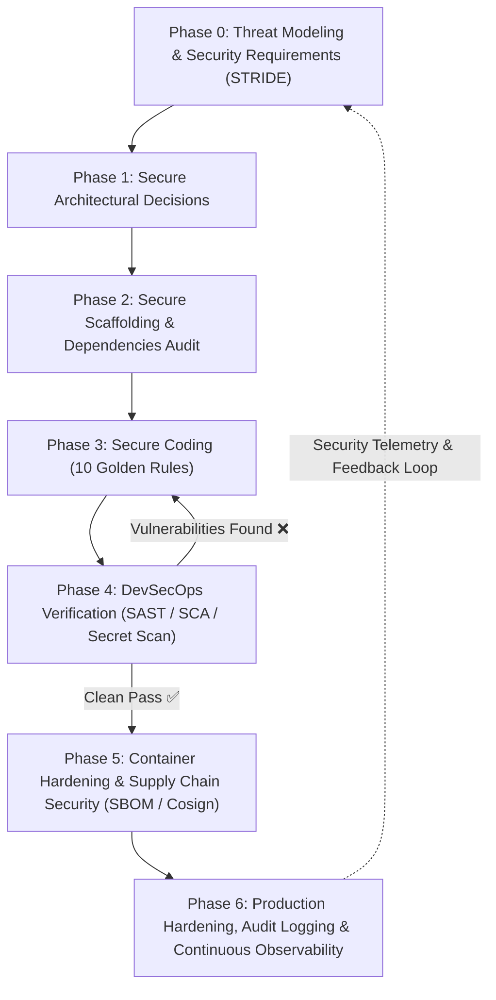

# 🛡️ Secure Software Development & DevSecOps Guide (SSDLC)

> **Antigravity IDE Developer & AI Agent Security Specification**  
> Enterprise spec for cyber-resilient software (Secure by Design & Default).  
> Threat modeling, architecture, OWASP/CWE remediation (10 Golden Rules), AI/LLM security, CI/CD DevSecOps, prod hardening.

---

## 🧭 MANDATORY WORKFLOW — Secure Software Development Lifecycle (SSDLC)

**Follow 7-phase workflow in sequence:**



---

### 🔹 Phase 0: Threat Modeling & Security Requirements (Pre-Coding)
Set security boundary before code:
1. **Asset & Trust Boundary**:
   - DFD: map untrusted input, external APIs, DBs, privilege zones.
2. **STRIDE Threat Matrix**:
   - **S - Spoofing**: Verify identity. Sign/validate tokens.
   - **T - Tampering**: Crypto integrity checks in transit and rest.
   - **R - Repudiation**: Tamper-evident audit logs on mutations.
   - **I - Information Disclosure**: Encrypt sensitive data. Suppress stack traces.
   - **D - Denial of Service**: Rate limits, size limits, timeouts.
   - **E - Elevation of Privilege**: Enforce domain-layer auth on every endpoint.
3. **Data Classification**: Public, Internal, Confidential, Restricted (PII/Financial).

---

### 🔹 Phase 1: Secure Architectural Decisions
Set baseline architecture:

| Security Domain | Standard Selection | Key Considerations |
|---|---|---|
| **Authentication** | JWT (Access <= 15m + Rotating Refresh in HttpOnly Secure SameSite Cookie) or Redis Sessions | Never store tokens in `localStorage` (XSS) |
| **Authorization** | Centralized Policy Enforcement (RBAC/ABAC) at Domain Layer | Never rely on UI hiding or client routing |
| **Secrets Management** | Env vars injected via Secret Manager (Vault/AWS/GCP) | Never commit keys/credentials in repo |
| **Transport Security** | TLS 1.3 / HSTS, Strict CORS Whitelist, CSP | Reject plain HTTP; strict CORS origins |
| **Cryptography** | Argon2id for passwords; AES-256-GCM / ChaCha20-Poly1305 for data | CSPRNG (`crypto.randomBytes`) for salts/tokens |

---

### 🔹 Phase 2: Secure Scaffolding & Pre-Flight Checklist
Verify pre-reqs before feature code:
- [ ] Audit dependencies; 0 High/Critical CVEs (`npm audit`, `pip-audit`, `cargo audit`, `govulncheck`)
- [ ] `.gitignore` & `.dockerignore` exclude `.env`, `*.key`, `*.pem`, `*.log`, credentials
- [ ] Security middleware active (Helmet, CORS Whitelist, Rate Limiter, Body Limit, CSRF)
- [ ] Structured logging with auto-redaction for PII, passwords, tokens

---

### 🔹 Phase 3: Secure Coding Implementation Patterns (The 10 Golden Rules)

#### Rule 1: Injection Prevention (SQLi, NoSQLi, Command Injection, Path Traversal)
- **Parameterized Queries & ORMs Only**: Never concatenate raw input into queries.
  ```typescript
  // ❌ VULNERABLE (SQL Injection)
  const query = `SELECT * FROM users WHERE email = '${req.body.email}'`;

  // ✅ SECURE (Parameterized Query)
  const query = `SELECT id, email, role FROM users WHERE email = $1`;
  const result = await db.query(query, [req.body.email]);
  ```
- **OS Commands**: No `exec()` or `system()`. Use `execFile()` with arg array:
  ```python
  # ❌ VULNERABLE (Command Injection)
  os.system(f"ping -c 1 {user_input}")

  # ✅ SECURE (No shell interpretation, argument list)
  subprocess.run(["ping", "-c", "1", sanitized_ip], check=True, capture_output=True)
  ```
- **Path Traversal**: Resolve absolute paths; verify prefix matches base dir:
  ```typescript
  const safePath = path.resolve(STORAGE_DIR, path.basename(req.params.filename));
  if (!safePath.startsWith(STORAGE_DIR)) throw new ForbiddenError("Access denied");
  ```

#### Rule 2: Broken Object Level Authorization (BOLA / IDOR) & Tenant Isolation
- Scope every query to current user/tenant:
  ```typescript
  // ❌ VULNERABLE (IDOR)
  const doc = await db.document.findUnique({ where: { id: req.params.id } });

  // ✅ SECURE (Scoped Query)
  const doc = await db.document.findFirst({
    where: {
      id: req.params.id,
      tenantId: req.user.tenantId,
      userId: req.user.id
    }
  });
  if (!doc) throw new NotFoundError("Document not found");
  ```

#### Rule 3: Cross-Site Scripting (XSS) & Content Security Policy (CSP)
- Use frameworks with auto-escaping (React, Vue, Svelte); avoid `dangerouslySetInnerHTML`.
- Enforce strict `Content-Security-Policy`:
  ```http
  Content-Security-Policy: default-src 'self'; script-src 'self' 'nonce-rAnd0m'; object-src 'none'; frame-ancestors 'none'; base-uri 'self';
  ```

#### Rule 4: Server-Side Request Forgery (SSRF) Defense
- Restrict scheme to `http://` / `https://`.
- Resolve DNS; block private/loopback subnets (RFC 1918, Cloud Metadata `169.254.169.254`):
  ```typescript
  import ipaddr from 'ipaddr.js';
  const ip = ipaddr.parse(resolvedIp);
  if (ip.range() !== 'unicast') {
    throw new SecurityError("Requests to internal network addresses are blocked");
  }
  ```

#### Rule 5: Cryptography, Password Hashing & Timing Attack Defense
- **Password Hash**: **Argon2id** (m=65536, t=3, p=4) or **bcrypt** (cost >= 12). MD5/SHA-1 forbidden.
- **Symmetric Cipher**: **AES-256-GCM** or **ChaCha20-Poly1305** with unique nonce/IV.
- **Constant-Time Comparison**: Compare secrets with `crypto.timingSafeEqual()`:
  ```typescript
  const valid = crypto.timingSafeEqual(Buffer.from(providedToken), Buffer.from(expectedToken));
  ```

#### Rule 6: Safe File Uploads & Deserialization
- Validate file type via **Magic Bytes (MIME)**, not extension alone.
- Rename to random UUIDv4; store outside web root or in private S3 bucket with presigned URLs.
- Forbid unsafe native deserialization (Python `pickle.loads()`, PHP `unserialize()`, Java `ObjectInputStream`).

#### Rule 7: AI, LLM & Agentic Security (OWASP LLM Top 10)
- **Prompt Injection Defense**: Delimit system instructions from untrusted user inputs.
- **Guardrails**: Apply NeMo Guardrails or LLM Guard for input/output sanitization.
- **Tool Calling**: Enforce **Least Privilege**; require human approval on destructive mutations.

#### Rule 8: Race Conditions & Concurrency (TOCTOU)
- Use DB transactions with row-level locks (`SELECT ... FOR UPDATE`) or optimistic version locks:
  ```sql
  BEGIN;
  SELECT balance FROM accounts WHERE id = $1 FOR UPDATE;
  UPDATE accounts SET balance = balance - $2 WHERE id = $1;
  COMMIT;
  ```

#### Rule 9: API Rate Limiting, Throttling & DoS Defense
- Enforce IP/token rate limits via Token Bucket / Sliding Window (Redis):
  ```typescript
  import rateLimit from 'express-rate-limit';
  export const authLimiter = rateLimit({
    windowMs: 15 * 60 * 1000,
    max: 5,
    message: { error: "Too many login attempts. Please try again later." }
  });
  ```

#### Rule 10: Error Handling & Secure Logging
- Hide stack traces; format errors per **RFC 9457 (Problem Details)**:
  ```json
  {
    "type": "https://api.example.com/errors/invalid-input",
    "title": "Invalid Request Parameter",
    "status": 400,
    "detail": "The provided input data is invalid.",
    "instance": "/api/v1/users/register"
  }
  ```
- Redact credentials, tokens, PII from logs before SIEM ingestion.

---

### 🔹 Phase 4: DevSecOps Verification & Automated Security Testing
Automate checks before delivery:

1. **SAST**:
   ```bash
   semgrep scan --config auto .
   bandit -r src/
   npx eslint . --plugin security
   ```
2. **Secret Scan**:
   ```bash
   gitleaks detect --source . -v
   ```
3. **SCA**:
   ```bash
   trivy fs --severity HIGH,CRITICAL .
   npm audit --production
   ```
4. **Container Scan**:
   ```bash
   trivy image my-app:latest
   hadolint Dockerfile
   ```

---

### 🔹 Phase 5: Container Hardening & Supply Chain Security (SBOM / Cosign)

1. **Multi-stage Distroless Dockerfile**:
   ```dockerfile
   FROM node:20-alpine AS builder
   WORKDIR /app
   COPY package*.json ./
   RUN npm ci
   COPY . .
   RUN npm run build && npm prune --production

   FROM gcr.io/distroless/nodejs20-debian12
   WORKDIR /app
   COPY --from=builder /app/node_modules ./node_modules
   COPY --from=builder /app/dist ./dist
   USER 10001:10001
   EXPOSE 3000
   ENV NODE_ENV=production
   CMD ["dist/index.js"]
   ```

2. **SBOM & Cosign Sign**:
   ```bash
   syft my-app:latest -o cyclonedx-json > sbom.json
   grype sbom:sbom.json
   cosign sign --key env://COSIGN_PRIVATE_KEY my-app:latest
   ```

---

### 🔹 Phase 6: Production Hardening, Audit Logging & Continuous Observability

1. **Kubernetes SecurityContext**:
   ```yaml
   securityContext:
     runAsNonRoot: true
     runAsUser: 10001
     allowPrivilegeEscalation: false
     readOnlyRootFilesystem: true
     capabilities:
       drop:
         - ALL
   ```

2. **Telemetry & Tamper-Evident Audit Logging**:
   - Log auth events (login, reset, token rotation).
   - Log authz failures (403, IDOR, role change).
   - Stream logs to SIEM with integrity hashing.
   - Feed production incident metrics back to **Phase 0 (Threat Modeling)**.

---

## 🛠️ Security Engineering Implementation Code

### 🔒 1. JWT Signing, Rotation & Algorithm Confusion Defense
```typescript
import jwt from 'jsonwebtoken';
import fs from 'fs';

const privateKey = fs.readFileSync(process.env.JWT_PRIVATE_KEY_PATH!);
const publicKey = fs.readFileSync(process.env.JWT_PUBLIC_KEY_PATH!);

export function signAccessToken(payload: object): string {
  return jwt.sign(payload, privateKey, {
    algorithm: 'RS256',
    expiresIn: '15m',
    issuer: 'auth.myapp.com',
    audience: 'api.myapp.com',
  });
}

export function verifyAccessToken(token: string): any {
  return jwt.verify(token, publicKey, {
    algorithms: ['RS256'],
    issuer: 'auth.myapp.com',
    audience: 'api.myapp.com',
  });
}
```

---

### 🤖 2. LLM Tool Calling Least-Privilege Guard
```python
ALLOWED_TOOLS = {"search_docs", "get_weather"}
DESTRUCTIVE_TOOLS = {"delete_account", "transfer_funds", "write_file"}

def execute_agent_tool(tool_name: str, arguments: dict, user_context: dict):
    if tool_name not in ALLOWED_TOOLS and tool_name not in DESTRUCTIVE_TOOLS:
        raise ValueError(f"Unauthorized tool invocation: {tool_name}")
    
    if tool_name in DESTRUCTIVE_TOOLS:
        if not user_context.get("human_confirmed"):
            return {
                "status": "REQUIRES_CONFIRMATION",
                "message": f"Action {tool_name} requires explicit user approval."
            }
            
    sanitized_args = {k: str(v)[:500] for k, v in arguments.items()}
    return run_tool(tool_name, sanitized_args)
```

---

### 🐙 3. DevSecOps CI/CD Pipeline (GitHub Actions)
```yaml
name: DevSecOps Pipeline
on: [push, pull_request]

jobs:
  security-gate:
    runs-on: ubuntu-latest
    steps:
      - uses: actions/checkout@v4
        with:
          fetch-depth: 0

      - name: 1. Secret Scanning (Gitleaks)
        uses: gitleaks/gitleaks-action@v2
        env:
          GITHUB_TOKEN: ${{ secrets.GITHUB_TOKEN }}

      - name: 2. SAST Scanning (Semgrep)
        run: |
          pip install semgrep
          semgrep scan --config auto --error .

      - name: 3. Dependency Vulnerability Scan (Trivy SCA)
        uses: aquasecurity/trivy-action@master
        with:
          scan-type: 'fs'
          severity: 'HIGH,CRITICAL'
          exit-code: '1'
```

---

## 📋 Developer Security Checklists

### 🌐 1. Web App & API Security
- [ ] **Input & Schema Validation**: Validate bodies with Zod / Joi / Pydantic.
- [ ] **Strict CORS**: Explicit origins; no `Access-Control-Allow-Origin: *` with credentials.
- [ ] **CSRF Defense**: `SameSite=Lax`/`SameSite=Strict` cookies + anti-CSRF tokens on mutations.
- [ ] **CSP**: Headers with nonces; block `eval()` and inline scripts.
- [ ] **Security Headers**: `X-Content-Type-Options: nosniff`, `X-Frame-Options: DENY`, `Strict-Transport-Security`.
- [ ] **SSRF Defense**: Validate URLs; block private IP ranges (RFC 1918) & metadata (`169.254.169.254`).
- [ ] **GraphQL Security**: Disable introspection in prod; limit query depth/complexity.
- [ ] **WebSocket Security**: Verify origin on handshake; validate JWT before routing.

### 🔐 2. Auth, AuthZ & Secrets
- [ ] **JWT**: Asymmetric (RS256/EdDSA), <= 15 min, rotating refresh in HttpOnly cookie.
- [ ] **Password**: Argon2id or bcrypt (cost >= 12) with CSPRNG salt.
- [ ] **MFA / WebAuthn**: TOTP (RFC 6238) and Passkeys (FIDO2).
- [ ] **OAuth2 / OIDC**: Enforce PKCE; validate state.
- [ ] **Centralized AuthZ**: User/tenant scoped queries on every DB interaction.
- [ ] **Zero Hardcoded Secrets**: Inject env vars via Secret Managers.

### 🤖 3. AI / LLM & Agentic Security
- [ ] **Prompt Injection Defense**: Delimit system prompt from untrusted input.
- [ ] **Guardrails**: Filter inputs/outputs against jailbreaks and leaks.
- [ ] **Safe Tool Calling**: Restrict tool scope; require human approval on mutations.
- [ ] **RAG Isolation**: Enforce document access control before vector retrieval.
- [ ] **System Prompt Protection**: Prevent prompt extraction in outputs.

### 🐳 4. Containers & DevSecOps
- [ ] **Minimal Base Image**: Distroless or Alpine.
- [ ] **Non-root Container**: Run as non-root (`USER 10001:10001`).
- [ ] **Read-only Filesystem**: `readOnlyRootFilesystem: true` + tmpfs mounts.
- [ ] **CI/CD Security Gates**: Pass SAST (Semgrep), SCA (Trivy), Secret scan (Gitleaks).
- [ ] **SBOM & Provenance**: Generate SBOM (CycloneDX) and sign image via Sigstore/Cosign.
